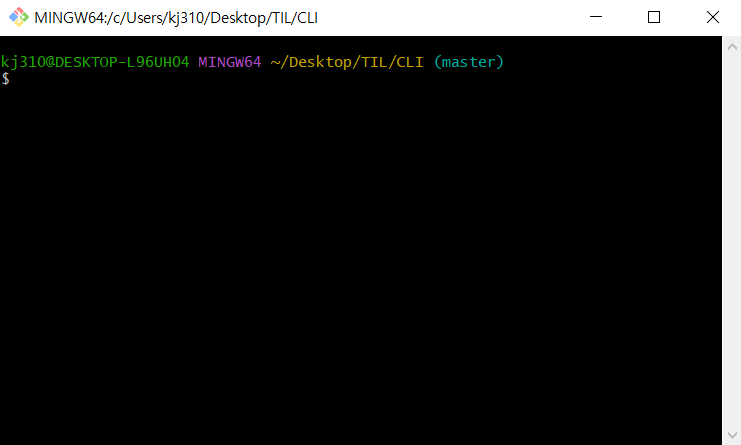

# 💻 CLI 

- CLI, 커맨드 라인 인터페이스) 또는 명령어 인터페이스는 가상 터미널 또는 텍스트
  터미널을 통해 사용자와 컴퓨터가 상호 작용하는 방식을 뜻한다. 
  
  
  
-  작업 명령은 사용자가 툴바 키보드 등을 통해 문자열의 형태로 입력하며, 컴퓨터로부터의
  출력 역시 문자열의 형태로 주어진다.
  
  
  
- 이 같은 인터페이스를 제공하는 프로그램을 명령 줄 해석기 또는 셸이라고 부른다. 
  이를테면, 유닉스 셸**(sh, ksh, csh, tcsh, bash 등)**과 **CP/M**, 도스의
  **command.com("명령 프롬프트")** 등이 있다.

# ⚙ CLI 예시

- 프롬프트 기본 인터페이스
  - 컴퓨터 정보
  - 디렉토리
  - $

## 📌 디렉토리 관리

- pwd (print working directory) : 현재 디렉토리 출력
- cd 디렉토리이름(change directory) : 디렉토리 이동
- . : 현재 디렉토리, .. : 상위 디렉토리
- ls (list) : 목록
- mkdir (make directory) : 디렉토리 생성
- touch : 파일 생성
- rm 파일명: 파일 삭제하기
- rm –r 폴더명 : 폴더 삭제하기