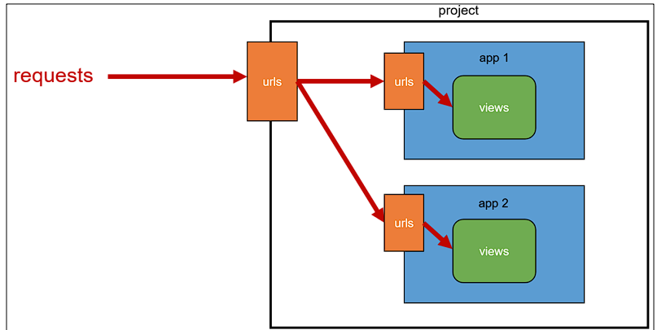

# App URL mapping 📲

- `app view` 함수가 많아지고, `app`이 더 많이 작성되기 때문에 유지보수를 위해 사용한다.

- 각각 앱 안에 `urls.py` 생성 후 각 앱에 `URL 매핑`

  ```python
  # [app]/urls.py
  
  from django.urls import path
  from ./ import views 
  
  urlpatterns = [
      path('index/', views.'index.html')
  ]
  ```


- 다만, 사전에 `project` 폴더 `urls.py`에 각 앱의 `urls`를 지정해줘야 한다!

  ```python
  # [project]/urls.py
  
  from django.contrib import admin
  from django.urls import path, include #include 추가! (Path와 비슷한 원리)
  
  urlpatterns = [
      path('[원하는 주소]/', include('[app].urls')), 
  ]
  ```


- 원리를 알아보면 다음과 같다.

