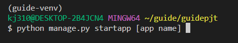
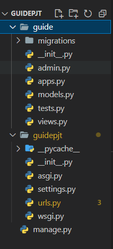
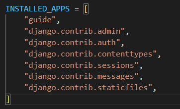
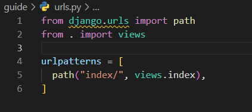
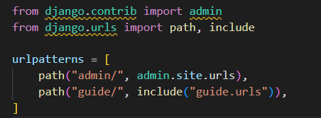
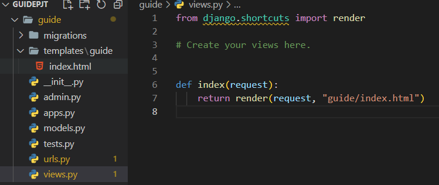
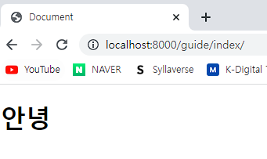
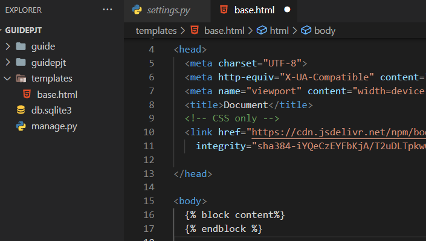
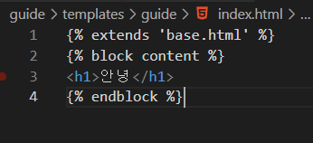
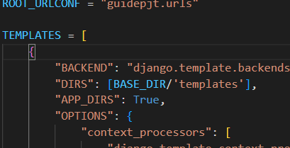

# Django 개발 환경 설정 가이드

## 목차

- [실행 전 확인](#[실행 전 확인])
- [가상환경](#[가상환경])
  - [가상환경 구축](#1. 가상환경 구축)
  - [가상환경 실행](#2. 가상환경 실행)
- [Django](#[Django])
  - [설치](#1. Django 설치)
  - [설치 확인](#2. Django 설치 확인)
  - [프로젝트 생성](#3. Django 프로젝트 생성)
  - [실행](#4. Django 실행)

## 내용

### [실행 전 확인]

- 홈 디렉토리 바로 아래 프로젝트나 작업을 관리할 폴더를 선택 

- 선택한 폴더는 홈 **디렉토리 ~ 안 존재**

## [가상환경]

### 1. **가상환경 구축** 

- #### `python -m venv [가상환경 이름]`

- 선택한 폴더 내에서(`~/[folder name]`)  **터미널 사용**

### 2. 가상환경 실행 

   - #### `source [가상환경 이름]/Scripts/activate`

   - 터미널 내 디렉토리 위치를 주의

   - 적용 예시

     

- 가상 환경을 종료할 때는 **`deactivete`** 입력

## [Django]

### 1. Django 설치

   - 최신 버전도 존재하나, 제일 안정적인 버전

   - #### `pip install django==3.2.13`

   - 가상 환경 실행 중인지 확인

     

### 2. Django 설치 확인

   - #### `pip list`

     

### 3. Django 프로젝트 생성

   - #### `django-admin startproject [프로젝트 이름] [설치 경로]`

   - 예시에서는 guidepjt (프로젝트 이름)  . (현재 디렉토리) 사용

     

     

##### 프로젝트가 생성되었는지 확인

- `ls`

- 파일이 잘 생성되었는지  확인한다

### 4. Django 실행 

- #### `python manage.py runserver`

- 서버가 구동된 모습

- `manage.py` 파일이 있는 폴더에서 실행해야 한다

  

###  5. Django app 생성후 기초 설정

- ####  app 생성

  - **`python manage.py startapp [app name]`**
  - **가상환경 확인**	
  
  - `manage.py` 파일이 있는지 확인한다.
  
  - 올바르게 진행했다면 `app` 폴더가 생성된다.
  

- #### app 기초 설정

  1. `project` 폴더 내에 있는 `setting.py` 파일에 생성한 `app` 이름을 지정해준다
  
     
  
     
  
  2. 웹 페이지 접속 시 반환해줄 URL 지정
  
     - app 폴더 내에 urls.py 파일 생성
  
     - 각각 app에 urls.py을 지정해주는 것은 유지보수를 위함이다.
  
       
  
     - app 폴더 내에 urls.py 파일을 프로젝트 폴더의 urls.py 안에 지정해줄 수 있도록 설정
  
       
  
     
  
  3. 'URL 주문이 들어왔을 때 반환해줄 함수를 설정해준다.
  
     - 지금까지 주문이 들어오면 🙍‍♂️(client) 👉 💻([server]project/urls.py) 👉 💻 ([server]app/urls.py) 까지 전송이 됐다. 무엇을 보여줄지 설정해줘야 한다.
  
     - 앱 내에 templates 폴더 안에 app 이름의 폴더를 생성 후 템플릿들을 넣어준다.
  
     - 앱의 views 파일 안에 html 경로를 지정해준다.
  
       
  
     
  
     - 여기까지 마쳤으면 서버를 실행해보자.
  
       
  
     - `guide/index` 경로 안의 경로를 출력해줌을 확인하면 완료!

6. BASE.DIR 설정

   - 부트스트랩, JS, nav, footer 등 우리가 웹페이지를 제작하면서 항상 공통으로 들어가는 것들이 있다.

   - 이럴 때 반복적인 작업을 없애주기 위해 base.html을 제작하여 extend가 가능하다.

     

   

   - 주의해야 할점

     - 방금 templates 폴더를 각 app에 지정했으나 base.html은 최상위 폴더에서 진행한다

     - 경로를 설정해주어야 한다.

       
