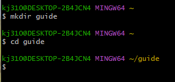
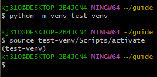
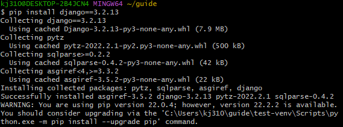
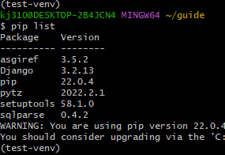
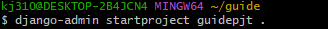
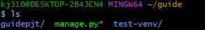
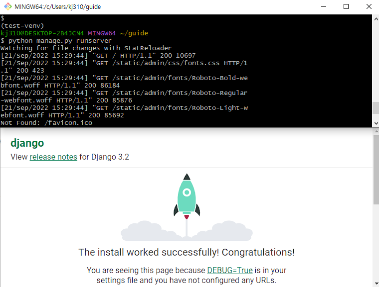

## Django 개발 환경 설정 가이드

## 목차

- [실행 전 확인](#[실행 전 확인])
- [가상환경](#[가상환경])
  - [가상환경 구축](#1. 가상환경 구축)
  - [가상환경 실행](#2. 가상환경 실행)
- [Django](#[Django])
  - [설치](#1. Django 설치)
  - [설치 확인](#2. Django 설치 확인)
  - [프로젝트 생성](#3. Django 프로젝트 생성)
  - [실행](#4. Django 실행)

## 내용

### [실행 전 확인]

- 홈 디렉토리 바로 아래 프로젝트나 작업을 관리할 폴더를 선택 

- 선택한 폴더는 홈 **디렉토리 ~ 안 존재**

### [가상환경]

#### 1. **가상환경 구축** 

- #### `python -m venv [가상환경 이름]`

- 선택한 폴더 내에서(`~/[folder name]`)  **터미널 사용**

#### 2. 가상환경 실행 

   - #### `source [가상환경 이름]/Scripts/activate`

   - 터미널 내 디렉토리 위치를 주의

   - 적용 예시

     

- 가상 환경을 종료할 때는 **`deactivete`** 입력

### [Django]

#### 1. Django 설치

   - 최신 버전도 존재하나, 제일 안정적인 버전

   - #### `pip install django==3.2.13`

   - 가상 환경 실행 중인지 확인

     

#### 2. Django 설치 확인

   - #### `pip list`

     

#### 3. Django 프로젝트 생성

   - #### `django-admin startproject [프로젝트 이름] [설치 경로]`

   - 예시에서는 guidepjt (프로젝트 이름)  . (현재 디렉토리) 사용

     

     

##### 프로젝트가 생성되었는지 확인

- `ls`

- 파일이 잘 생성되었는지  확인한다

#### 4. Django 실행 

- #### `python manage.py runserver`

- 서버가 구동된 모습

  

