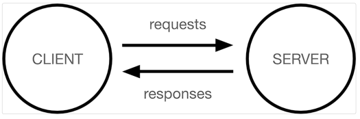

# Django 🔍

## Framework 이해하기 📝

**Frame + work**

- 특정 프로그램을 개발하기 위한 **여러 도구들과 규약을 제공**하는 것

- “소프트웨어 프레임워크”는 복잡한 문제를 해결하거나 서술하는 데 사용되는 기본 개념 구조
- Framework를 잘 사용하면 웹 서비스 개발에 있어서 모든 것들을 하나부터 열까지 직접 개발할 필요 없이 **내가 만들고자 하는 본질(로직)에 집중해 개발할 수 있음**
- 소프트웨어의 생산성과 품질을 높임

## WWW 🌎

*World Wide Web*

### 인터넷 🌎

- 전세계는 촘촘하고 거대한 유선으로 연결
  - 유선 연결의 한계
    - 오지가, 개발 도상국 같은 나라에서는 충분한 인프라를 기대하기 어려움
- 서버 컴퓨터와 내 컴퓨터 간의 통신이 연결되어 있다

- 무선 인터넷
  - 스타링크 프로젝트” – Space X
    - 지구를 아주 많은 소형 위성으로 감싸서, 케이블이 아닌 위성끼리 데이터를 교환

### 정리 💡

- 결국 우리가 인터넷을 이용한다는 건, 전세계의 컴퓨터가 연결되어 있는 **하나의 인프라**를 이용하는 것

## 클라이언트와 서버 🙍‍♂️ ↔ 💻

우리가 사용하는 **대부분의 웹 서비스는 클라이언트-서버 구조를 기반으로 동작**한다.

- #### 클라이언트

  - **서비스를 요청**하는 주체  (사용자 등)
  - 웹 사용자의 인터넷에 연결된 장치

- #### 서버

  - 웹 페이지, 사이트 또는 앱을 저장하는 컴퓨터
  - 요청에 대해 **서비스를 응답**하는 주체

- 상호작용 예시
  1. 사용자가 홈페이지에 접속
  2. 홈페이지 서버 컴퓨터에게 `html` 파일을 요청
  3. 서버 컴퓨터는 요청을 받고 인터넷을 통해 사용자에게 파일을 전송
  4. 사용자의 웹 브라우저가 `html` 파일을 해석해준다.

### 정리 💡

- 웹은 **클라이언트 ↔ 서버** 구조로 이루어져 있다
- Django는 서버를 구현하는 웹 프레임워크

## 웹 브라우저 📇

- 웹에서 페이지를 찾아 사용자에게 보여주고 다른 페이지로 이동할 수 있도록 해주는 프로그램
- 웹 페이지 파일을 (`HTML`) **우리가 보는 화면으로 바꿔주는**(`rendering`) 프로그램 

### 예시 📋

1. 우리가 자주 접하고 사용하는 **웹 페이지는 사실 `HTML` 문서 파일** 중 하나이다.
2. 웹 페이지에 접속하면 서버에서 `HTML` 파일을 전송해준다.
3. 사용자가 **웹 페이지 코드를 받으면 평소 화면처럼 바꿔주는 것**이 바로 웹 브라우저
4.  `HTML` / `CSS` / `JS` 를 적절히 사용하여 클라이언트에게 보기 좋은 화면으로 만들어준다 (동적이거나 가시성을 높일 수 있다.)

## 웹 페이지 📰

- 웹에 있는 문서
  - 우리가 보는 화면 각각 한 장이 웹 페이지
- 웹 페이지 종류
  - 정적 웹 페이지
  - 동적 웹 페이지

### 정적 웹 페이지 💻

*Static Web page*

- **있는 그대로를 제공**
- 한 번 작성된 HTML 파일의 내용이 변하지 않고 모든 사용자에게 동일한 모습으로 전달되는 것
  - **서버에 미리 저장된 HTML 파일 그대로 전달된 웹 페이지**
  - 같은 상황에서 모든 사용자에게 동일한 정보를 표시

### 동적 웹 페이지 💻

*Dynamic Web page*

- 사용자의 요청에 따라 웹 페이지에 추가적인 수정이 되어 클라이언트에게 전달되는 웹 페이지
- 웹 페이지의 내용을 바꿔주는 주체 👉 **서버**
  - **서버에서 동작하고 있는 프로그램이 웹 페이지를 변경**해줌

