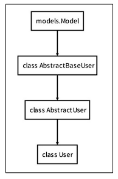

# Django Auth 🗂


## Django User Model 👨‍💻

- `Custom User Model` 대체하기
- 새 프로젝트를 시작하는 경우 기본 `User` 모델이 충분하더라도 `Custom User` 모델을 설정하는 것을 **강력하게 권장(*highly recommended*)**
- 커스텀 `User` 모델은 기본 `User` 모델과 동**일하게 작동 하면서도 필요한 경우 나중에 맞춤 설정할 수 있기 때문** 
  - `User` 모델 대체 작업은 프로젝트의 모든 **`migrations` 혹은 첫 `migrate` 를 실행하기 전에 이 작업을 마쳐야 함**
- 현재 프로젝트에서 사용할 `User Model`을 결정하는 `AUTH_USER_MODEL` 설정 값으로 *Default User Model*을 재정의 할 수 있도록 함


### AUTH_USER_MODEL 💻

- 프로젝트에서 `User`를 나타낼 때 사용하는 모델

- **프로젝트가 진행되는 동안 (모델을 만들고 마이그레이션 한 후) 변경할 수 없음**

- 참조하는 모델은 첫 번째 마이그레이션에서 사용할 수 있어야 함

  ```python
  AUTH_USER_MODEL = 'auth.User'
  ```

  

- `AbstractUser`를 상속받는 `Custom User` 클래스 작성

  ```python
  # accounts/models.py
  from django.contrib.auth.models import AbstractUser
  
  class User(AbstractUser):
  	pass
  ```

  

- `Custom User` 모델로 지정

  ```python
  # settings.py
  
  AUTH_USER_MODEL = 'accounts.User'
  ```


- `admin.py`  커스텀 `User` 모델 등록

  ```python
  # accounts/admin.py
  
  from django.contrib import admin
  from django.contrib.auth.admin import UserAdmin
  from .models import User
  
  admin.site.register(User, UserAdmin)
  ```


- `User Model` 상속 관계

  


### 암호 관리 🗃

- 회원은 가입시 일반적으로 **암호(password)를 저장이 필수**적이며, **별도의 처리가 필요** ⭐
- 기본으로 `PBKDF2`를 (*Password-Based Key Derivation Function*) 사용하여 저장
  - **솔팅(*Salting*)** : 패스워드에 임의의 문자열인 **salt를 추가하여 다이제스트를 생성** 
  - **키 스트레칭(*Key Stretching*)** : 해시를 여러 번 **반복하여 시간을 늘림**


### User 객체 활용 💡

- `User` 생성

  ```python
  user = User.objects.create_user('john‘, ‘john@google.com’, ‘1q2w3e4r!’)
  ```

  

- `User` 비밀번호 변경

  ```python
  user = User.objects.get(pk=2)
  User.set_password(‘new password’)
  User.save()
  ```


- `User` 인증(비밀번호 확인)

  ```python
  from django.contrib.auth import authenticate
  user = authenticate(username='john', password='secret')
  ```

  

### 회원 가입 📥

- `UserCreationForm()`

  - 주어진 `username`과 `password`로 **권한이 없는`user`를 생성하는 `ModelForm`**

    ```python
    # accounts/urls.py
    app_name = 'accounts'
    urlpatterns = [
        ...,
        path('signup/', views.signup, name='signup'),
    ]
    ```

    ```html
    <!-- accounts/signup.html -->
    
    
    <h1>회원가입</h1>
    <form action="" method="POST">
        
        {{ form.as_p }}
        <input type="submit">
    </form>
    
    ```

    ```python
    # accounts/views.py
    
    def signup(request):
    	if request.method == 'POST':
    		form = UserCreationForm(request.POST)
    		if form.is_valid():
    			form.save()
    			return redirect('articles:index')
    	else:
    		form = UserCreationForm()
    	context = {
    		'form': form,
    	}
    	return render(request, 'accounts/signup.html', context)
    ```

    

#### UserCreationForm Custom ⚙

- `UserCreationForm`을 상속받아 `User` 모델 **재정의**

  ```python
  # accounts/forms.py
  from django.contrib.auth import get_user_model
  from django.contrib.auth.forms import UserCreationForm
  
  class CustomUserCreationForm(UserCreationForm):
  	class Meta(UserCreationForm.Meta):
  		model = get_user_model()
  ```

  

- `get_user_model() `

  - 현재 프로젝트에서 활성화된 **사용자 모델(*active user model*)을 반환**

  - `User` 클래스는 커스텀을 통해 변경 가능, 직접 참조하는 대신 `get_user_model()`을 사용할 것을 권장함

    

