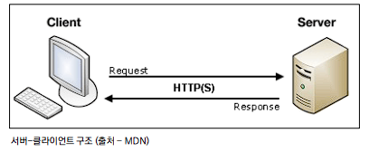

# 데이터를 보내고 가져오기 💡

*Sending and Retrieving form data*

## Client & Server architecture 🙍‍♂️ ↔ 💻

- 클라이언트-서버 아키텍처를 사용
  - 클라이언트(일반적으로 웹 브라우저)가 서버에 요청을 보내고,  서버는 클라이언트의 요청에 응답
- 클라이언트 측에서 HTML form은 HTTP 요청을 서버에 보내는 가장 편리한 방법
- 이를 통해 사용자는 HTTP 요청에서 전달할 정보를 제공할 수 있음

## Client 🙍‍♂️

- **HTML `<form>`  element**

  - ##### 데이터가 전송되는 방법을 정의

  - 웹에서 사용자 정보를 입력하는 여러 방식(`text`, `button`, `submit` 등)을 제공하고,  **사용자로부터 할당된 데이터를 서버로 전송**하는 역할을 담당

  - 데이터를 어디(`action`)로 어떤 방식(`method`)으로 보낼지

  - 핵심 속성

    - `action`
      - 입력 데이터가 전송될 URL을 지정
      - 데이터를 어디로 보낼 것인지 지정하는 것
    - `method`
      - 데이터를 어떻게 보낼 것인지 정의
      - `HTML form` 데이터는 **오직 2가지 방법으로만 전송** 할 수 있는데 바로 `GET` 방식과 `POST` 방식

- **HTML `<input>` element**

  - ##### 사용자로부터 데이터를 입력 받기 위해 사용

  - `“type”` 속성에 따라 동작 방식이 달라진다

    - `input` 요소의 동작 방식은 `type` 특성에 따라 현격히 달라지므로 각각의 `type`은 별도로 `MDN 문서`에서 참고하여 사용
    - `type`을 지정하지 않은 경우, 기본값은 `”text”`

  - 핵심 속성
    - `name`
      - `form`을 통해 데이터를 제출(`submit`)했을 때 `name` 속성에 설정된 값을 서버로 전송하고, 서버는 `name 속성` 에 설정된 값을 통해 **사용자가 입력한 데이터 값에 접근**
      - 주요 용도는 `GET/POST` 방식으로 서버에 전달하는 파라미터(`name`은 `key, value`는 `value`)로 매핑
      - **`GET` 방식에서는 `URL` 형식으로 데이터를 전달**

- ##### HTML request methods 

  - `HTTP`
    - `HTML` 문서와 **같은 리소스(데이터, 자원)들을 가져올 수 있도록 해주는 프로토콜**
  - 웹에서 이루어지는 **모든 데이터 교환의 기초**
  - `HTTP`는 주어진 리소스가 수행 할 원하는 작업을 나타내는 `request methods`를 정의
  - **자원에 대한 행위(수행하고자 하는 동작)을 정의**
  - `HTTP Method` 예시
    - **`GET`**, `POST`, `PUT`, `DELETE`

- #### `GET`

  - ##### 서버로부터 정보를 조회하는 데 사용

    - 즉, **서버에게 리소스를 요청하기 위해 사용**

  - **데이터를 가져올 때만 사용해야 함**

  - 데이터를 서버로 전송할 때 `Query String Parameters`를 통해 전송

    - 데이터는` URL`에 포함되어 서버로 보내짐

- ##### Query String Parameters

  - 사용자가 입력 데이터를 전달하는 방법 중 하나로,  `url` 주소에 데이터를 파라미터를 통해 넘기는 것
  - `key=value` 쌍으로 구성
  - `Query String`이라고도 한다.
  - 물음표를 쓰는 것으로 `Query String`이 시작함을 알린다.
  - 여러 개일 경우 “`&`”를 붙여 여러 개의 파라미터를 넘길 수 있다.

## Server 💻

- ##### Retrieving the data (Server)

  - **데이터 가져오기(검색하기)**
  - 서버는 클라이언트로 받은 `key-value` 쌍의 목록과 같은 데이터를 받게 됨
  - 목록에 접근하는 방법은 사용하는 특정 프레임워크에 따라 다름

- ##### 데이터 가져오기

  - `catch` 페이지가 잘 응답되어 출력됨을 확인
  - 모든 요청 데이터는`view` 함수의 첫번째 인자 `request`에 들어있다.
  - `request`가 **어떤 객체인지 확인해보기**

- ##### Request and Response objects

  - ##### 요청과 응답 객체 흐름

  - 페이지가 요청되면 `Django`는 요청에 대한 메타데이터를 포함하는 `HttpRequest object`를 생성

  - 그리고 해당하는 적절한 `view` 함수를 로드하고 `HttpRequest`를 첫번째 인자로 전달

  - 마지막으로 `view` 함수는 `HttpResponse object`를 반환

## Django URLs 🔗

- `Dispatcher`(운행 관리원)로서의 `URL 이해`하기
- **웹 어플리케이션은 URL을 통한 클라이언트의 요청에서부터 시작**

### Trailing Slashes 🔍

- `Django`는 `URL` 끝에 `/`가(`Trailing slash`) 없다면 **자동으로 붙여주는 것이 기본 설정**
  - 모든 주소가 `/`로 끝나도록 구성 되어있음
- `Django`의 `url` 설계 철학을 통해 먼저 살펴보면 다음과 같이 설명함
  -  **foo.com/bar와 foo.com/bar/는 서로 다른 URL이다.**

### URL 정규화 📄

- **정규 URL(=오리지널로 평가되어야 할 URL)을 명시하는 것**
- 복수의 페이지에서 같은 콘텐츠가 존재하는 것을 방지하기 위함
- “`Django`에서는 `trailing slash`가 없는 요청에 대해 자동으로 `slash`를 추가하여 통합된 하나의 콘텐츠로 볼 수 있도록 한다.”