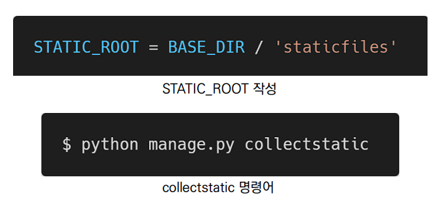

# Static files 💾

- 정적 파일 
  - 별도의 처리 없이 파일 내용을 **그대로 보여주는 파일**
  - 웹 서버는 일반적으로 이미지, `JS` 또는 `CSS`와 같은 미리 준비된 추가 파일을 제공
  - `Django`에서는 이러한 파일들을 `Static file`이라 함


## 정적 파일 활용 💡

- `django.contrib.staticfiles`가 `INSTALLED_APPS`에 포함되어 있는지 확인

- `settings.py`에서 `STATIC_URL`을 정의

- `static` 템플릿 태그 사용

- 앱 내` static` 폴더에 파일을 저장

  - 예시)  `my_app/static/my_app/example.jpg`

  ```html
  
  
  
  ```

  


- `STATICFILES_DIRS`

  - 추가적인 **정적 파일 경로 목록을 정의하는 리스트**

  - ```python
    STATICFILES_DIRS = [
        BASE_DIR / 'static',
    ]
    ```


- `STATIC_URL`

  - `STATIC_ROOT`에 있는 정적 파일을 참조 할 때 사용할 `URL`

  - 실제 파일이나 디렉토리가 아니며, `URL`로만 존재

    ```python
    STATIC_URL = '/static/'
    ```


- `STATIC_ROOT`

  - `django` 프로젝트에서 사용하는 **모든 정적 파일을 한 곳에 모아 넣는 경로**

  - 개발 과정에서 `settings.py`의 `DEBUG` 값이 `True`로 설정되어 있으면 **해당 값은 작용되지 않음**

    

- `load`

  - 사용자 정의 **템플릿 태그 세트를 로드**(`load`)
  - 로드하는 라이브러리, 패키지에 등록된 **모든 태그와 필터**를 불러온다.

- `static`

  - `STATIC_ROOT`에 저장된 정적 파일에 연결

    ```html
    
    
    
    ```

    


