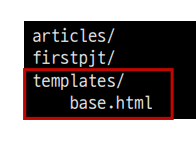

# Template inheritance 🔄

- 코드의 재사용성
- 사이트의 모든 공통 요소를 포함
- 하위 템플릿이 재정의(override) 할 수 있는 블록을 정의하는 기본 ‘skeleton’ 템플릿을 만들 수 있음


## 템플릿 상속에 관련된 태그 🔖

``

- **자식(하위)템플릿**이 **부모 템플릿을 확장한다는 것**을 알림

- #### 반드시 템플릿 최상단에 작성 되어야 함 (즉, 2개 이상 사용할 수 없음)

- 하위 템플릿에서 **재지정(`overridden`)할 수 있는 블록**을 정의

- 가독성을 높이기 위해 선택적으로 `endblock` 태그에 이름을 지정할 수 있음

```html


    <h1>만나서 반가워요!</h1>
    <a href="/greeting/">greeting</a>
    <a href="/dinner/">dinner</a>

```


### 추가 템플릿 경로 추가하기 ✔

- `base.html`의 위치를 앱 안의 `template` 디렉토리가 아닌 프로젝트 최상단의 `templates `디렉토리 안에 위치하기

  - 기본 `template` 경로가 아닌 **다른 경로를 추가하기위해 다음과 같은 코드를 작성**

    ```python
    # settings.py
    TEMPLATES = [
        {
            'BACKEND': 'django.template.backends.django.DjangoTemplates',
            'DIRS': [BASE_DIR / 'templates',],
            'APP_DIRS': True,
            'OPTIONS': {
                'context_processors': [
                    'django.template.context_processors.debug',
                    'django.template.context_processors.request',
                    'django.contrib.auth.context_processors.auth',
                    'django.contrib.messages.context_processors.messages',
                ],
        },
    }
    ```

    

- 추가 템플릿 경로 

  - `app_name/templates/` **디렉토리 경로 외 추가 경로를 설정한 것**

  - `base.html`의 위치를 다음과 같이 이동 후 **상속에 문제가 없는지 확인**

    

