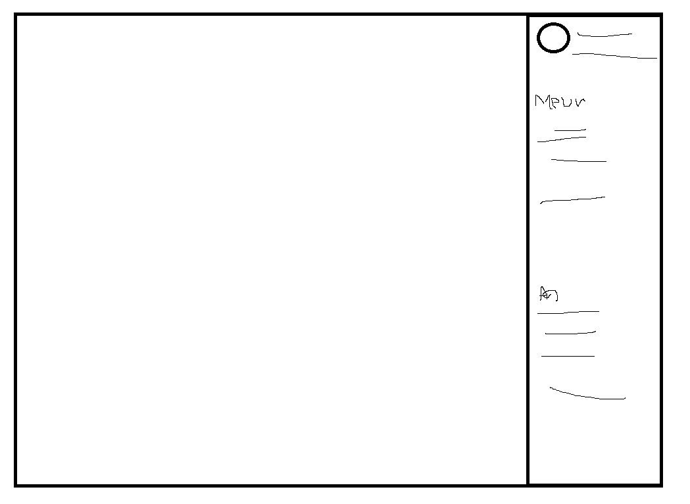

1. 해외 사이트 정보는 정말 다양하지만 가시성이 나쁘다

2. 모두의 니즈를 다 충족시킬 수는 없다

3. 제일 대중성있고 보기 간편한 페이지 구성이 필요하다. 

4. 그 점에 있어서 왓챠피디아는 어떤 사용자가 와도 보기 간편했다.

   

5. nav바 구성

   ### [로고]

   - 페이지를 나타내는 로고를 제작 로고 클릭 시 홈 화면으로 이동

   

   ### [검색]

   - 영화 제목, 장르, 감독을 검색할 수 있는 인풋박스를 nav의 2/3 크기로 길게 만들어준다.
     - 검색할 때 보기 편하고 추천 목록을 꺼내주기도 좋을 것 같았다
     - 검색하면 정보와 일치한 영화를 보여준다.
   - 오른쪽에는 메뉴와 로그인, 회원가입 기입

   

   - 상황에 따라 메뉴를 로고 옆 위치하거나  인풋박스를 줄이고 메뉴를 펼쳐놓는다.

   

   ### [메뉴]

   - 드롭다운 메뉴 구성

     - 추천 영화 (여기선 알고리즘으로 추천 영화를 받아와도 좋을 것 같다 예, 회원 가입 시 내가 좋아하는장르의 정보 가져오기)

     - 상위권 영화

     - 새로운 영화 소식

     - 문의하기

     - 이벤트

     - 등등 

       

   ### [로그인, 회원가입]

   - 	로그인이나 회원 가입시 모달 창을 띄어주거나 로그인 페이지를 만든다.

      - 	로그인 페이지 제작 시 회원가입 버튼을 없앰
      - 	로그인 페이지 아래에 회원가입 존재

       

   - 	로그인 하면 내 정보의 드롭다운 구성 

     - 내 정보
     - 내가 좋아하는 영화
     - 내가 작성한 리뷰
     - 출석이나, 등급! 등급이란? 리뷰를 작성하는 데에 있어서 공감을 많이 받을 수록 점수를 부여한다

   - 	내 정보는 오른쪽에서 등장하여 정보를 나열하는 것도 좋을 것 같다

     

     

   ### [메인 페이지]

   - 	메인 페이지

      - 크루셀 사용 상영 중인 영화 중 인기 순대로 이동하는 이미지들을 만든다.
        - 영화 이미지에는 스티커가 붙여져있다 순위, 평점 등  
      - 요새 핫한 영화, 요새 유행하는 장르, 기대작, 지금 개봉한 작품 등등을 나열해주는 박스를 쭉 만들어준다

      - 영화 이미지를 클릭하면 상세정보 페이지로 이동한다

      

   ### [상세 정보 페이지]

   - 맨 위에 영화 장면과 관련된 백그라운드 이미지 삽입
   - 백그라운드 이미지 가운데에서 영화 포스터 삽입 
     - 제목이나 정보 기입
     - 포스터가 좌측 내용이 우측
     - 그 밑에는 리뷰나 평론가 평점등
     - 아래 동영상이나 사진, 
     - 리뷰 작성란
       - 회원가입을 해야지만 작성 가능
       - 

   

   

   

