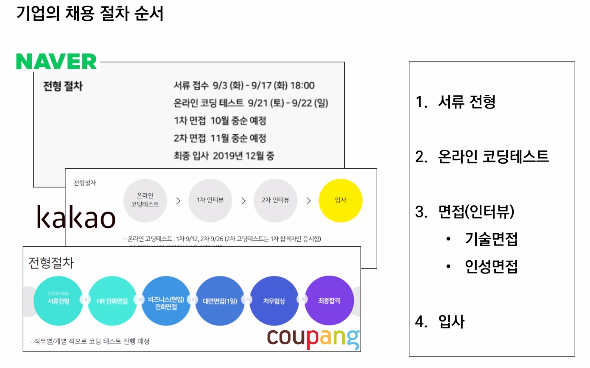
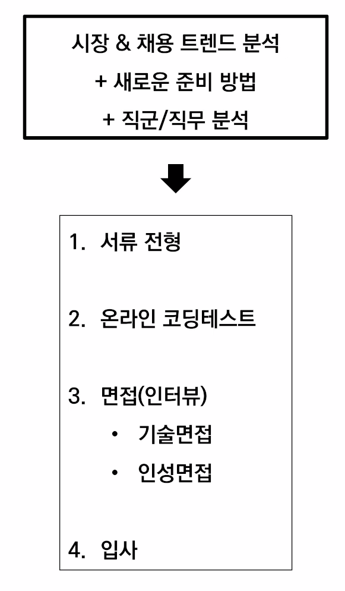
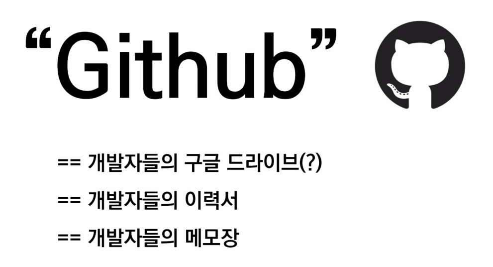
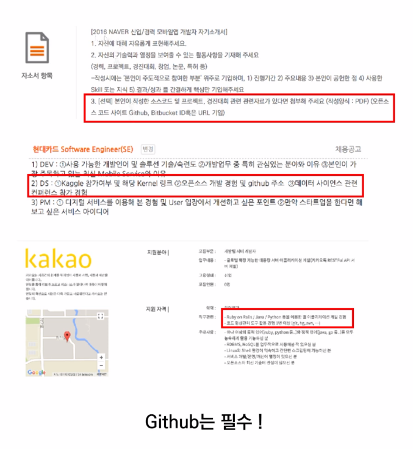

# HPHK 취업특강 

- ### Series 1 급격히 변화된 시장 & 채용 트랜드 분석

  - **시장 분석**
  - **채용 트렌드 분석**: 변화한 채용 시장에서의 새로운 준비
  - **직군/직무 분석**: 채용공고 리서치

# 4차 산업혁명 시대 & 디지털 대전환(DX) 시대에 취업하기 (feat. Github) 

- 회사에 들어가지 않아도 기술을 배우고 활용할 수 있는 시대이다.

- 대 경력직의 시대 (공채의 끝)

  - 회사는 왜 경력직을 선호할까? ‣ 역량 추정이 가능하기 때문

  - 공채의 시대가 끝나감, 역량 중심의 수시 채용 시대

    

## 나는 신입인데 역량을 어떻게 증명하지?

- ### 프로젝트 (Github)

  프로젝트 중심의 자기소개서

  - 자기를 소개하는 것이 아닌, 자기가 한 것을 소개하는 것

  

## 취업을 위한 학습 전략 수립(feat. MOOC)

- 학습 공식
  - 공고 - 내가 가진 것
- 학습하기 전 마인드 셋을 다시 잡아야 함
  - 직장 < 커리어 < 삶
  - ~~나는 [회사] 개발자가 되고 싶다~~
  - 나는 [회사] 개발자이다.
  - 그렇다면 [회사] 개발자는 어떻게 일할까?
    - [회사]에서 어떻게 일하는지 모두 공개되어 있다. 
- MOOC의 사례
  1. [Coursera](https://coursera.org)
  2. [edx-CS50](https://edx.org)
  3. [Udacity](https://www.udacity.com/), [introduction to machine learning udacity]
  4. [K-MOOC](http://www.kmooc.kr/)
- 코딩 플랫폼의 사례
  1. [codecademy](https://codecademy.com/)
  2. [Code Avengers](https://codeavengers.com/)
  3. [programmers](https://programmers.co.kr)
  4. [Team Treehouse](https://teamtreehouse.com)
- 프로젝트 사례
  1. [Kaggle](https://www.kaggle.com/)
  2. 다양한 공모전 및 contest
  3. 내 주변 문제를 해결 (거창할 필요 없음)

# ⭐ 취업 절대 공식

1. **Github TIL**을 1.5년 이상 지속
2. (나의 언어로) 타인에게 설명할 수 있는 **SW** 역량
3. 유저가 실사용 하는 **프로젝트를 개발 & 유지보수**

## 내용 정리

- 4차 산업혁명 시대 (직무 역량 중심 채용의 시대)

- 회사에 들어가지 않아도 기술을 학습할 수 있는 시대

- 공채가 저물고 직무 역량으로 검증하는 수시 채용 시대

- 내가 이미 그 회사의 직원이라는 마음가짐으로 그 사람이 하는 업무를 찾아봄
- MOOC를 통해 공고에는 있지만 나에게는 없는 지식을 배우자

- 거창할 필요없이, 주변의 문제를 해결하는 프로젝트를 하자.
- 반드시 학습 내용과 프로젝트는 Github에 기록하자. 그것이 내 역량과 포트폴리오가 될 것이다.