# Bootstrap 📖

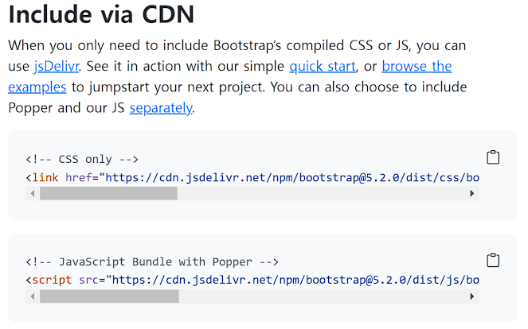

## CDN ❔

***Content Delivery(Distrivution) Newtwork***

컨텐츠를 효율적으로 전달하기 위해 여러 노드에 가진 네트워크에 데이터를 제공하는 시스템

## sapcing (Margin and padding) ✒

#### ✔ `{property}{sides}-{size}`

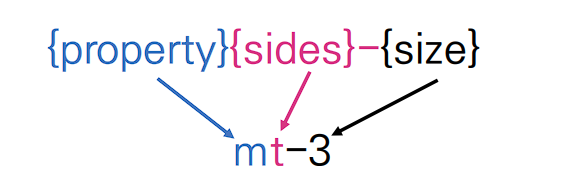

```html
<div class"mt-3 ms-5"> 
    bootstrap-spacing
</div>
```


####  ✔ `{property}`

- *Where property is one of* 
  - `m` - set margin
  - `p` - set padding


#### ✔ `{sides}`

- *Where sides is one of*
  - `t` - `margin-top` or `padding-top`
  - `b` - `margin-bottom` or `padding-bottom`
  - `s` - start set `margin-left` or `padding-left` in `LTR`, `margin-right` or `padding-right` in `RTL`
  - `e` - end set `margin-left` or `padding-left` in `LTR`, `margin-right` or `padding-right` in `RTL`
  - `x` - set both `*-left ` and `*-right`
  - `y` - set both `*-top` and `*-bottom`
  - `blank` - set a `margin` or `padding` on all `4sides` of the element


#### ✔ `{size}`

- *Where size is one of*
  - `0` - `margin` or `padding` by setting it to `0`
  - `1` - `margin` or `padding` to `$spacer *  .25`
  - `2` - `margin` or `padding` to `$spacer *  .5`
  - `3` - `margin` or `padding` to `$spacer`
  - `4` - `margin` or `padding` to `$spacer *  1.5`
  - `5` - `margin` or `padding` to `$spacer *  3`
  - `auto` - set `margin` to `auto `


#### ✔ 정리

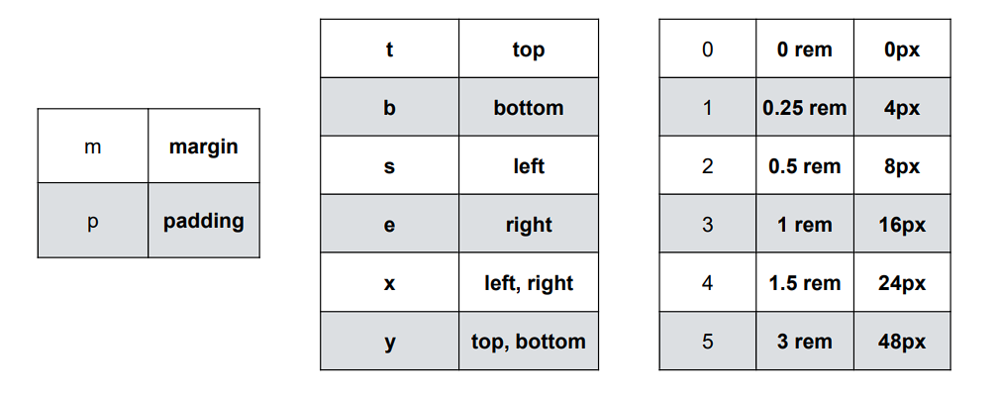

## Layout 🖥

### Breakpoints 📱

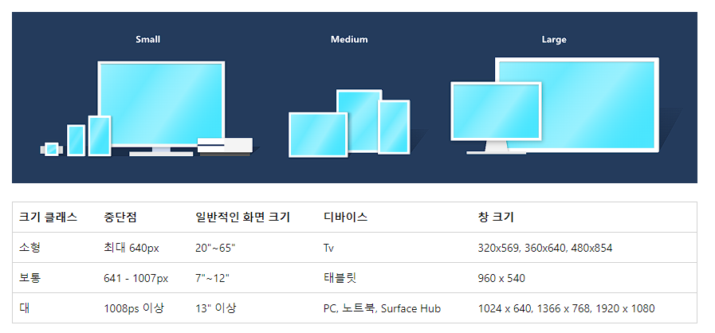

반응형 설계의 기본 요소

#### ✔ 특징

- 레이아웃을 특정 뷰포트 또는 장치 크기에 맞게 조정
- 미디어 쿼리를 사용


#### ✔ 장점 

- 모바일 우선, 반응형 디자인
- CSS 최적화
- 렌더링 시간을 개선
- 방문자의 편의 증대


## Content 📑

### Reboot ⚙

요소를 간단하고 우아하게 만들어준다.


#### ✔ Headings and paragraphs

- 모든 `Headings` 요소(예: `<h1>` 및 `<p>`)는 여백 상단이 제거되도록 재설정된다.
- `margin-bottom: 0.5rem,` 문단 `margin-bottom`: `1rem` 이 추가되어 간격을 쉽게 만들어준다.


#### ✔ Horizontal rules

- 브라우저 기본값과 유사하게 단순화

- 기본 불투명도 25를 가진다.

- 부모를 통해 색상이 설정되는 경우를 포함하여 자동으로 경계 색상을 상속한다.

- 텍스트, 테두리 및 불투명도는 수정할 수 있다.

  ```html
  <hr>
  
  <div class="text-success">
    <hr>
  </div>
  
  <hr class="border border-danger border-2 opacity-50">
  <hr class="border border-primary border-3 opacity-75">
  ```

  

#### ✔ Lists

- 모든 `List`의 `margin-top` 제거
- `margin-bottom` : `1rem`
- 중첩된 목록에는 `margin-bottom`이 없다
- `ul` 및 `ol` 요소의 `padding-left` 재설정


#### ✔ Table

- 표 스타일에 맞게 조정

  ```html
  <table>
    <caption>
      This is an example table, and this is its caption to describe the contents.
    </caption>
    <thead>
      <tr>
        <th>Table heading</th>
        <th>Table heading</th>
        <th>Table heading</th>
        <th>Table heading</th>
      </tr>
    </thead>
    <tbody>
      <tr>
        <td>Table cell</td>
        <td>Table cell</td>
        <td>Table cell</td>
        <td>Table cell</td>
      </tr>
      <tr>
        <td>Table cell</td>
        <td>Table cell</td>
        <td>Table cell</td>
        <td>Table cell</td>
      </tr>
      <tr>
        <td>Table cell</td>
        <td>Table cell</td>
        <td>Table cell</td>
        <td>Table cell</td>
      </tr>
    </tbody>
  </table>
  ```


### Typography 📰

- 제목의 글꼴 스타일링을 일치시키려 하지만 관련 HTML 요소를 사용할 수 없는 경우 .h1에서 .h6 클래스도 사용할 수 있다.

  

#### ✔ Customizing headings

  ```html
  <h3>
    Fancy display heading
    <small class="text-muted">With faded secondary text</small>
  </h3>
  ```


#### ✔ Display headings

```html
<h1 class="display-1">Display 1</h1>
<h1 class="display-2">Display 2</h1>
<h1 class="display-3">Display 3</h1>
<h1 class="display-4">Display 4</h1>
<h1 class="display-5">Display 5</h1>
<h1 class="display-6">Display 6</h1>

<!-- 사이즈 >
$display-font-sizes: (
  1: 5rem,
  2: 4.5rem,
  3: 4rem,
  4: 3.5rem,
  5: 3rem,
  6: 2.5rem
);

$display-font-family: null;
$display-font-style:  null;
$display-font-weight: 300;
$display-line-height: $headings-line-height;
```


#### ✔ Lead

```html
<p class="lead">
  This is a lead paragraph. It stands out from regular paragraphs.
</p>
```


#### ✔ Inline text elements

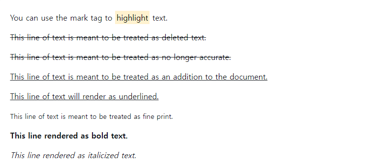

```html
<p>You can use the mark tag to <mark>highlight</mark> text.</p>

<p><del>This line of text is meant to be treated as deleted text.</del></p>

<p><s>This line of text is meant to be treated as no longer accurate.</s></p>

<p><ins>This line of text is meant to be treated as an addition to the document.</ins></p>

<p><u>This line of text will render as underlined.</u></p>

<p><small>This line of text is meant to be treated as fine print.</small></p>

<p><strong>This line rendered as bold text.</strong></p>

<p><em>This line rendered as italicized text.</em></p>
```


#### ✔ Blockquotes

```html
<blockquote class="blockquote">
  <p>A well-known quote, contained in a blockquote element.</p>
</blockquote>
```


### image 🖼


#### ✔ 반응형 이미지

- 자동으로 크기 조정

```html

```


#### ✔ 이미지 썸네일

- `.img-thumbnail`하여 이미지에 둥근 1px 테두리를 부여할 수 있다.

```html

```


#### ✔ 이미지 정렬

```html
  


<div class="text-center">
  
</div>
```


### Table style 🎨

https://getbootstrap.com/docs/5.2/content/tables/


### Figure 🏷

- 선택적 캡션이 있는 이미지와 같은 콘텐츠를 표시해야 할 때마다 `<figure>`

- `.figure`, `.figure-img`및 `.figure-caption`클래스를 사용하여 HTML5 `<figure>`및 `<figcaption>`요소에 대한 몇 가지 기본 스타일을 제공

- 그림의 이미지에는 명시적인 크기가 없으므로 반응형으로 만들려면 `.img-fluid`클래스를 클래스에 추가해야 한다.``

  ```html
  <figure class="figure">
    
    <figcaption class="figure-caption">A caption for the above image.</figcaption>
  </figure>
  
  
  <figure class="figure">
    
    <figcaption class="figure-caption text-end">A caption for the above image.</figcaption>
  </figure>
  ```


## Utilities 📝

### Background 🎞

의미를 더 강하게 전달

#### ✔ Background Color

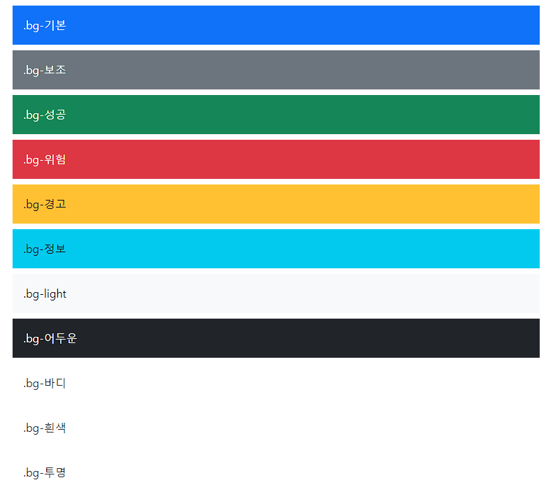

```html
<div class="p-3 mb-2 bg-primary text-white">.bg-primary</div>
<div class="p-3 mb-2 bg-secondary text-white">.bg-secondary</div>
<div class="p-3 mb-2 bg-success text-white">.bg-success</div>
<div class="p-3 mb-2 bg-danger text-white">.bg-danger</div>
<div class="p-3 mb-2 bg-warning text-dark">.bg-warning</div>
<div class="p-3 mb-2 bg-info text-dark">.bg-info</div>
<div class="p-3 mb-2 bg-light text-dark">.bg-light</div>
<div class="p-3 mb-2 bg-dark text-white">.bg-dark</div>
<div class="p-3 mb-2 bg-body text-dark">.bg-body</div>
<div class="p-3 mb-2 bg-white text-dark">.bg-white</div>
<div class="p-3 mb-2 bg-transparent text-dark">.bg-transparent</div>
```

- `.bg-gradient` 시 배경 이미지로 선형 그리디언트가 추가된다.


#### ✔ Opacity


```html
<div class="bg-success p-2 text-white">This is default success background</div>

<div class="bg-success p-2" style="--bs-bg-opacity: .5;">This is 50% opacity success background</div>
```


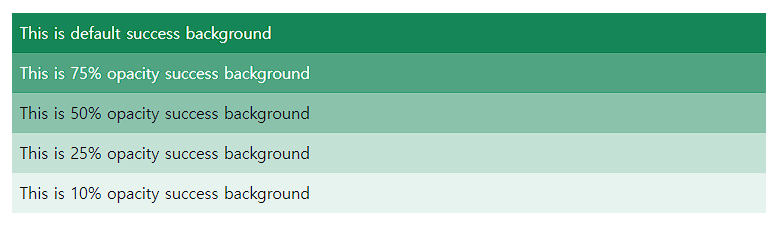

```html
<div class="bg-success p-2 text-white">This is default success background</div>

<div class="bg-success p-2 text-white bg-opacity-75">This is 75% opacity success background</div>

<div class="bg-success p-2 text-dark bg-opacity-50">This is 50% opacity success background</div>

<div class="bg-success p-2 text-dark bg-opacity-25">This is 25% opacity success background</div>

<div class="bg-success p-2 text-dark bg-opacity-10">This is 10% opacity success background</div>
```


### Borders 📋

테두리 및 데두리 반경 스타일을 지정 이미지, 버튼 또는 기타 요소에 적합하다


#### ✔ Additive

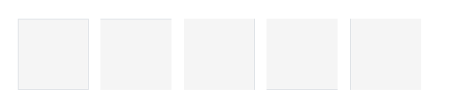

```html
<span class="border"></span>
<span class="border-top"></span>
<span class="border-end"></span>
<span class="border-bottom"></span>
<span class="border-start"></span>
```


#### ✔ Subtractive

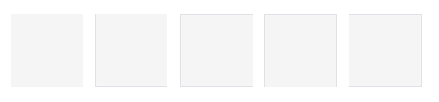

```html
<span class="border border-0"></span>
<span class="border border-top-0"></span>
<span class="border border-end-0"></span>
<span class="border border-bottom-0"></span>
<span class="border border-start-0"></span>
```


#### ✔ Color

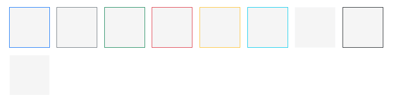

```html
<span class="border border-primary"></span>
<span class="border border-secondary"></span>
<span class="border border-success"></span>
<span class="border border-danger"></span>
<span class="border border-warning"></span>
<span class="border border-info"></span>
<span class="border border-light"></span>
<span class="border border-dark"></span>
<span class="border border-white"></span>
```


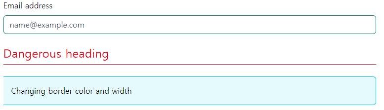

```html
<div class="mb-4">
  <label for="exampleFormControlInput1" class="form-label">Email address</label>
  <input type="email" class="form-control border-success" id="exampleFormControlInput1" placeholder="name@example.com">
</div>

<div class="h4 pb-2 mb-4 text-danger border-bottom border-danger">
  Dangerous heading
</div>

<div class="p-3 bg-info bg-opacity-10 border border-info border-start-0 rounded-end">
  Changing border color and width
</div>
```


#### ✔ Opacity

- 작동 방식

  ```css
  .border-success {
    --bs-border-opacity: 1;
    border-color: rgba(var(--bs-success-rgb), var(--bs-border-opacity)) !important;
  }
  ```

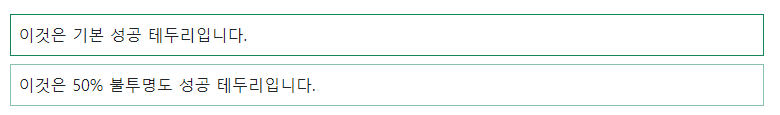

```html
<div class="border border-success p-2 mb-2">This is default success border</div>

<div class="border border-success p-2" style="--bs-border-opacity: .5;">This is 50% opacity success border</div>
```


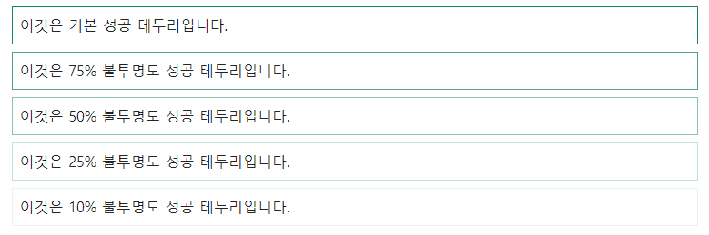

```html
<div class="border border-success p-2 mb-2">This is default success border</div>

<div class="border border-success p-2 mb-2 border-opacity-75">This is 75% opacity success border</div>

<div class="border border-success p-2 mb-2 border-opacity-50">This is 50% opacity success border</div>

<div class="border border-success p-2 mb-2 border-opacity-25">This is 25% opacity success border</div>

<div class="border border-success p-2 border-opacity-10">This is 10% opacity success border</div>
```


#### ✔ Width

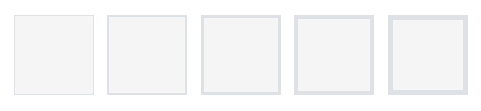

```html
<span class="border border-1"></span>
<span class="border border-2"></span>
<span class="border border-3"></span>
<span class="border border-4"></span>
<span class="border border-5"></span>
```


#### ✔ Radius

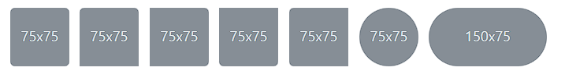

```html


```


#### ✔ Sizes 

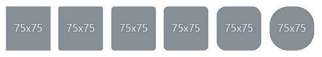

```html


```


### Display property 📲

요소의 표시 값 등을 빠르고 반응적으로 토글

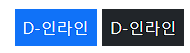

```html
<div class="d-inline p-2 text-bg-primary">d-inline</div>
<div class="d-inline p-2 text-bg-dark">d-inline</div>
```


```html
<span class="d-block p-2 text-bg-primary">d-block</span>
<span class="d-block p-2 text-bg-dark">d-block</span>
```


#### ✔ Hiding elements

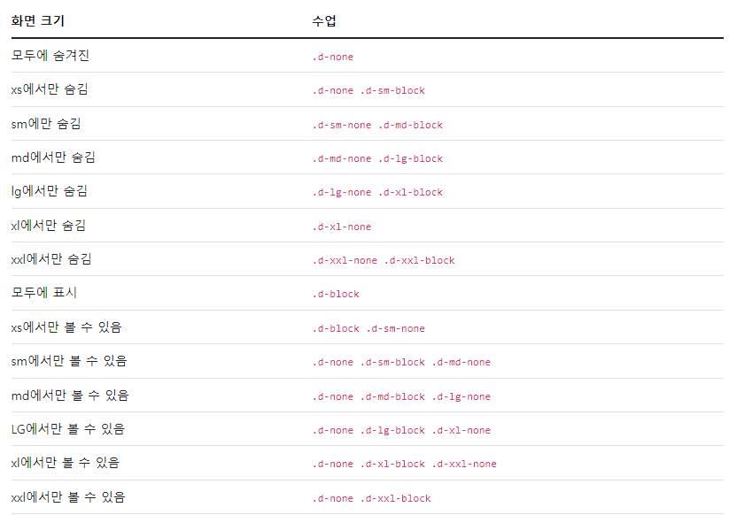

```html
<div class="d-lg-none">hide on lg and wider screens</div>
<div class="d-none d-lg-block">hide on screens smaller than lg</div>
```


#### ✔ Display in print

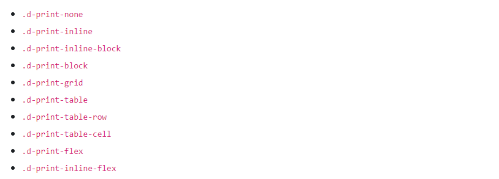

```html
<div class="d-print-none">Screen Only (Hide on print only)</div>

<div class="d-none d-print-block">Print Only (Hide on screen only)</div>

<div class="d-none d-lg-block d-print-block">Hide up to large on screen, but always show on print</div>
```


### Flex 🧩

그리드 열, 탐색, 구성 요소 등의 레이아웃, 정렬 및 크기 조정을 신속하게 관리


#### ✔ Enable flex behaviors


```html
<div class="d-flex p-2">I'm a flexbox container!</div>
```


```html
<div class="d-inline-flex p-2">I'm an inline flexbox container!</div>
```


- `.d-flex` 변형
  - `.d-flex`
  - `.d-inline-flex`
  - `.d-sm-flex`
  - `.d-sm-inline-flex`
  - `.d-md-flex`
  - `.d-md-inline-flex`
  - `.d-lg-flex`
  - `.d-lg-inline-flex`
  - `.d-xl-flex`
  - `.d-xl-inline-flex`
  - `.d-xxl-flex`
  - `.d-xxl-inline-flex`


#### ✔ Direction

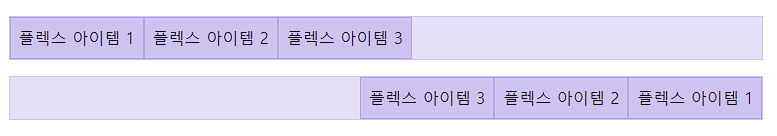

```html
<div class="d-flex flex-row mb-3">
  <div class="p-2">Flex item 1</div>
  <div class="p-2">Flex item 2</div>
  <div class="p-2">Flex item 3</div>
</div>
<div class="d-flex flex-row-reverse">
  <div class="p-2">Flex item 1</div>
  <div class="p-2">Flex item 2</div>
  <div class="p-2">Flex item 3</div>
</div>
```

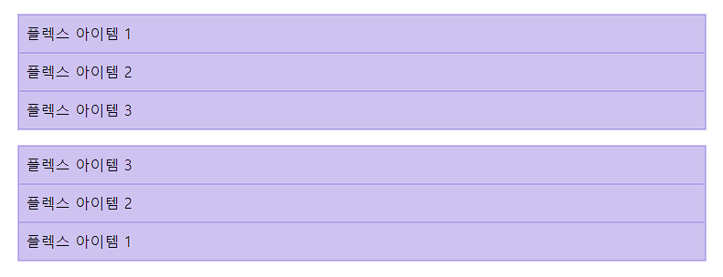

```html
<div class="d-flex flex-column mb-3">
  <div class="p-2">Flex item 1</div>
  <div class="p-2">Flex item 2</div>
  <div class="p-2">Flex item 3</div>
</div>
<div class="d-flex flex-column-reverse">
  <div class="p-2">Flex item 1</div>
  <div class="p-2">Flex item 2</div>
  <div class="p-2">Flex item 3</div>
</div>
```


#### ✔ Justify content


```html
<div class="d-flex justify-content-start">...</div>
<div class="d-flex justify-content-end">...</div>
<div class="d-flex justify-content-center">...</div>
<div class="d-flex justify-content-between">...</div>
<div class="d-flex justify-content-around">...</div>
<div class="d-flex justify-content-evenly">...</div>
```


#### ✔ Align items

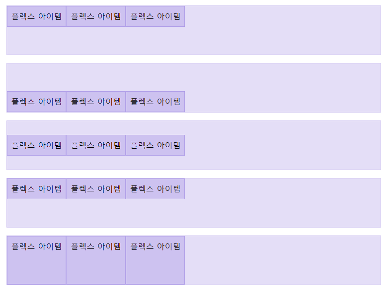

```html
<div class="d-flex align-items-start">...</div>
<div class="d-flex align-items-end">...</div>
<div class="d-flex align-items-center">...</div>
<div class="d-flex align-items-baseline">...</div>
<div class="d-flex align-items-stretch">...</div>
```


#### ✔ Align self

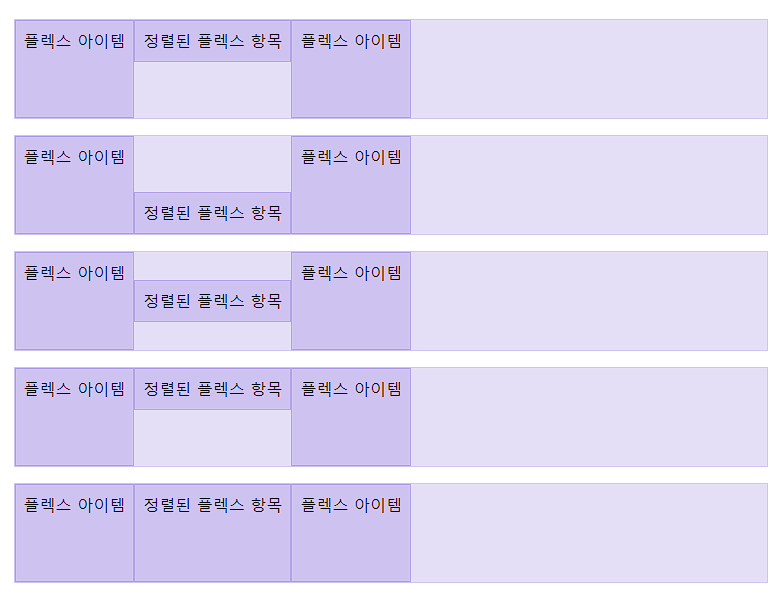

```html
<div class="align-self-start">Aligned flex item</div>
<div class="align-self-end">Aligned flex item</div>
<div class="align-self-center">Aligned flex item</div>
<div class="align-self-baseline">Aligned flex item</div>
<div class="align-self-stretch">Aligned flex item</div>
```


#### ✔ Fill

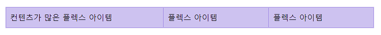

```html
<div class="d-flex">
  <div class="p-2 flex-fill">Flex item with a lot of content</div>
  <div class="p-2 flex-fill">Flex item</div>
  <div class="p-2 flex-fill">Flex item</div>
</div>
```


#### ✔ Grow

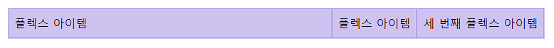

```html
<div class="d-flex">
  <div class="p-2 flex-grow-1">Flex item</div>
  <div class="p-2">Flex item</div>
  <div class="p-2">Third flex item</div>
</div>
```


####  ✔ shrink

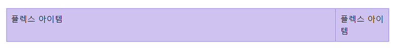

```html
<div class="d-flex">
  <div class="p-2 w-100">Flex item</div>
  <div class="p-2 flex-shrink-1">Flex item</div>
</div>
```


#### ✔ Auto margins

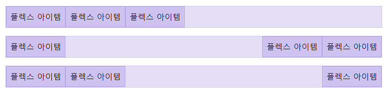

```html
<div class="d-flex mb-3">
  <div class="p-2">Flex item</div>
  <div class="p-2">Flex item</div>
  <div class="p-2">Flex item</div>
</div>

<div class="d-flex mb-3">
  <div class="me-auto p-2">Flex item</div>
  <div class="p-2">Flex item</div>
  <div class="p-2">Flex item</div>
</div>

<div class="d-flex mb-3">
  <div class="p-2">Flex item</div>
  <div class="p-2">Flex item</div>
  <div class="ms-auto p-2">Flex item</div>
</div>
```


#### ✔ With align-items 

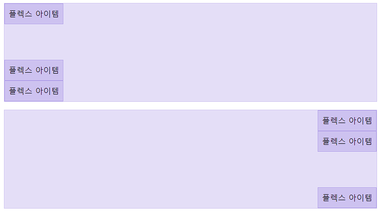

```html
<div class="d-flex align-items-start flex-column mb-3" style="height: 200px;">
  <div class="mb-auto p-2">Flex item</div>
  <div class="p-2">Flex item</div>
  <div class="p-2">Flex item</div>
</div>

<div class="d-flex align-items-end flex-column mb-3" style="height: 200px;">
  <div class="p-2">Flex item</div>
  <div class="p-2">Flex item</div>
  <div class="mt-auto p-2">Flex item</div>
</div>
```


#### ✔ Wrap

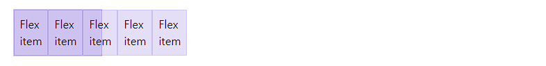

```html
<div class="d-flex flex-nowrap">
  ...
</div>
```

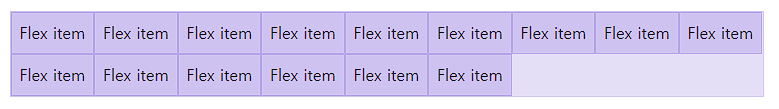

```html
<div class="d-flex flex-wrap">
  ...
</div>
```

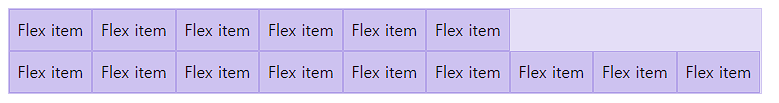

```html
<div class="d-flex flex-wrap-reverse">
  ...
</div>
```


#### ✔ Order

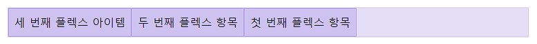

```html
<div class="d-flex flex-nowrap">
  <div class="order-3 p-2">First flex item</div>
  <div class="order-2 p-2">Second flex item</div>
  <div class="order-1 p-2">Third flex item</div>
</div>
```


#### ✔ Align content

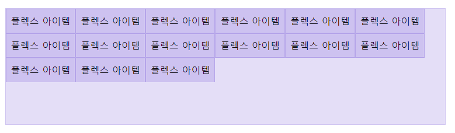

```html
<div class="d-flex align-content-start flex-wrap">
  ...
</div>
```

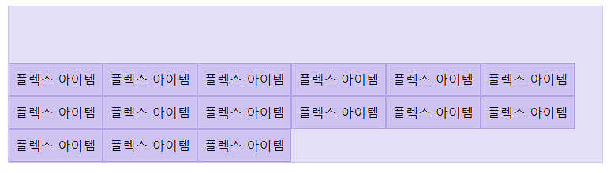

```html
<div class="d-flex align-content-end flex-wrap">...</div>
```

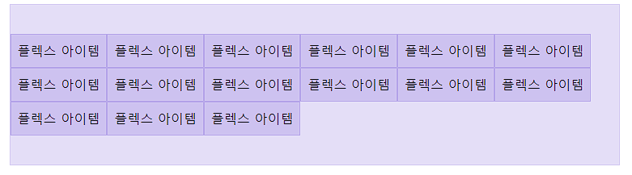

```html
<div class="d-flex align-content-center flex-wrap">...</div>
```

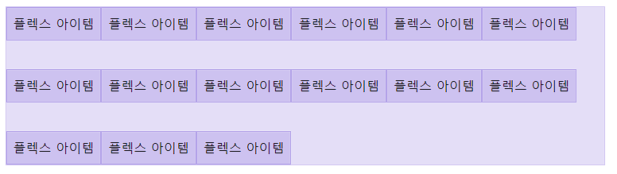

```html
<div class="d-flex align-content-between flex-wrap">...</div>
```

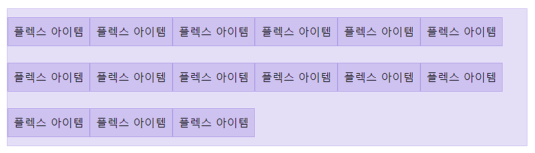

```html
<div class="d-flex align-content-around flex-wrap">...</div>
```

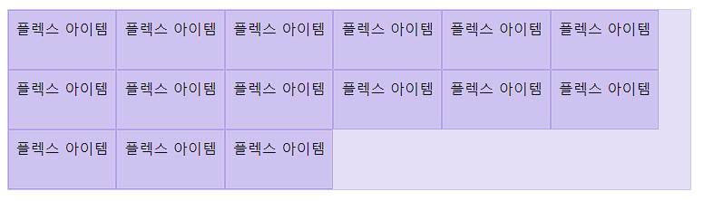

```html
<div class="d-flex align-content-stretch flex-wrap">...</div>
```


#### ✔ Media object

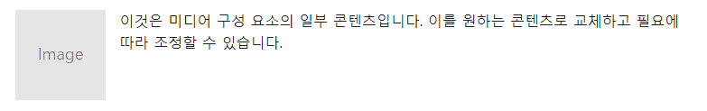

```html
<div class="d-flex">
  <div class="flex-shrink-0">
    
  </div>
  <div class="flex-grow-1 ms-3">
    This is some content from a media component. You can replace this with any content and adjust it as needed.
  </div>
</div>
```

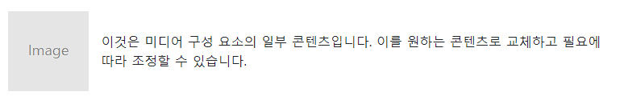

```html
<div class="d-flex align-items-center">
  <div class="flex-shrink-0">
    
  </div>
  <div class="flex-grow-1 ms-3">
    This is some content from a media component. You can replace this with any content and adjust it as needed.
  </div>
</div>
```