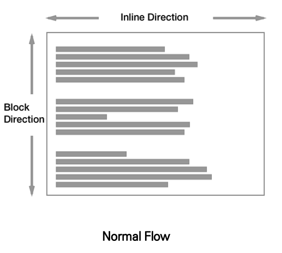
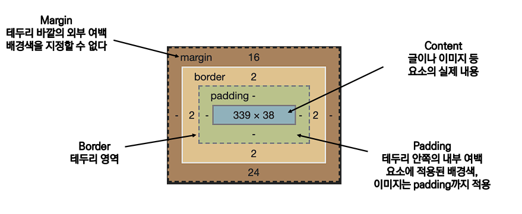
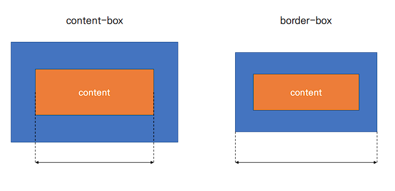
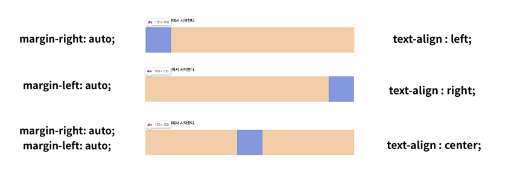

#  CSS Box Model 📦

- ### 모든 요소는 네모 (box model)이다 

- ### 위에서부터 아래로, 왼쪽에서 오른쪽으로 쌓인다.

  

- 하나의 박스는 네 부분으로 이루어진다

- 시계 방향으로 간격을 조정할 수 있다.

  ```css
  .margin-4{
      margin: 10px 20px 30px 40px
  }
  ```

  - **margin**
  - **border**
  - **padding**
  - **content**

  


## box-sizing 📏

- 기본적으로 모든 요소의 `box-sizing`은 `content-box`

  - `padding`을 제외한 순수 `contents` 영역만을 `box`로 지정

- 다만, 우리가 일반적으로 영역을 볼 때는 `border`까지의 너비를 `100px`보는 것을 원함

  - 그 경우 `box-sizing`을`border-box`로 설정

  

## CSS Display 🖥

- `display`에 따라 크기와 배치가 달라진다.

- 대표적으로 활용되는` display`

  -  `display : block`

    - **줄 바꿈이 일어나는 요소**
    - 화면 크기 **전체의 가로 폭을 차지한다.**
    - **블록 레벨 요소 안에 인라인 레벨 요소가 들어갈 수 있음.**

    

  - `display : inline`

    - 줄 바꿈이 일어나지 않는 행의 일부 요소
    - ⭐ `content`너비만큼 가로 폭을 차지한다. ⭐
    - `width`, `height`, `margin-top`, `margin-bottom`을 지정할 수 없다.
    - 상하 여백은` line-height`로 지정한다.
    
    
    
  - `display : inline-block`

    -  `block`과 `inline` 레벨 요소의 특징을 모두 가짐
    -  ⭐ `inline`처럼 한 줄에 표시할 수 있고, `block`처럼 `width`, `height`, `margin` 속성을 모두 지정할 수 있음 ⭐ 

    

  - `display: none`

    -  해당 요소를 화면에 표시하지 않고, 공간조차 부여되지 않음
    -  이와 비슷한 `visibility: hidden`은 해당 요소가 공간은 차지하나 화면에 표시만 하지 않는다.

  

- 블록 레벨 요소와 인라인 레벨 요소

  - 블록 레벨 요소와 인라인 레벨 요소 구분 (HTML 4.1까지)
  - 대표적인 블록 레벨 요소
    - **`div`** / `ul`, `ol`, `li` / `p` / `hr` / `form` 등
  - 대표적인 인라인 레벨 요소
    - **`span`** / `a` / `img` / `input`, `label` / `b`, `em`, `i`, `strong` 등

  

  
  
  
  
  

## block ✔

- block의 기본 너비는 가질 수 있는 너비의 100%

- 너비를 가질 수 없다면 margin이 자동으로 부여된다.


## inline ✔

- inline의 기본 너비는 컨텐츠 영역만큼 차지한다.


## 속성에 따른 수평 정렬 ⚙




  