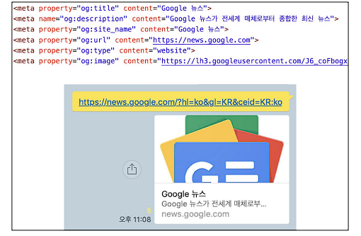
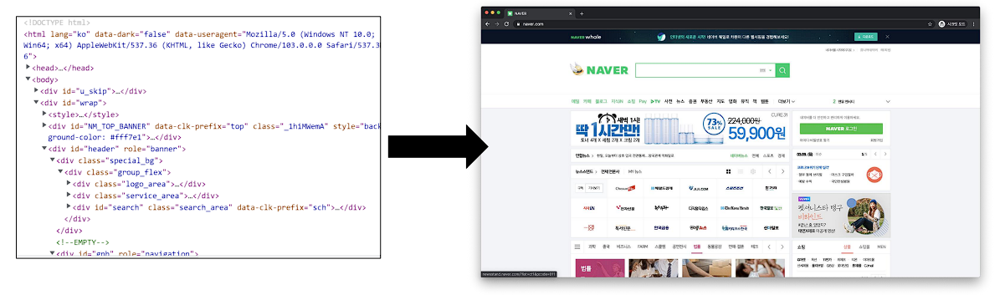
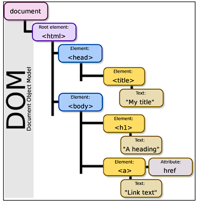
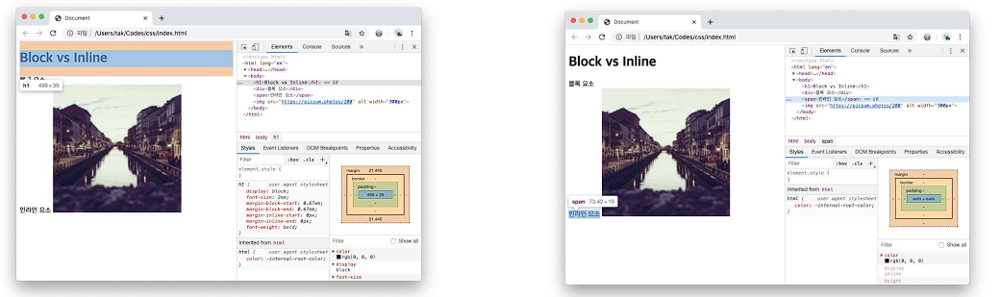
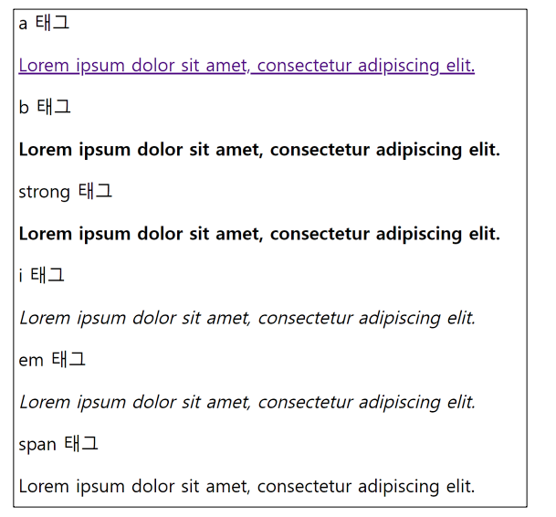
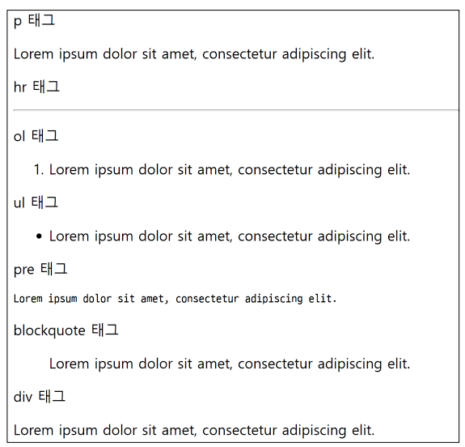

# HTML 기초 🌱

### *Hyper Text Markup Language*

### 웹 페이지를 작성(구조화)하기 위한 언어! 📝


## Hyper Text 🔎

**참조(Hyper Text)를 통해 사용자가 한 문서에서 다른 문서로 즉시 접근 📥 할 수 있는 텍스트**


## Markup Lanuage 🔎  

**태그 등을 이용하여 문서나 데이터의 구조를 명시하는 언어**

- 대표적인 예 : `HTML` , `Markdown`

  ```html
  <!DOCTYPE html>
  <html lang="en">
  <head>
      <meta charset="UTF-8">
      <title>Hello, HTML</title>
  </head>
  <body>
  </body>
  </html>
  ```


## Markup Example 💡

**예시를 보고 코드가 어떻게 짜여져 있나 생각해보자.**


- #### 우리가 보는 구조 👨‍👩‍👧‍👦

# HTML

HTML이란 Hyper Text Markup Language 의 약자이다.

## Hyper Text.

Hyper Text 란 기존의 선형적인 텍스트가 아닌 비 선형적으로 이루어진 텍스트를 의미하며, 이는 인터넷의 등장과 함께 대두되었다. 기본적 으로 Hyper Link를 통해 텍스트를 이동한다.

본문 : 이러한 Hyper Text 는 인간이 기억하는 방식까지 바꾸고 있는데 이를 컬럼비아대 벳시 스패로 교수팀은 구글 효과(Google Effect) 라 고 이름붙이고,해당 연구를 ‘사이언스’ 지에 게재하였다.

## 구글 효과(Google Effect).

구글 효과란...


- #### 쓰여진 코드 🔎

```html
<h1>HTML</h1>
<p>HTML이란 Hyper Text Markup Language 의 약자이다.</p>

<h2>Hyper Text.</h2>
<p>Hyper Text 란 기존의 선형적인 텍스트가 아닌 비 선형적으로 이루어진 텍스트를 의미하며, 이는 인터넷의 등장과 함께 대두되었다. 기본적
으로 Hyper Link를 통해 텍스트를 이동한다.</p>
<p>본문 : 이러한 Hyper Text 는 인간이 기억하는 방식까지 바꾸고 있는데 이를 컬럼비아대 벳시 스패로 교수팀은 구글 효과(Google Effect) 라
고 이름붙이고,해당 연구를 ‘사이언스’ 지에 게재하였다.</p>

<h2>구글 효과(Google Effect).</h2>
<p>구글 효과란...</p>

```


## HTML 스타일 가이드 💡

```html
<body>
    <h1> 웹문서 </h1>
    <ul>
        <li>HTML</li>
        <li>CSS</li>
    </ul>
</body>
```


## HTML 기본 구조 🗃

- `html` : 문서의 최상위(root) 요소 
- `head` : 문서 메타데이터 요소
  - **문서 제목, 인코딩, 스타일, 외부 파일 로딩 등**
  - **일반적으로 웹 브라우저에 나타나지 않는 내용**
- `body` : 문서 본문 요소
  - 실제 화면 구성과 관련된 내용

```html
<!DOCTYPE html>
<html lang="en">
<head>
    <meta charset="UTF-8">
    <title>Hello, HTML</title>
</head>
<body>
</body>
</html>
```


- **`<title> ` : 브라우저 상단 타이틀**
- **`<meta>` : 문서 레벨 메타데이터 요소**
- **`<link>` : 외부 리소스 연결 요소 (CSS 파일, favicon 등)**
- **`<script>` : 스크립트 요소 (Javascript 파일 / 코드)**
- **`<style>` : CSS 직접 작성**


- #### head 예시 💡

  ```html
  <head>
      <title>HTML 수업</title>
      <meta charset="UTF-8">
      <link href="style.css" rel="stylesheet">
      <script src="javascript.js"></script>
      <style>
      p {
      color: black;
      }
  </style>
  ```


- #### Open Graph Protocol 🔎

  - 메타 데이터를 표현하는 새로운 규약

  - HTML 문서의 메타 데이터를 통해 문서의 정보를 전달

  - 메타정보에 해당하는 제목, 설명 등을 쓸 수 있도록 정의

    


## HTML 기초문법 📖

### ✔ 요소(element) 

- **HTML의 요소는 태그와 내용(contents)로 구성되어 있다**
  - `<h1> contents </h1>`
  - `(여는/시작)태그` `[내용]` `(닫는/종료)태그`

- HTML 요소는 시작 태그와 종료 태그 그리고 태그 사이에 위치한 내용으로 구성
- 요소는 태그로 컨텐츠(내용)를 감싸는 것으로 그 정보의 성격과 의미를 정의 
- 내용이 없는 태그들도 존재(닫는 태그가 없음) 
  - `br`, `hr`, `img`, `input`, `link`, `meta`


- 요소는 중첩(nested)될 수 있음
- 요소의 중첩을 통해 하나의 문서를 구조화 
- 여는 태그와 닫는 태그의 쌍을 잘 확인해야함 ⭐
  - 오류를 반환하는 것이 아닌 그냥 레이아웃이 깨진 상태로 출력되기 때문에, 디버깅이 힘들어 질 수 있음


### ✔ 속성(attribute)

- 태그별로 사용할 수 있는 속성은 다르다.
- `<a href="https://google.com"></a>`
  - 속성 작성 방식 통일하기
  - `=` 옆에 공백을 두지 않는다.
  - `" "` 쌍따옴표를 사용한다.


- 속성을 통해 태그의 부가적인 정보를 설정할 수 있음 
- 요소는 속성을 가질 수 있으며, 경로나 크기와 같은 추가적인 정보를 제공 
- 요소의 시작 태그에 작성하며 보통 이름과 값이 하나의 쌍으로 존재 
- 태그와 상관없이 사용 가능한 속성*(HTML Global Attribute)*들도 있음


### ✔ HTML Global Attribute

- **모든 HTML 요소가 공통으로 사용할 수 있는 대표적인 속성 (몇몇 요소에는 아무 효과가 없을 수 있음)**
  - ⭐ `id` : 문서 전체에서 유일한 고유 식별자 지정
  - ⭐ `class` : 공백으로 구분된 해당 요소의 클래스의 목록 (CSS, JS에서 요소를 선택하거나 접근)
  - `data-*` : 페이지에 개인 사용자 정의 데이터를 저장하기 위해 사용
  - ⭐ `style` : inline 스타일
  - `title` : 요소에 대한 추가 정보 지정
  - `tabindex` : 요소의 탭 순서


### HTML / CSS 작성한 코드가 어떻게 웹사이트가 되는 걸까 💡

- #### 렌더링(*Rendering*) 
  
  - 웹사이트 코드를 사용자가 보게 되는 웹 사이트로 바꾸는 과정

    
  
  
  
- #### DOM(*Document Object Model*) 트리 🔎

  - 텍스트 파일인 HTML 문서를 브라우저에서 렌더링 하기 위한 구조 

  - HTML 문서에 대한 모델을 구성함

  - HTML 문서 내의 각 요소에 접근 / 수정에 필요한 프로퍼티와 메서드를 제공함

    

  

### 인라인 / 블록 요소 🔎

- HTML 요소는 크게 인라인 / 블록 요소로 나눈다.

- 인라인 요소는 글자처럼 취급 

- 블록 요소는 한 줄 모두 사용

  


## 텍스트 요소 📝

| 태그            | 설명                                                         |
| --------------- | ------------------------------------------------------------ |
| `<a></a>`       | href 속성을 활용하여 다른 URL로 연결하는 하이퍼링크 생성     |
| `<b></b>`       | 굵은 글씨 요소 <br />중요한 강조하고자 하는 요소 (보통 긁은 글씨로 표현) |
| `<i></i>`       | 기울임 글씨 요소 <br />중요한 강조하고자 하는 요소 (보통 기울임 글씨로 표현) |
| `<br>`          | 텍스트 내에 줄 바꿈 생성                                     |
| ``         | src 속성을 활용하여 이미지 표현, <br />alt 속성을 활용하여 대체 텍스트 |
| `<span></span>` | 의미 없는 인라인 컨테이너                                    |




## 그룹 컨텐츠 📝

| 태그                                | 설명                                                         |
| ----------------------------------- | ------------------------------------------------------------ |
| `<p></p>`                           | 하나의 문단 (paragraph)                                      |
| `<hr>`                              | 문단 레벨 요소에서의 주제의 분리를 의미하며<br />수평선으로 표현됨 (A Horizontal Rule) |
| `<ol></ol>`<br />`<ul></ul>`        | 순서가 있는 리스트 (ordered) <br />순서가 없는 리스트 (unordered) |
| `<pre></pre>`                       | HTML에 작성한 내용을 그대로 표현. <br />보통 고정폭 글꼴이 사용되고 공백문자를 유지 |
| `<blockquote>`<br />`</blockquote>` | 텍스트가 긴 인용문 <br />주로 들여쓰기를 한 것으로 표현됨    |
| `<div></div>`                       | 의미 없는 블록 레벨 컨테이너                                 |

