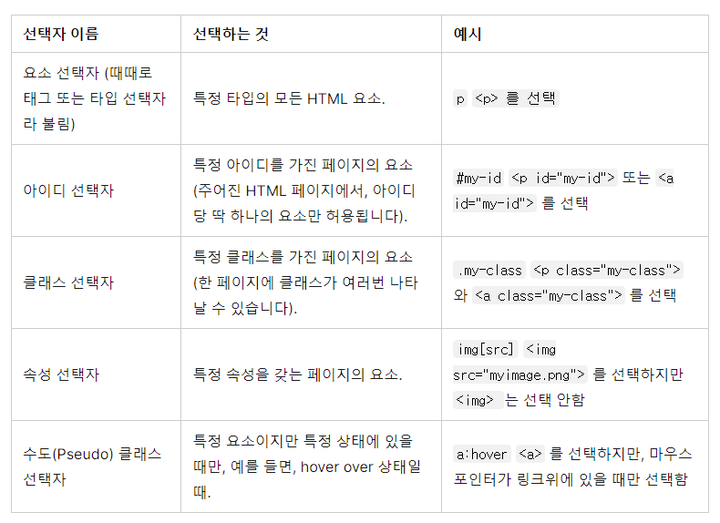

# MDN 문서


## HTML

웹을 이루는 가장 기초적인 구성 요소

웹 콘텐츠의 의미와 구조를 정의할 때 사용한다.


마크업 요소를 사용해 웹을 표현한다. 또한, 태그를 사용해 문서의 다른 텍스트와 구분함

예시 :  `<` , `>`  태그 안에 요소를 넣어서 사용한다.

``` html
<여는요소>문장</닫는요소>
```


요소를 중첩할 때 요소들이 적절히 열고 닫혔는지 꼭 확인해야한다.

`` 등과 같은 요소는 닫는 요소가 존재하지 않는 빈 요소이다.


`<!DOCTYPE html>`

- 모든 것이 올바르게 동작하게 하기 위한 자동 오류 확인 용도

`<html></html>`

- 페이지 전체의 컨텐츠를 감싸는 루트 요소

`<head></head>`

- head의 내용은 페이지에 표시되지 않는다.

- metadata를 포함한다

  ```html
  <head>
    <meta charset="utf-8">
    <title>My test page</title>
  </head>
  ```

`<body></body>`

- 웹 방문자에게 보여지는 컨텐츠

`<meta charset="utf-8">`

- 문서가 사용해야 할 문자 집합을 utf-8로 설정
- 전 세계적인 character 집합 많은 언어와 문자들을 포함


`<meta name="text" content = "text">`

  - 메타 요소가 name과 content 속성을 가진다.
    - `name` 
      - 메타 요소가 어떤 정보의 형태를 띄고 있는지
    - content
      - 실제 메타데이터의 컨텐츠
  -  검색엔진에서 이 페이지가 더 많이 표시 될 가능성이 생기게 할 수 있다


`<title></title>`

- 컨텐츠 제목을 표현해주는 요소
- `<h1></h1>` 과 헷갈릴 수 있지만 전혀 다르다. 
  - HTML 문서 전체의 타이틀을 표현하기 위한 메타데이터


### img

```html

```

- 이미지를 끼워 넣는다, src 속성을 통해 이미지 파일의 경로를 집어넣는다.
- alt 속성을 통해 이미지를 설명하는 문자를 넣는다.


### 문자 나타내기

#### 제목

`<h1></h1>`

- h1~h6까지 존재한다. 제목 또는 하위 제목임을 구체화 할 수 있다.

- 주로 3~4를 사용한다.


#### 문단

`<p></p>`

- 문자의 문단을 포함하기 위해 사용
- 일반적인 문자를 표현할 때에 사용한다


#### 목록

`<ul></ul>` 

- 순서가 없는 목록

`<ol></ol>`

- 순서가 있는 목록


#### ⭐ 연결

웹을 웹으로 존재하게 만들어주기 위한 아주 중요한 요소

`<a></a>`

- anchor 
- 문장 안의 어떤 단어를 링크로 만들기 위해 사용

```html
<a href="https://www.mozilla.org/en-US/about/manifesto/">Mozilla Manifesto</a>
```

- 문자를 링크로 표현한다.

- ***h**ypertext **ref**erence* 같이 기억하면 href 라는 속성 이름을 편하게 기억할 수 있다.


### HTML TIP 💡

[HTML 요소 참고서](https://developer.mozilla.org/ko/docs/Web/HTML/Element)

[HTML 특성 참고서](https://developer.mozilla.org/ko/docs/Web/HTML/Attributes)


### HTML 전역 특성

[HTML 전역 특성](https://developer.mozilla.org/ko/docs/Web/HTML/Global_attributes)

#### 주로 알아볼 특성

- `class`
  - 공백으로 구분된 해당 요소의 클래스 목록
- `id`
  - 문서 전체에서 유일한 식별자(id) 링크, 스크립트 스타일 적용시 요소를 식별할 때에 사용한다.
- `style`
  - 요소에 적용할 CSS 스타일 선언을 담는다.
  - 스타일은 별도 파일에 정의하는 것이 추천하는 방식임을 유의
  - 테스트 등을 위한 빠른 스타일링이 주 용도


## CSS

- HTML이나 XML 등으로 작성된 문서의 표시 방법을 기술하기 위한 **스타일 시트** 언어다.

- HTML 문서에 있는 요소들에 선택적으로 스타일을 적용할 수 있다.


### ruleset 해부

- 선택자

  - HTML 요소 이름을 가져온다.

  - 선택자의 여러 종류

    

  

- 선언

  - `color : red`와 같은 단일 규칙 꾸미길 원하는 요소의 속성을 선언한다.

- 속성

  - 주어진 HTML 요소를 꾸밀 수 있는 방법  예) 선언의 `color`을 뜻함

- 속성 값

  - 주어진 속성을 위한 결과 중 하나의 값 예) `color` : 뒤에 붙는 `red`


#### 지켜야 할 사항 ⭐

- 각각의  rule set (셀렉터로 구분) 은 반드시 (`{}`) 로 감싸져야 한다.

- 각각의 선언 안에, 각 속성을 해당 값과 구분하기 위해 콜론 (`:`)을 사용해야만 한다

- 각각의 rule set 안에, 각 선언을 그 다음 선언으로부터 구분하기 위해 세미콜론 (`;`)을 사용해야만 한다.

  ```css
  p {
    color: red;
    width: 500px;
    border: 1px solid black;
  }
  ```


- 요소를 `,` 로 구분지어 모두 하나의 rule set을 적용할 수 있다.

  ```css
  p,li,h1 {
    color: red;
  }
  ```

  

### 박스의 모든 것

#### 💡 [CSS 참고서](https://developer.mozilla.org/ko/docs/Web/CSS/Reference)


#### 페이지 색 바꾸기

```css
html {
  background-color: #00539F;
}
```

- `background-color` : 배경색을 지정


#### body 외부 정렬하기

```css
body {
  width: 600px;
  margin: 0 auto;
  background-color: #FF9500;
  padding: 0 20px 20px 20px;
  border: 5px solid black;
}
```

- ` width` 
  - body가 항상 600 pixels의 너비를 갖도록 한다.
- `margin`
  - 한 속성에 두개의 값을 설정할 때 첫번째 값은 요소의 상단과 하단에 영향을 준다
  - 두 번째 값은 좌측과 우측
  - `auto`는 자동으로 수평공간에서 왼쪽과 오른쪽을 같게 나눠주는 특별한 값이다.
  - [margin](https://developer.mozilla.org/ko/docs/Web/CSS/margin#values)
- `background-color`
  - 요소의 배경 색을 지정
  - `#FF9500` 같이 지정했다.
- `padding`
  - 콘텐츠 주위에 약간의 공간을 주기 위한 네 개의 값
  - 상단 우측 하단 좌측 순서로 값을 설정 
- `border`
  - body 모든 면의 border를 5 pixels 두께의 실선으로 설정


#### 메인 페이지 제목 배치하고 꾸미기

```css
h1 {
  margin: 0;
  padding: 20px 0;
  color: #00539F;
  text-shadow: 3px 3px 1px black;
}
```

`text-shadow`

- 요소의 문자 콘텐츠에 그림자를 적용해준다.


#### 이미지 가운데 정렬

```css
img {
  display: block;
  margin: 0 auto;
}
```


- `display: block` 이미지에 `margin`을 적용하기 위해 이미지에 block-level 성질을 준다


