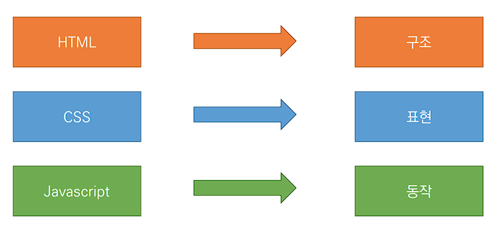

# Happy Web  🎈

- #### 웹 사이트의 구성 요소  ⛏

# 🔗 웹 사이트와 브라우저

- **웹 사이트는 브라우저를 통해 동작**
- 브라우저마다 동작이 달라 문제가 많이 발생 
- **웹 표준**이 등장
  - **표준적으로 사용되는 기술이나 규칙**
  - **어떤 브라우저든 웹 페이지가 동일하게 보이도록 한다(크로스 브라우징)**
  - *HTML Living Standard*

## ⚙ 개발 환경 설정

#### `HTML/CSS` 코드 작성을 위한 `Visual Studio Code` 추천 확장 프로그램 

- **Open in browser** 
- **Auto Rename Tag** 
- **Auto Close Tag** 
- **Intellisense for CSS class names in HTML** 
- **HTML CSS Support**

#### `크롬 웹 브라우저`에서 제공하는 개발과 관련된 다양한 기능

- 주요 기능
  - **Elements : DOM 탐색 및 CSS 확인 및 변경**
    - **Sytles : 요소에 적용된 CSS 확인**
    - Computed : 스타일이 계산된 최종 결과
    - **Event Listeners : 해당 요소에 적용된 이벤트 (JavaScript)**
  - *Sources, Network, Performance, Application, Security, Audits* 등

