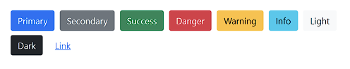
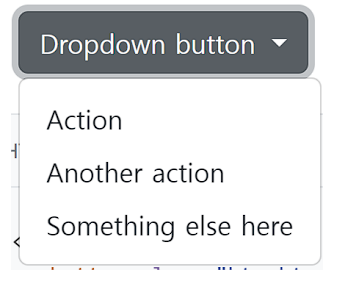
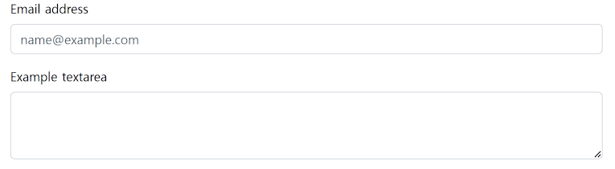
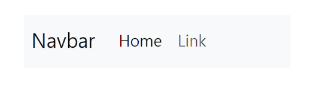
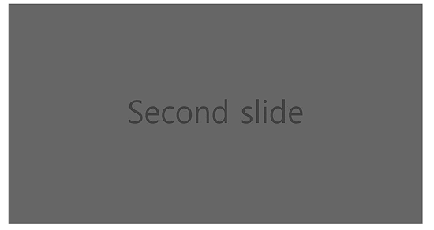
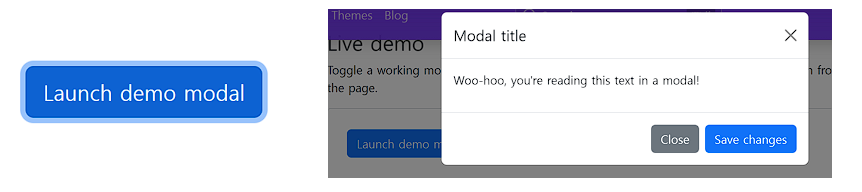

# Components 💡

- `Bootstrap`의 다양한 UI 요소를 활용할 수 있다.
- 아래 `Components` 탭 및 검색으로 원하는 UI 요소를 찾을 수 있다
- 기본 제공된 `Components`를 변환해서 활용


## 자주 사용하는 기능 🔨


### Buttons 🔘

클릭 했을 때 어떤 동작이 일어나도록 하는 요소



```html
<button type="button" class="btn btn-primary">Primary</button>
<button type="button" class="btn btn-secondary">Secondary</button>
<button type="button" class="btn btn-success">Success</button>
<button type="button" class="btn btn-danger">Danger</button>
<button type="button" class="btn btn-warning">Warning</button>
<button type="button" class="btn btn-info">Info</button>
<button type="button" class="btn btn-light">Light</button>
<button type="button" class="btn btn-dark">Dark</button>
<button type="button" class="btn btn-link">Link</button
```


### Dropdowns 📜

`dropdown`, `dropdown-menu`, `dropdown-item` 클래스를 활용해 옵션 메뉴를 만들 수 있다



```html
<div class="dropdown">
<button class="btn btn-secondary dropdown-toggle" type="button" data-bs-toggle="dropdown" ariaexpanded="false">
Dropdown button
</button>
<ul class="dropdown-menu">
<li><a class="dropdown-item" href="#">Action</a></li>
<li><a class="dropdown-item" href="#">Another action</a></li>
<li><a class="dropdown-item" href="#">Something else here</a></li>
</ul>
</div>
```


### Form > Form controls 🗨

`form-control` 클래스를 사용해  및  태그를 스타일링할 수 있다



```html
<div class="mb-3">
<label for="exampleFormControlInput1" class="form-label">Email address</label>
<input type="email" class="form-control" id="exampleFormControlInput1"
placeholder="name@example.com">
</div>

<div class="mb-3">
<label for="exampleFormControlTextarea1" class="form-label">Example textarea</label>
<textarea class="form-control" id="exampleFormControlTextarea1" rows="3"></textarea>
</div>
```


### Navber 🔎

`navbar` 클래스를 활용하면 네비게이션 바를 제작할 수 있다



```html
<nav class="navbar navbar-expand-lg bg-light">
	<div class="container-fluid">
	<a class="navbar-brand" href="#">Navbar</a>
	<button class="navbar-toggler" type="button" data-bs-toggle="collapse" data-bs-target="#navbarSupportedContent" aria-controls="navbarSupportedContent" aria-expanded="false" aria-label="Toggle navigation">
	<span class="navbar-toggler-icon"></span>
	</button>
		<div class="collapse navbar-collapse" id="navbarSupportedContent">
			<ul class="navbar-nav me-auto mb-2 mb-lg-0">
                <li class="nav-item">
                <a class="nav-link active" aria-current="page" href="#">Home</a>
                </li>
                <li class="nav-item">
                <a class="nav-link" href="#">Link</a>
				</li>
			</ul>
        </div>
	</div>
</nav>
```


### Carousel 🎞

콘텐츠(사진)을 순환시키기 위한 슬라이드쇼

- 스크립트 활용

`First slide` 👉 `Second slide` 👉 `...`  



```html
<div id="carouselExampleSlidesOnly" class="carousel slide" data-bs-ride="carousel">
    <div class="carousel-inner">
        <div class="carousel-item active">
            
        </div>
        <div class="carousel-item">
            
        </div>
        <div class="carousel-item">
            
        </div>
    </div>
</div
```


### Modal 🚧

사용자와 상호작용 하기 위해서 사용하며, 긴급 상황을 알리는 데 주로 사용한다

- 현재 열려 있는 페이지 위에 또 다른 레이어를 띄운다.
- 페이지를 이동하면 자연스럽게 사라짐(제거를 하지 않고도 배경 클릭시 사라짐 – 옵션에 따라 다름)
- Modal은 자바스크립트를 활용하며, 반드시 target과 id가 일치되어야 함.



```html
!-- Button trigger modal -->
<button type="button" class="btn btn-primary" data-bs-toggle="modal" data-bs-target="#exampleModal">
Launch demo modal
</button>

<!-- Modal -->
<div class="modal fade" id="exampleModal" tabindex="-1" aria-labelledby="exampleModalLabel" aria-hidden="true">
    <div class="modal-dialog">
        <div class="modal-content">
            <div class="modal-header">
            	<h5 class="modal-title" id="exampleModalLabel">Modal title</h5>
            	<button type="button" class="btn-close" data-bs-dismiss="modal" aria-label="Close"></button>
            </div>
            <div class="modal-body">
	            ...
            </div>
            <div class="modal-footer">
                <button type="button" class="btn btn-secondary" data-bs-dismiss="modal">Close</button>
                <button type="button" class="btn btn-primary">Save changes</button>
            </div>
        </div>
    </div>
</div>
```

