# CSS Position 📌

 **문서 상에서 요소의 위치를 지정한다.**

- #### `static` : 모든 태그의 기본 값 `(기준 위치)`
  
  - 일반적인 요소의 배치 순서에 따름 `(좌측 상단)`
  - 부모 요소 내에서 배치될 때는 부모 요소의 위치를 기준으로 배치 됨
  
  
  
- 아래는 좌표 프로퍼티(`top`, `bottom`, `left`, `right`)를 사용하여 이동 가능
  
  - ##### `relative` (상대 위치)
    
    - 💡 **자기 자신의 `static` 위치를 기준으로 이동** (`normal flow 유지`)
    - 레이아웃에서 요소가 차지하는 공간은 `static`일 때와 같음 (`normal position 대비 offset`)
    
    
    
  - ##### `absolute` (절대 위치)
    
    - 💡 **요소를 일반적인 문서 흐름에서 제거 후 레이아웃에 공간을 차지하지 않음** (`normal flow에서 벗어난다.`)
    
    
    
  - ##### `fixed` (고정 위치)
    
    - 요소를 일반적인 문서 흐름에서 제거 후 레이아웃에 공간을 차지하지 않음 (`normal flow에서 벗어난다.`)
    - 부모 요소와 관계없이 `viewport`를 기준으로 이동
      - 💡 **스크롤 시에도 항상 같은 곳에 위치한다.**
    
    
    
  - ##### `sticky` (스크롤에 따라 `static` 👉 `fixed` 변경)
    
    - 속성을 적용한 박스는 평소에 문서 안에서 `position: static` 상태와 같이 일반적인 흐름에 따르지만 **스크롤 위치가 임계점에 이르면 `position: fixed` 와 같이 박스를 화면에 고정할 수 있는 속성**
    - **일반적으로 Navigation Bar에서 사용된다** 💡


## absolute와 relative의 차이 🔎

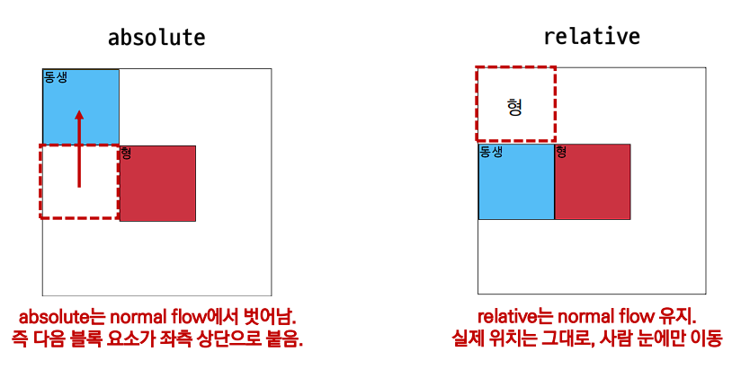


## fixed의 사용 용도 🔎

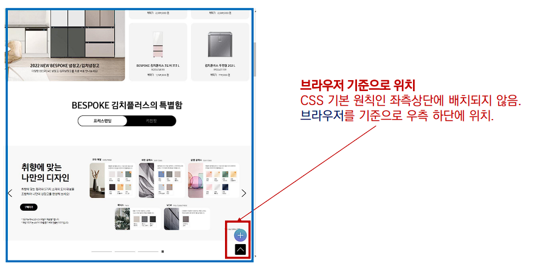


## ⭐ CSS 원칙 ⭐

- CSS 원칙 `I`, `II` : `Normal flow` 
  - #### 모든 요소는 네모(박스모델), 좌측상단에 배치 
  - ##### `display`에 따라 크기와 배치가 달라짐
- CSS 원칙 `III` 
  - ##### `position`으로 위치의 기준을 변경 
    
    - ##### `relative` : 본인의 원래 위치 
    - ##### `absolute` : 특정 부모의 위치 
    - ##### `fixed` : 화면의 위치 
    - ##### `sticky` : 기본적으로 `static`이나 스크롤 이동에 따라 `fixed`로 변경


## CSS layout 📊

- `Display`
- `Position`
- `Float` 💡
- `Flexbox` 💡
- `Grid` 💡


### Float ✔

- **박스를 왼쪽 혹은 오른쪽으로 이동시켜 텍스트를 포함 인라인 요소들이 주변을 `wrapping` 하도록 함**
- **요소**가 `Normal flow`를 벗어나도록 함


### Flexbox ✔

#### *CSS Flexible Box Layout* 📊

- ##### 행과 열 형태로 아이템을 배치하는 1차원 레이아웃 모델

- 축  

  - #### main axis

  - #### cross axis

  

- 구성 요소

  - ##### `Flex Container` (부모 요소)

    - `Flexbox` 레이아웃을 형성하는 가장 기본적인 모델

    - `Flex Item` 들이 놓여있는 영역

    - `display` 속성을 `flex` 혹은 `inline-flex`로 지정

      ```css
      .flex-container {
          display: flex;
      }
      ```

      

  - ##### `Flex Item` (자식 요소)

    - ##### 컨테이너에 속해있는 컨텐츠 (`box`)

  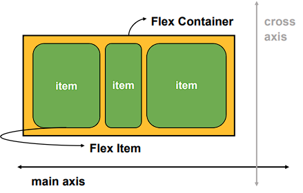


#### Flexbox의 장점 💡

⭐ (수동 값 부여 없이)

- #### 수직 정렬 
- #### 아이템의 너비와 높이 혹은 간격을 동일하게 배치


#### Flex 속성 💡

##### 배치 설정 🔎

- ##### `flex-direction`

  - `Main axis` 기준 방향 설정

  - **역방향의 경우 `HTML` 태그 선언 순서와 시각적으로 다르니 유의**

    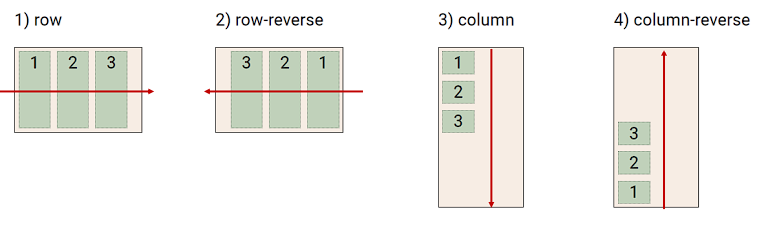

- ##### `flex-wrap`

  - **아이템이 컨테이너를 벗어나는 경우 해당 영역 내에 배치되도록 설정**

  - **즉, 기본적으로 컨테이너 영역을 벗어나지 않도록 한다.** 💡

    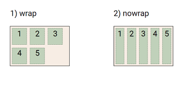

- `flex-flow`

  - `flex-direction` 과 `flex-wrap` 의 `shorthand`

  - `flex-direction`과 `flex-wrap`에 대한 설정 값을 차례로 작성

    ```css
    flex-flow: row nowrap;
    ```

    

##### 공간 나누기 🔎

- ##### `justify-content (main axis)`

  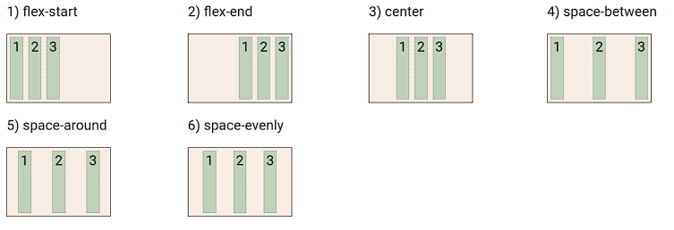

  

- ##### `align-content  (cross axis)`

  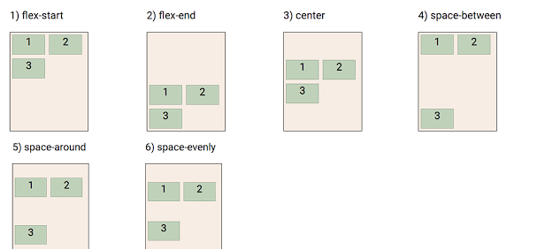

  

  - **아이템이 한 줄로 배치되는 경우 확인할 수 없다.**


##### 정렬 🔎

- ##### `align-items` (모든 아이템을 `cross axis` 기준으로)

  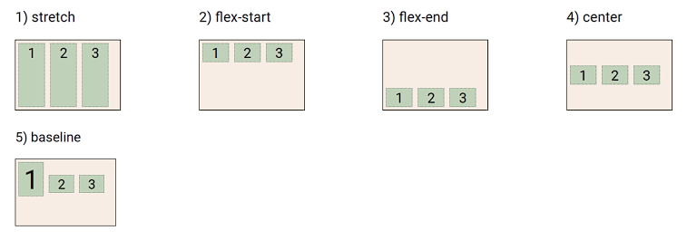

- ##### `align-self` (개별 아이템)

  - **주의! : 해당 속성은 컨테이너에 적용하는 것이 아니라 개별 아이템에 적용**

  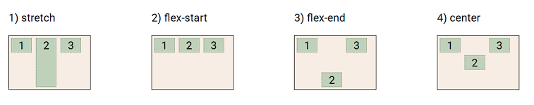


##### 기타 속성 🔎

- `flex-grow`

  - **남은 영역을 아이템에 분배**

- `order` 배치 순서

  ```html
  <div class="flex_item grow-1 order-3">1</div>
  <div class="flex_item grow-1">2</div>     \
  <div class="flex_item order-1">3</div>	   \
  <div class="flex_item order-2">4</div>		\
  ```

  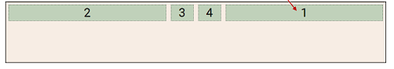


#### 활용 예 📝

##### 수직 수평 가운데 정렬  🔎

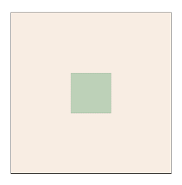

``` css
/* 방법 1
컨테이너 설정
*/

.container {
    display: flex;
    justify-content: center;
    align-items: center;
}

/* 방법 2
아이템 설정
*/

.container {
    dispaly : flex;
}
.item {
    margin: auto;
}
```


##### 카드 배치 🔎

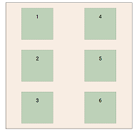

```css
#layout_03 {
    display: flex;
    flex-direction: column;
    flex-wrap: wrap;
    justify-content: space-around;
    align-content: space-around;
}
```

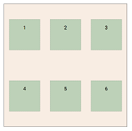

```css
#layout_03 {
    display: flex;
    flex-direction: row;
    flex-wrap: wrap;
    justify-content: space-around;
    align-content: space-around;
}
```

