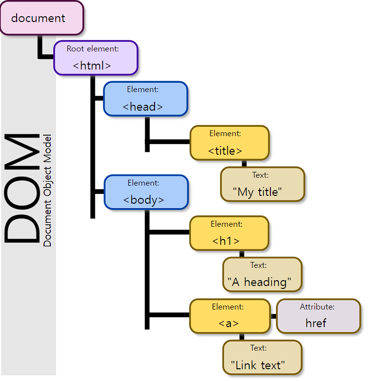
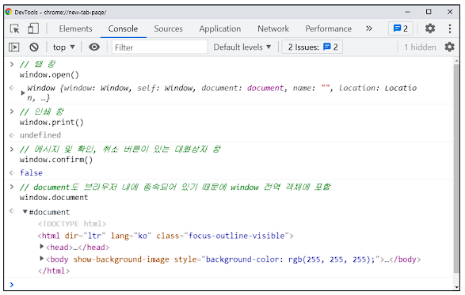
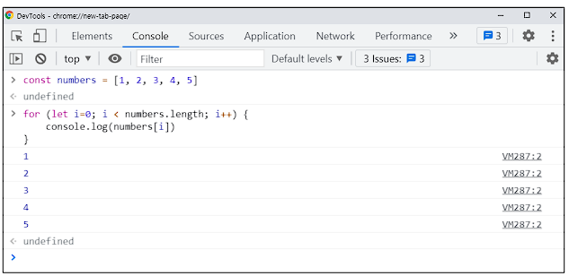
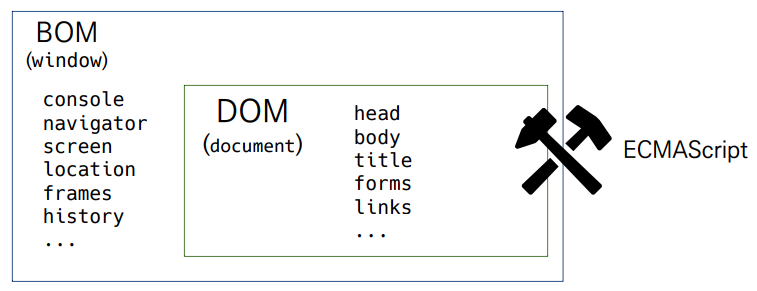

# DOM 🗃

***Document Object Model***

## 브라우저에서 할 수 있는 일 🌎

- `DOM 조작`
  - 문서(`HTML`) 조작
- `BOM 조작`
  - `navigator`, `screen`,`location`, `frames`, `history`, `XHR`
- `JavaScript Core (ECMAScript)`
  - `Data Structure(Objectm, Array)`, `Conditional Expression`, `Iteration`

## DOM ?

- `HTML`, `XML` 같은 문서를 다루기 위한 *문서 프로그래밍 인터페이스*

- **문서를 구조화한다, 각 요소는 객체로 취급**

- *논리적 트리 모델*

- 단순한 속성 접근과 메서드 활용뿐 아니라 프로그래밍 언어적 특성을 활용한 조작이 가능하다

  

- #### 주요 객체

  - `Window `
    - `DOM`을 표현하는 창,  가장 최상위 객체
  - `document`
    - 페이지 컨텐츠의 `Entry Point` 역할
    - `<body>` 등과 같은 수많은 다른 요소들을 포함
    - `navigator`, `location`, `history`, `screen`

### Parsing ✔

- 구문 분석, 해석
- **`Browser`가 문자열을 해석**하여 `DOM Tree`로 만드는 과정

## BOM ?

***Browser Object Model***

- **`JavaScript`가 `Browser`와 소통하기 위한 모델**
- `Browser`의 창이나 프레임을 추상화해서 프로그래밍적으로 제어할 수 있도록 제공하는 수단
  - 버튼, URL 입력창, 타이틀 바 등 브라우저 윈도우 및 웹 페이지 일부분을 제어 가능
  - `window` 객체는 모든 브라우저로부터 지원받으며 `Browser`의 창(`window`)를 지칭

### BOM 조작 🕹

## JavaScript Core 🔧

- *프로그래밍 언어*

  

## 정리 📝

- #### 브라우저`(BOM)` 와 그 내부의 문서`(DOM)`를 조작하기 위해 `ECMAScript(JS)`를 학습

