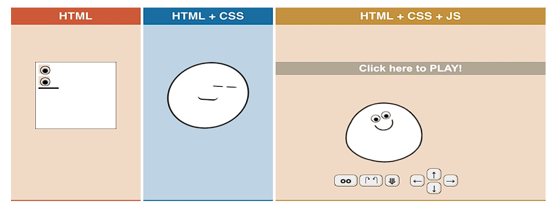

# JavaScript 🖥

- 1994년 당시 넷스케이프  *Netscape Navigator(NN)* 브라우저가 전 세계 점유율을 80% 이상 독점하며 브라우저의 표준 역할
- 당시 넷스케이프에 재직 중이던 브랜던 아이크가 `HTML`을 동적으로 동작하기 위한 회사 내부 프로젝트를 진행 중 `JS` 개발

## JavaScript의 필요성 💡

- 브라우저 화면을 **'동적'**으로 만들기 위해

- 브라우저를 조작할 수 있는 유일한 언어

  

## Browser 🌎

- `URL`로 웹을 탐색하며 서버와 통신하고, `HTML` 문서나 파일을 출력하는 `GUI` 기반의 소프트웨어
- 인터넷의 컨텐츠를 검색 및 열람하도록 함
- **'웹 브라우저'**
- 주요 브라우저
  - *Chrome, Firefox, Microsoft Edge, Opera, Safari*

## History of JavaScript 📜

### 파편화와 표준화 🔍

- 제1차 브라우저 전쟁 이후 수많은 브라우저에서 자체 자바스크립트 언어를 사용함
  - 결국 서로 다른 자바스크립트가 만들어지면서 `크로스 브라우징 이슈`가 발생
  - **웹 표준의 필요성**이 제기

- #### 크로스 브라우징

  - `W3C`에서 채택된 표준 웹 기술을 채용하여 각각의 브라우저마다 다르게 구현되는 기술을 비슷하게 제작
  - 어느 한쪽에 치우치지 않도록 웹 페이지를 제작하는 방법론 `(동일성이 아닌 동등성)`
  - 브라우저마다 렌더링에 사용하는 엔진이 다르기 때문

- #### *Vanilla JavaScript*

  - `크로스 브라우징`, 간편한 활용 등을 위해 많은 라이브러리 등장 (`jQuery` 등)
  - `ES6` 이후, 다양한 도구의 등장으로 **순수 자바스크립트 활용의 증대**

## ECMA Script 📊

### 코딩 스타일 가이드 💡

-  코딩 스타일의 핵심은 합의된 원칙과 일관성
  - 절대적인 하나의 정답은 없으며, 상황에 맞게 원칙을 정하고 일관성 있게 사용하는 것이 중요
  
- 코딩 스타일은 코드의 품질에 직결되는 중요한 요소
  - 코드의 가독성, 유지보수 
  
  - 팀원과의 커뮤니케이션 등 개발 과정 전체에 영향을 끼침
  
    
  
- 다양한 **자바스크립트 코딩 스타일 가이드**
  - [Airbnb Javascript Style Guide](https://github.com/airbnb/javascript)
  - [Google Javascript Style Guide](https://google.github.io/styleguide/jsguide.html)
  - [standardjs](https://standardjs.com/#javascript-style-guide-linter-and-formatter)