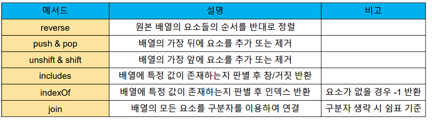
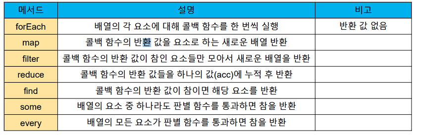
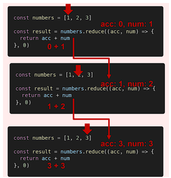

# JavaScript Arrays 📚


## 배열의 정의와 특징 📖

- 키와 속성들을 담고 있는 참조 타입의 객체(`object`) 

- **순서를 보장하는 특징이 있다.**

- **주로 대괄호를 이용하여 생성**

- 0을 포함한 양의 정수 인덱스로 특정 값에 접근 가능

- **배열의 길이는 `array.length` 형태로 접근 가능**

  - 배열의 마지막 원소는 `array.length – 1`로 접근

  ```js
  const numbers = [1, 2, 3, 4, 5]
  
  console.log(number[0])		// 1
  console.log(number[-1])		// undefined
  console.log(number.length)	//5
  
  console.log(number[numbers.length -1]) // 5
  console.log(number[numbers.length -2]) // 4
  console.log(number[numbers.length -3]) // 3
  console.log(number[numbers.length -4]) // 2
  console.log(number[numbers.length -5]) // 1
  ```


## 배열 관련 주요 메서드 목록 📜

- #### [MDN](https://developer.mozilla.org/ko/docs/Web/JavaScript/Reference/Global_Objects/Array#%EC%9D%B8%EC%8A%A4%ED%84%B4%EC%8A%A4_%EB%A9%94%EC%84%9C%EB%93%9C)

- ##### 기본

  	

- ##### 심화

  	


### 기본 🌱

#### reverse  🔄

- `array.reverse()`

  - 원본 배열의 요소들의 순서를 **반대로 정렬**

    ```js
    const numbers = [1, 2, 3, 4, 5]
    numbers.reverse()
    console.log(numbers) // [5, 4, 3, 2, 1]
    ```

    

#### push & pop 📥

- `array.push()`

  - 배열의 가장 **뒤에 요소 추가**

    ```js
    const numbers = [1, 2, 3, 4, 5] 
    
    numbers.push(100)
    console.log(numbers) // [1, 2, 3, 4, 5, 100]
    ```

    


- `array.pop()`

  - 배열의 **마지막 요소 제거**

    ```js
    const numbers = [1, 2, 3, 4, 5] 
    
    numbers.pop( )
    console.log(numbers) // [1, 2, 3, 4]
    ```

    

#### unshift & shift 📥

- `array.unshift()`

  - 배열의 가장 **앞에 요소 추가**

    ```js
    const numbers = [1, 2, 3, 4, 5] 
    
    numbers.unshift(100)
    console.log(numbers) // [100, 1, 2, 3, 4, 5]
    ```

    


- `array.shift()`

  - 배열의 **첫번째 요소 제거**

    ```js
    const numbers = [1, 2, 3, 4, 5] 
    
    numbers.shift(100)
    console.log(numbers) // [2, 3, 4, 5]


#### includes 🔍

- `array.includes(value)`

  - 배열에 특정 값이 **존재하는지 판별 후 참 또는 거짓** 반환

    ```js
    const numbers = [1, 2, 3, 4, 5]
    
    console.log(numbers.includes(1))	// true
    
    console.log(numbers.includes(100))	// false
    ```

    

#### indexOf

- `array.indexOf(value)`

  - 배열에 특정 값이 **존재하는지 확인 후 가장 첫 번째로 찾은 요소의 인덱스 반환**

  - 만약 해당 **값이 없을 경우 -1** 반환

    ```js
    const numbers = [1, 2, 3, 4, 5]
    let result
    
    result = numbers.indexOf(3) // 2
    console.log(result)
    
    result = numbers.indexOf(100) // -1
    console.log(result)
    ```

    

#### join 🎫

- `array.join([separator])`

  - **배열의 모든 요소를 연결하여 반환**

  - `separator` (구분자)는 **선택적으로 지정 가능**하며 생략 시 **쉼표를 기본 값**으로 사용

    ```js
    const numbers = [1, 2, 3, 4, 5]
    let result
    
    result = numbers.join()		// 1, 2, 3, 4, 5
    console.log(result)	
    
    result = numbers.join('')		// 12345
    console.log(result)	
    
    result = numbers.join(' ')		// 1 2 3 4 5 
    console.log(result)
    
    result = numbers.join('-')		// 1-2-3-4-5
    console.log(result)
    ```


### 심화 🌳


### forEach 🎢

- `array.forEach(callback(element[, index[,array]]))`

- 배열의 각 요소에 대해 **콜백 함수를 한 번씩 실행**

- 콜백 함수는 **3가지 매개변수**로 구성

  - `element`: 배열의 요소
  - `index`: 배열 요소의 인덱스
  - `array`: 배열 자체

- **반환 값(return)이 없는 메서드**

  ```js
  const fruits = ['딸기', '수박', '사과', '체리']
  
  fruits.forEach((fruit, index) => {
  	console.log(fruit, index)
      // 딸기 0
      // 수박 1
      // 사과 2
      // 체리 3
  })
  ```


#### map 🔖

- `array.map(callback(element[, index[, array]]))`

- 배열의 **각 요소에 대해 콜백 함수를 한 번씩 실행**

- 콜백 함수의 반환 값을 요소로 하는 **새로운 배열 반환**

- **기존 배열 전체를 다른 형태**로 바꿀 때 유용

  ```js
  const numbers= [1, 2, 3, 4, 5]
  
  const doublenNums = numbers.map((num) => {
      return num * 2 
  })
  
  console.log(doubleNums) // [2, 4, 6, 8, 10]
  ```


#### filter 🗑

- `array.filter(callback(element[, index[, array]]))`

- 배열의 **각 요소에 대해 콜백 함수를 한 번씩 실행**

- 콜백 함수의 반환 값이 **참인 요소들만 모아서 새로운 배열**을 반환

- 기존 **배열의 요소들을 필터링**할 때 유용

  ```js
  const numbers= [1, 2, 3, 4, 5]
  
  const oddNums = numbers.filter((num, index) => {
      return num % 2 
  })
  
  console.log(oddNums) // [1, 3, 5]
  ```

  

#### reduce 🧶

- `array.reduce(callback(acc, element, [index[, array]])[, initialValue])`

- 배열의 **각 요소에 대해 콜백 함수를 한 번씩 실행**

- 콜백 함수의 반환 값들을 **하나의 값(acc)에 누적** 후 반환

- `reduce` 메서드의 주요 매개변수

  - `acc`
    - 이전 `callback` 함수의 반환 값이 누적되는 변수
  - `initialValue(optional)`
    - 최초 `callback`함수 호출 시 `acc`에 할당되는 값, `default` 값은 배열의 첫 번째 값

-  빈 배열의 경우 `initialValue`를 제공하지 않으면 에러 발생

  ```js
  const numbers= [1, 2, 3]
  
  const result = numbers.reduce((acc, num) => {
      return acc + num 
  }, 0)
  
  console.log(result) // 6 
  ```




#### find 🔍

- `array.find(callback(element[, index[, array]]))`
- 배열의 **각 요소에 대해 콜백 함수를 한 번씩 실행**
- 콜백 함수의 반환 값이 **참이면, 조건을 만족하는 첫번째 요소**를 반환

- **찾는 값이 배열에 없으면 `undefined`** 반환

  ```js
  const avengers = {
      { name : 'Tony Stark' age : 45},
      { name : 'Steve Rogers' age : 32},
      { name : 'Thor' age : 40},
  }
  
  const result = avergers.find((avengers) => {
      return avengers.name === 'Tony Stark'
  })
  
  console.log(result) //  { name : 'Tony Stark' age : 45}
  ```


#### some 👨‍👩‍👧‍👦

- `array.some(callback(element[, index[, array]]))`

- 배열의 요소 중 **하나라도 주어진 판별 함수를 통과**하면 **참**을 반환

- 모든 요소가 통과하지 못하면 거짓 반환

- **빈 배열은 항상 거짓 반환**

  ```js
  const numbers = [1, 3, 5, 7, 9]
  
  const hasEvenNumber = numbers.some((num) => {
      return num % 2 === 0
  })
  console.log(hasEvenNumber)  				// false
  
  const oddNumber = numbers.some((num) => {
      return num % 2
  })
  console.log(oddNumber)  				// false
  ```


#### every 👨‍👩‍👧‍👦

- `array.every(callback(element[, index[, array]]))`

- 배열의 **모든 요소가 주어진 판별 함수를 통과**하면 참을 반환

- 하나의 요소라도 통과하지 못하면 **거짓 반환**

- **빈 배열은 항상 참 반환**

  ```js
  const numbers = [1, 3, 5, 7, 9]
  
  const evenNumber = numbers.every((num) => {
      return num % 2 === 0
  })
  console.log(evenNumber)  				// false
  
  const oddNumber = numbers.some((num) => {
      return num % 2
  })
  console.log(oddNumber)  				// true
  ```

  

## Spread operator ✔

- `spread operator(…)`를 사용하면 **배열 내부에서 배열 전개** 가능

  - `ES5`까지는 `Array.concat()` 메서드를 사용

- **얕은 복사에 활용 가능**

  ```js
  const array = [1, 2, 3]
  const newArray = [0, ...array, 4]
  
  console.log(newArray) // [0, 1, 2, 3, 4]
  ```

  


