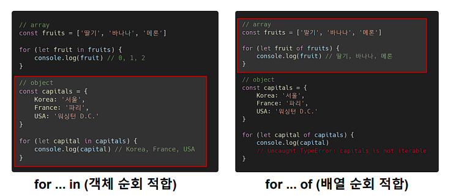

# JavaScript Control 🕹


## 조건문 ✔

### 조건문의 종류와 특징 📖

#### if ✔

- `if`

  - 조건 표현식의 **결과값을 `Boolean` 타입으로 변환 후 참/거짓을 판단**

- `if`, `else if`, `else`

  - 조건은 **소괄호**(`condition`) 안에 작성
  - 실행할 **코드는 중괄호{ }** 안에 작성
  - 블록 스코프 생성

  ```js
  const nation = 'korea'
  
  if (nation === 'korea') {
      console.log('안녕하세요!')
  } else if (nation === 'france') {
      console.log('Bonjour!')
  } else {
      console.log('Hello!')
  }
  ```

  


#### switch ✔

- `switch`

  - 조건 표현식의 **결과값이 어느 값(`case`)에 해당하는지 판별**

  - 주로 **특정 변수의 값에 따라 조건을 분기**할 때 활용
  - `break` 및 `default`문은 [**선택적**]으로 사용 가능
  - `break`문을 만나거나 `default`문을 실행할 때까지 다음 조건문 실행
    - **조건이 많아질 경우 if문보다 가독성이 나을 수 있음**

  ```js
  Switch(expression) {
      case 'first value': {
          // do something
          [break]
      }
      case 'second value' : {
          // do something
          [break]
      }
      [default: {
       	// do something
       }]
  }
  ```

  


## 반복문 🔄

### 반복문의 종류와 특징 📖

#### while 🔄

- 조건문이 **`true`인 동안 반복 시행**

- 조건은 **소괄호 안에 작성**

- 실행할 **코드는 중괄호 안에 작성**

- 블록 스코프 생성

  ```js
  let i = 0
  
  while (i < 6) {
      console.log(i) // 0 ,1 ,2 ,3 ,4 ,5
      i += 1
  }
  ```

  

#### for 🔄

- 세미콜론(`;`)으로 구분되는 세 부분 으로 구성

- `initialization`

  - 최초 반복문 진입 시 **1회만 실행**되는 부분

- `condition`

  - 매 **반복 시행 전 평가**되는 부분

- `expression`

  - 매 **반복 시행 이후 평가**되는 부분

- 블록 스코프 생성

  ```js
  for (let i= 0; i < 6; i++) {
      console.log(i) // 0, 1, 2, 3, 4, 5
  }
  ```


#### for...in 🔄

- 객체의 **속성들을 순회할 때** 사용

- **배열도 순회 가능하지만 권장하지 않는다.**

- 실행할 **코드는 중괄호 안에** 작성

- 블록 스코프 생성

  ```js
  // object(객체) => key-value로 이루어진 자료구조
  const capitals = {
      korea: 'seoul',
      france: 'paris',
      USA: 'washington D.C.'
  }
  
  for (let capital in capitas) {
  	console.log(capital) // korea, france, USA
  }
  
  ```

  

#### for...of 🔄

- 반복 가능한(`iterable`) **객체를 순회하며 값을 꺼낼 때** 사용

- 실행할 코드는 **중괄호 안에** 작성

- 블록 스코프 생성

  ```js
  const fruits = ['딸기', '바나나', '메론']
  
  for (let fruit of fruits) {
      fruit = fruit + '!'
      console.log(fruit)
  }
  ```


#### for ... in vs for ... of  💡




