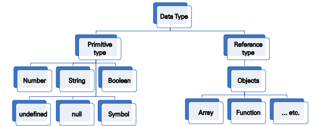
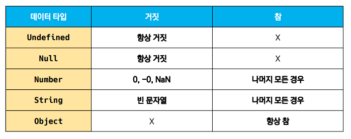

# Data type

JavaScript의 모든 값은 특정한 데이터 타입을 가져간다.




## 원시 타입

*Primitive type*

```js
let message = '안녕하세요!'   // 1. messege 선언 및 할당

let greeting = message		// 2. greeting에 message 복사
console.log(greeting)		// 3. '안녕하세요!' 출력

message = 'Hello'			// 4. message 재할당
console.log(greeting)		// 5. '안녕하세요!' 출력

// 원시 타입은 실제 해당 타입의 값을 변수에 저장
```


- 객체가 아닌 기본 타입
- 변수에 해당 type의 값을 저장
- 다른 변수에 복사할 때 실제 값이 복사된다.


## 참조 타입

*Reference type*

```js
const message = ['안녕하세요']	 // 1. message 선언 및 할당

const greeting = message		// 2. greeting에 message 복사
console.log(greeting)			// 3. ['안녕하세요!'] 출력

message[0] = 'Hello'			// 4. message 재할당
console.log(greeting)			// 5. ['Hello'] 출력

// 참조 타입은 해당 객체를 참조할 수 있는 참조 값을 저장
```


- 객체 타입의 자료형
- 변수에 해당 객체의 참조 값을 저장
- ㄷ른 변수에 복사할 때 참조 값이 복사된다.


## 숫자 타입

Number

```js
const a = 1				// 양의 정수
const b = -5			// 음의 정수
const c = 3.14			// 실수
const d = 2.998e8		// 거듭제곱 
const e = Infinity		// 양의 무한대
const f = -Infinity		// 음의 무한대
const g = NaN			// 산술 연산 불가능
```


- 정수,  실수 구분 없는 하나의 숫자 타입
- 부동소수점 형식을 따른다.
- NaN  (Not-A-Number)
  - 계산 불가능한 경우 반환되는 값
  - 'carrot' / 1000 => NaN


## 문자열 타입

String

```js
const first = 'kim'
const last = 'woo'
const full = '${first} ${last}'

console.log(full) // kim woo
```


- 텍스트 데이터를 나타내는 타입
- 16 비트 유니코드 문자의 집합
- 작은따옴표 또는 큰따옴표 모두 가능
- 템플릿 리터럴 (Template Literal)
  - ES6부터 지원
  - 따옴표 대신 backtick(` `)으로 표현
  - ${ expression } 형태로 표현식 삽입 가능


## undefined 타입

- 변수의 값이 없음을 나타내는 데이터 타입

- 변수 선언 이후 직접 값을 할당하지 않으면 자동으로 undefinded가 할당된다

  ```js
  let first
  console.log(first) // undefinded
  ```


## null 타입

- 변수의 값이 없음을 의도적으로 표현할 때 사용하는 데이터 타입

- null 타입과 typeof 연산자*

  - typeof 연산자*: 자료형 평가를 위한 연산자

  - null 타입은 [ECMA 명세의 원시 타입의 정의](https://tc39.es/ecma262/#sec-primitive-value)에 따라 원시 타입에 속하지만, typeof 연산자의 결과는 객체(object)로 표현됨 ([참고 자료](https://2ality.com/2013/10/typeof-null.html))

    ``` js
    let first = null
    console.log(first) // null
    
    typeof null // object
    ```

  

## Boolean 타입

- 논리적 참 또는 거짓을 나타내는 타입

- true 또는 false로 표현

- 조건문 또는 반복문에서 유용하다.

  - 조건문 또는 반복문에서 boolean이 아닌 데이터타입은 자동 형변환 규칙에 따라  true 또는 false로 변환

  ```js
  let isAdmin = true
  console.log(isAdmin) // true
  
  isAdmin = false
  console.log(isAdmin) // false
  ```

  

## 정리




