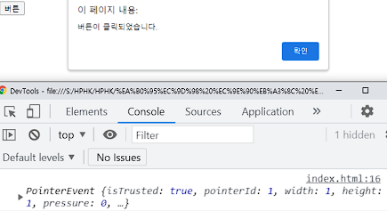

# JavaScript Event 🎢

네트워크 활동이나 사용자와의 상호작용 같은 사건의 발생을 알리기 위한 객체

**마우스 클릭, 스크롤, 키보드 입력 등**


## Event 메서드 💡

1. `EventTarget.addEventListener()`
- 지정한 이벤트가 대상에 전달될 때마다 **호출할 함수를 설정**
   
- **이벤트를 지원하는 모든 객체**(`Element`, `Document`, `Window` 등)를 대상으로 지정 가능


2. `target.addEventListener(type, listener[, options])`

   - `type`
     
     - 반응 할 **이벤트 유형** (대소문자 구분 문자열)
     
   - `listener`
     
     - 지정된 타입의 이벤트가 발생했을 때 알림을 받는 객체 
     
     - ##### `EventListener` 인터페이스 혹은 `JS function 객체`(콜백 함수)여야 함


3. `EventTarget.addEventListener(type, listener)`
   - `EventTarget`= 대상을 설정
   
   - `type` = 이벤트 타입을 설정
   
   - `listener` = 할 일을 설정


### 예시 📝



```html
<button type="button">
	버튼    
</button>
```

```js
// HTML script 부분

// 1. btn 변수에 button 할당
const btn = document.querySelector('button') 	

// 1. btn을 대상으로 선택
// 2. click 입력 발생시
// 3. funcion (event) 실행
btn.addEventListener('click', function (event) {
    alert('버튼이 클릭되었습니다.')
    console.log(event)
})
```


## Event 취소 ❌

- `event.preventDefault()`
  - **현재 이벤트의 기본 동작을 중단**
  - `HTML 요소`의 기본 동작이 작동하지 않게 막는다
  - 취소 할 수 없는 이벤트도 존재
    - ` event.cancelable` 을 사용해 확인할 수 있음
