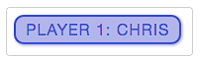

# JavaScript MDN

MDN 문서 정리 


## JavaScript 기본

적으로 콘텐츠를 바꾸고, 멀티미디어를 제어하고, 애니메이션을 추가하는 등 거의 모든 것을 만들 수 있는 스크립팅 언어


### HTML


```html
<p>Player 1: Chris</p>
```


### CSS



```css
p {
  font-family: 'helvetica neue', helvetica, sans-serif;
  letter-spacing: 1px;
  text-transform: uppercase;
  text-align: center;
  border: 2px solid rgba(0, 0, 200, 0.6);
  background: rgba(0, 0, 200, 0.3);
  color: rgba(0, 0, 200, 0.6);
  box-shadow: 1px 1px 2px rgba(0, 0, 200, 0.4);
  border-radius: 10px;
  padding: 3px 10px;
  display: inline-block;
  cursor: pointer;
}
```


### JavaScript


```javascript
const para = document.querySelector('p');

para.addEventListener('click', updateName);

function updateName() {
  const name = prompt('Enter a new name');
  para.textContent = `Player 1: ${name}`;
}
```


## JavaScript 실행 순서

```js
/* 1. 텍스트 문단을 선택 */
const para = document.querySelector('p');

/* 2. 이벤트 수신기를 부착 */ 
para.addEventListener('click', updateName); 

/* 3. 코드 블록 실행 (함수) */ 
function updateName() {
  const name = prompt('Enter a new name');
  para.textContent = `Player 1: ${name}`;
}

/* 사용자에게 새로운 이름을 입력받고 이름을 문단에 삽입해서 화면을 업데이트 */
```


## 웹페이지에 JavaScript 적용하기

CSS와 비슷한 방법으로 HTML 코드에 적용할 수 있다.


### 내부 JavaScript

```html
<!DOCTYPE html>
<html lang="en">
<head>
  <meta charset="UTF-8">
  <meta http-equiv="X-UA-Compatible" content="IE=edge">
  <meta name="viewport" content="width=device-width, initial-scale=1.0">
  <title>Document</title>
</head>
<body>
  <button>Click me</button>
  
   <script>
    // 내부에서 스크립트 작성하기
       
    document.addEventListener('DOMContentLoaded', () => {
    function createParagraph() {
      const para = document.createElement('p');
      para.textContent = 'You clicked the button!';
      document.body.appendChild(para);
    }
  
    const buttons = document.querySelectorAll('button');
  
    for (const button of buttons) {
      button.addEventListener('click', createParagraph);
    }
  });
  </script>
</body>
</html>
```


### 외부 JavaScript

```html
<!DOCTYPE html>
<html lang="en">
<head>
  <meta charset="UTF-8">
  <meta http-equiv="X-UA-Compatible" content="IE=edge">
  <meta name="viewport" content="width=device-width, initial-scale=1.0">
  <title>Document</title>
</head>
<body>
  <button>Click me</button>
   
  <script src="script.js" defer>
    // 외부 스크립트 불러오기
    </script>
</body>
</html>
```


- `async`는 다수의 백그라운드 스크립트를 최대한 빠르게 불러와야 할 때 사용
- `defer` 특성으로 가져오는 스크립트(아래)는 페이지에 나타난 순서 그대로 불러와서, 페이지 콘텐츠와 위쪽 스크립트 로딩이 끝나면 실행
- 다른 스크립트에 의존하거나 DOM 로딩이 필요한 스크립트에는 `defer`를 사용하고, 원하는 순서에 맞춰서 `<script>` 요소를 배치
