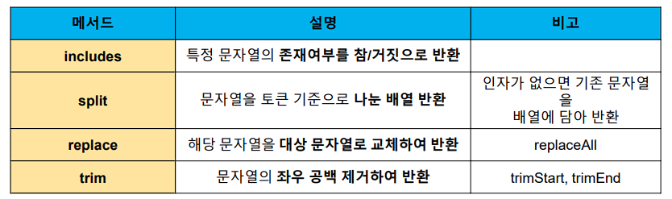

# JavaScript String ✏


## 문자열 관련 주요 메서드 목록 📜

- #### [MDN](https://developer.mozilla.org/en-US/docs/Web/JavaScript/Reference/Global_Objects/String#instance_methods)

  


### includes 📋

- `string.includes(value)`

  - 문자열에 `value`가 존재하는지 **판별 후 참 또는 거짓 반환**

    ```js
    const str = 'a santa at nasa’
    
    str.includes('santa') // true
    str.includes('asan') // false
    ```


### split 📝

- `string.split(value)`

  - `value`가 **없을 경우, 기존 문자열을 배열에 담아 반환**

  - `value`가 **빈 문자열일 경우 각 문자로 나눈 배열을 반환**

  - `value`가 **기타 문자열일 경우, 해당 문자열로 나눈 배열을 반환**

    ```js
    const str = 'a cup’
    
    str.split() // ['a cup’]
    str.split('') // ['a', ' ', 'c', 'u', 'p']
    str.split(' ') // ['a', 'cup']
    ```


### replace 📑

- `string.replace(from, to)`

  - 문자열에 `from` 값이 존재할 경우 **1개만 `to` 값으로 교체**하여 반환

  ```js
  const str = 'a b c d'
  
  str.replace(' ', '-') // 'a-b c d'
  ```

  

- `string.replaceAll(from, to)`

  - 문자열에 `from` 값이 존재할 경우 **모두 `to` 값으로 교체**하여 반환

  ```js
  const str = 'a b c d'
  
  str.replaceAll(' ', '-') // 'a-b-c-d'
  ```


### trim 📇

- `string.trim()`
  - 문자열 **시작과 끝의 모든 공백문자(스페이스, 탭, 엔터 등)를 제거**한 문자열 반환
- `string.trimStart()`
  - 문자열 **시작의 공백문자(스페이스, 탭, 엔터 등)를 제거**한 문자열 반환
- `string.trimEnd()`
  - 문자열 **끝의 공백문자(스페이스, 탭, 엔터 등)를 제거**한 문자열 반환

```js
const str = ' hello '
str.trim() // 'hello'
str.trimStart() // 'hello '
str.trimEnd() // ' hello'
```


