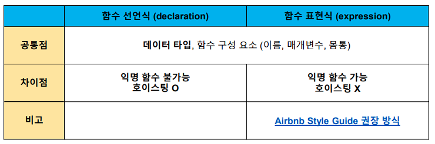

# JavaScript function

- 참조 타입 중 하나로써 function 타입에 속함\
- JavaScript의 함수는 일급 객체(First-class citizen)에 해당
  - 일급 객체: 다음의 조건들을 만족하는 객체를 의미함
    - 변수에 할당 가능
    - 함수의 매개변수로 전달 가능
    - 함수의 반환 값으로 사용 가능


## 함수의 정의

- 함수의 이름과 함께 정의하는 방식

  ```js
  function name(args) {
  // do something
  }
  ```

  ```js
  function add(num1, num2) {
  	return num1 + num2
  }
  add(1, 2)
  ```

  

- 3가지 부분으로 구성
  - 함수의 이름 (name)
  - 매개변수 (args)
  - 함수 body (중괄호 내부)


## 함수 표현식

*function expression*


- 함수를 표현식* 내에서 정의하는 방식

  - 표현식*: 어떤 하나의 값으로 결정되는 코드의 단위

    ```js
    const name = function (args) {
    // do something
    }
    ```

    

- 함수의 이름을 생략하고 익명 함수*로 정의 가능

  - 익명 함수*(anonymous function): 이름이 없는 함수

  - 익명 함수는 함수 표현식에서만 가능

    ```js
    const add = function (num1, num2) {
    	return num1 + num2
    }
    
    add(1, 2)
    ```

    

- 3가지 부분으로 구성

  - 함수의 이름 (생략 가능)
  - 매개변수 (args)
  - 함수 body (중괄호 내부)


## 기본 인자

*default arguments*


- 인자 작성 시 ‘=’ 문자 뒤 기본 인자 선언 가능

  ```js
  const greeting = function (name = 'Anonymous') {
  	return `Hi ${name}`
  }
  
  greeting() // Hi Anonymous
  ```


- 매개변수보다 인자의 개수가 많을 경우

  ```js
  const noArgs = function () {
  	return 0
  }
  noArgs(1, 2, 3) // 0
  
  const twoArgs = function (arg1, arg2) {
  	return [arg1, arg2]
  }
  twoArgs(1, 2, 3) // [1, 2]
  ```


- 매개변수보다 인자의 개수가 적을 경우

  ```js
  const threeArgs = function (arg1, arg2, arg3) {
  	return [arg1, arg2, arg3]
  }
  threeArgs() // [undefined, undefined, undefined]
  threeArgs(1) // [1, undefined, undefined]
  threeArgs(1, 2) // [1, 2, undefined]
  ```

  


## Rest Parameter

- rest parameter(…)를 사용하면 함수가 정해지지 않은 수의 매개변수를 배열로 받음

  - 만약 rest parameter로 처리한 매개변수에 인자가 넘어오지 않을 경우에는, 빈 배열로 처리

  ```js
  const restOpr = function (arg1, arg2, ...restArgs) {
  	return [arg1, arg2, restArgs]
  }
  
  restArgs(1, 2, 3, 4, 5) // [1, 2, [3, 4, 5]]
  restArgs(1, 2) // [1, 2, []]
  ```


## Spread Operator

- spread operator(…)를 사용하면 배열 인자를 전개하여 전달 가능.

  ```js
  const spreadOpr = function (arg1, arg2, arg3) {
  	return arg1 + arg2 + arg3
  }
  
  const numbers = [1, 2, 3]
  spreadOpr(...numbers) // 6
  ```


## 함수 선언식과 표현식 비교 정리




## 함수의 타입

- 선언식 함수와 표현식 함수 모두 타입은 function으로 동일

  ```js
  // 함수 표현식
  const add = function ()
  
  // 함수 선언식
  function sub(args) {}
  
  console.log(typeof add) // function
  console.log(typeof sub) // function


## 호이스팅

#### 함수 선언식

- 함수 선언식으로 선언한 함수는 var로 정의한 변수처럼 hoisting 발생

- 함수 호출 이후에 선언 해도 동작

  ```js
  add(2, 7) // 9
  
  function add (num1, num2) {
      return num1 + num2
  }
  ```

  

#### 함수 표현식

- 함수 표현식으로 선언한 함수는 함수 정의 전에 호출 시 에러 발생

- 함수 표현식으로 정의된 함수는 변수로 평가되어 변수의 scope 규칙을 따름

  ```js
  sub(7, 2) // ReferenceError
  
  const sub = function (num1, num2) {
      return num1 + num2
  }
  ```

  

- 함수 표현식을 var 키워드로 작성한 경우

  - 변수가 선언 전 undefined 로 초기화 되어 다른 에러가 발생

    ```js
    console.log(sub) // undefined
    sub(7, 2) // TypeError
    
    var sub = function (num1, num2) {
        return num1 - num2
    }


## Arrow function

```js
const arrow1 = function (name) {
	return `hello, ${name}`
}

// 1. function 키워드 삭제
const arrow2 = (name) => { return `hello, ${name}` }

// 2. 매개변수가 1개일 경우에만 ( ) 생략 가능
const arrow3 = name => { return `hello, ${name}` }

// 3. 함수 바디가 return을 포함한 표현식 1개일 경우에 { } & return 삭제
가능
const arrow4 = name => `hello, ${name}`
```

