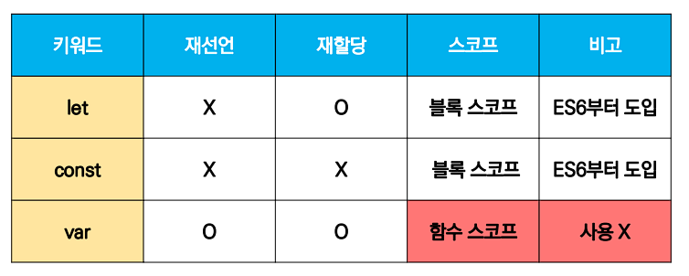

# JavaScript identifier


## Identifier

- 식별자(identifier)는 변수를 구분할 수 있는 변수명을 말한다.
- 식별자는 반드시 문자, 달러($) 또는 밑줄(_)로 시작
- 대소문자를 구분하며, 클래스명 외에는 모두 소문자로 시작
- 예약어* 사용 불가능
  -  for, if, function 등


## Identifier 구성

```js
let foo				// 선언
console.log(foo)	// undefined

foo = 11 			// 할당
console.log(foo)	// 11

let bar = 0			// 선언 + 할당
console.log(bar) 	// 0
```


- 선언 (Declaration)
  - 변수를 생성하는 행위 또는 시점
- 할당 (Assignment)
  - 선언된 변수에 값을 저장하는 행위 또는 시점
- 초기화 (Initialization)
  - 선언된 변수에 처음으로 값을 저장하는 행위 또는 시점


## let, const

- let 

  - 재할당 가능

    ```js
    let number = 10 		// 1. 선언 및 초기값 할당
    number = 10 			// 2. 재할당
    
    console.log(number) 	// 10
    ```


- const

  - 재할당 불가능

    ```js
    const number = 10 		// 1. 선언 및 초기값 할당
    number = 10				// 2. 재할당 불가능
    
    // 타입 에러 발생
    ```


### 블록 스코프

- if, for 함수 등의 중괄호 내부를 가리킨다.

- 블록 스코프를 가지는 변수는 블록 바깥에서 접근이 불가능하다.

  ```js
  let x = 1
  
  if (x === 1) {
    let x = 2
    console.log(x)  // 2
  }
  
  console.log(x)    // 1
  ```


## var

```js
var number = 10 // 1. 선언 및 초기값 할당
var number = 50 // 2. 재할당

console.log(number) // 50

// 재선언 및 재할당 모두 가능
```


- var로 선언한 변수는 재선언 및 재할당 모두 가능

- ES6 이전에 변수를 선언할 때 사용되던 키워드

- 호이스팅 되는 특성으로 인해 예기치 못한 문제 발생 가능

  - 따라서 ES6 이후부터는 var 대신 const와 let을 사용하는 것을 권장
  - 호이스팅
    - 변수를 선언 이전에 참조할 수 있는 현상
    - 변수를 선언 이전의 위치에서 접근 시 undefined를 반환
    - 자바스크립트는 모든 선언을 호이스팅한다.
    - 즉 var, let, const 모두 호이스팅이 발생
    - var는 선언과 초기화가 동시에 발생 하여 일시적 사각지대가 존재하지 않는다.

  

- 함수 스코프*

  - 함수의 중괄호 내부
  - 바깥에서 접근 불가능

  ```js
  function foo() {
    var x = 5
    console.log(x)  // 5
  }
  
  // ReferenceError: x is not defined
  console.log(x)
  ```


## 비교



