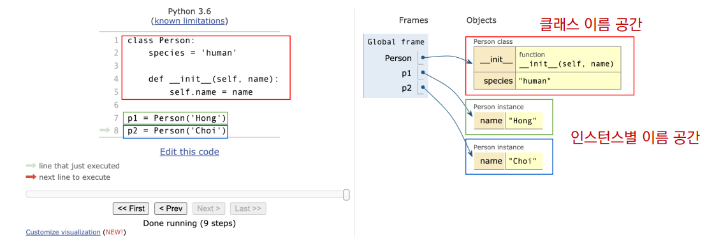
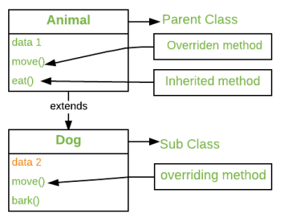

# Class ✒

## 📌 클래스 속성(attribute)

- **한 `class`의 모든 `instance`라도 똑같은 값을 가지고 있는 속성**

- `class` **선언 내부에서 정의**

- ```python
  <classname>.<name> # 접근 및 할당
  ```

- ### instance와 class 간의 namespace

  - `class`를 정의하면, `class`와 해당하는 `namespace` 생성

  - `instance`를 만들면,  `instance` 객체가 생성되고 `namespace` 생성

  - `instance`에서 특정 속성에 접근하면, `instance - class`순으로 탐색

    

### 📝 class method

- `class`가 사용할 `method`

  ```python
  class Myclass 
  
  	@classmethod # 데코레이터 사용하여 정리
      def class_method(cls, arg1, ..) # 호출 시 첫번째 인자로 cls 전달됨
  ```

### 📝 static method

- `instance` 변수, `class` 변수를 전혀 다루지 않는 `method`

  ```python
  class Myclass 
  # 속성을 다루지 않고 단지 기능만을 하는 method를 정의할 때 사용
  	@staticmethod # 데코레이터 사용하여 정리
      def calss_method(arg1, ...) # 호출 시 어떠한 인자도 전달되지 않음 (class 정보에 접근/수정 불가)
  ```

### 📝 정리

#### 🔖 클래스 구현

- **class 정의**

- **데이터 속성 정의** (객체 정보는 무엇인가?)
- `method` **정의** (객체를 어떻게 사용할 것인가?)

#### 🔖 클래스 활용

- 해당 객체`type`의 `instance` 생성 및 조작

### 📝 method 정리

#### 	🔖 instance method

- 호출한`instance`를 의미하는 `self` 매개 변수를 통해 `instance`를 조작

  ```python
  class Myclass:
      def method(self):
          return 'instance method', self
  ```

#### 	🔖 class method

- `class`를 의미하는 `cls` 매개 변수를 통해 `class`를 조작

#### 	🔖 static method

- `instance`나 `class`를 의미하는 매개변수는 사용하지 않음
- 일반 함수처럼 동작하지만 `class`의 이름 공간에 귀속된다
  - **주로 해당 클래스로 한정하는 용도**

## 📌 객체지향의 핵심 개념

### 📝 객체지향의 핵심 4가지

#### 🔖 추상화

```python
class Person:
    
    def __init__(self, name, age):
        self.name = name
        self.age = age
    
    def talk(self):
    	print(f'반갑습니다. {self.name}입니다.')
```

#### 🔖 상속

- 두 `class` 사이 부모 - 자식 관계를 정립

- `class`는 **상속이 가능**

  - 모든 `python class` 는 `object`를 상속받음  👉 `code 재사용성`이 높아짐

  ```python
  class ChildClass(ParentClass):
      pass
  ```

- #### 상속 관련 함수와 method

  ```python
  isinstance(object, classinfo)	# classinfo의 instance거나 subclass인 경우 True
  ```
  ```python
  issubclass(class, classinfo)	# class 가 classinfo의 subclass면 True
  								# classinfo는 class 객체의 tuple일 수 있으며, classinfo의 모든 항목을 검사
  ```
  
  ```python
  super().__init__(name, age, ...)
  self.[id] = [id]				# 자식 class에서 부모 class를 사용하고 싶은 경우
  ```

##### 💡 상속 정리

- `python`의 모든 `class`는 `object`로부터 상속됨
- 부모 `class`의 모든 요소`(속성, method)`가 상속됨
- `super()` 를 통해 부모` class`의 요소를 호출할 수 있음
- `method overriding`을 통해 자식 `class`에서 재정이 가능
- 상속관계에서 `namespace`는 `instance`, 자식` class`, 부모 `class` 순으로 탐색

##### 💡 다중 상속

- 두개 이상의` class`를 상속 받는 경우
- 상속 받은 모든 `class`의 요소를 활용 가능함
- 중복된 속성이나 `method`가 있는 경우 상속 순서에 의해 결정됨

#### 🔖 다형성

- **여러 모양을 뜻함**
- 동일한 `method`가 `class`에 따라 다르게 행동할 수 있음을 의미
- 서로 다른 `class`에 속해있는 `객체(object)`들이 동일한 메시지에 대해 다른 방식으로 응답될 수 있음

##### 🔖 method overriding

- 상속 받은 `method`를 재정의
- `class` 상속 시, 부모 `class`에서 정의한 `method`를 자식 `class`에서 변경
- 부모 `class`의 `method` 이름과 기본 기능은 그대로 사용, **특정 기능을 바꾸고 싶을 때 사용**



#### 🔖 캡슐화

- 객체의 일부 구현 내용에 대해 외부로부터 직접적인 액세스를 차단
- `python`에서 기능상으로 존재하지 않지만, 관용적으로 사용되는 표현이 있음

#####  💡 접근제어자 종류

- Public Access Modifier `(public = 어디서나)`
  - `underbar(_)` 없이 시작하는` method`나 속성
  - 어디서나 호출이 가능, 하위 `class override` 허용
- Protected Access Modifier `(Protected  = 우리끼리)`
  - `underbar(_)` 1개로 시작하는 ` method`나 속성
  - 암묵적 규칙에 의해 부모 `class`나 내부와 자식 `class`에서만 호출 가능
- Private Access Modifier ```#(Private = 나만)```
  - `underbar(_)` 2개로 시작하는 `method` 나 속성
  - 본 `class` 내부에서만 사용 가능