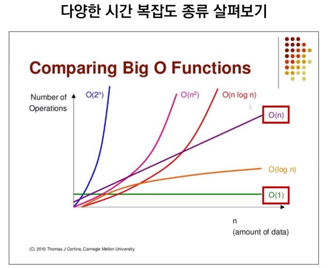

# 시간 복잡도 & 빅오 표기법

같은 output을 만드는 알고리즘이라도 시간 복잡도에 따라 성능이 달라질 수 있다.

- 시험에서 정답 여부를 갈리는 포인트가 된다!

- 먼저 문제를 풀고 더 좋은 방법을 찾는 것을 목표로 한다! 

## 🔎 알고리즘의 시간 복잡도

- ### 알고리즘의 수행 시간

  - 시간 복잡도가 높다 👉 느린 알고리즘
  - 시간 복잡도가 낮다 👉 빠른 알고리즘

### 📌 좋은 알고리즘이란?

- #### `input`을 넣은 후 `output`이 나오는 시간이 짧은 알고리즘!!

### 📌 알고리즘의 소요 시간 측정하기

- 같은 알고리즘인데 측정 시간이 다르다 = 환경에 영향을 받지 않는 **객관적인 기준**이 필요하다

- 객관적인 측정을 위해 알고리즘 내부에서 **기본연산**이 **몇 번** 일어나는지 살펴본다.

- #### 기본연산의 총 횟수 == 알고리즘의 소요 시간

  - 성능을 측정할 때는 **입력을 통일**시킨다.
  - 가장 기본연산이 많이 일어나는 **최악의 입력 n개**가 들어온다고 가정한다!
  - 입력 n개에 따른 소요 시간 = **시간 복잡도**

## 🔎 빅오(Big-O) 표기법

- 입력 **n이 무한대**로 커진다 가정하고 시간 복잡도를 간단하게 표시하는 법
  - **최고차항**만 남기고 계수와 상수 제거
- 매 입력에 따라 정확한 수식을 구하는 것은 불필요
  - 정확한 수치보다는 **증가율**에 초점을 맞춘다.

|  BIG-O   |                   설명                   |                 예시                 |
| :------: | :--------------------------------------: | :----------------------------------: |
|   O(1)   | 단순 산술 계산(덧셈, 뺄셈, 곱셈, 나눗셈) |            A+B, 100 * 200            |
| O(logN)  |      크기 N인 리스트를 반절씩 순회       |          이진탐색, 분할정복          |
|   O(N)   |          크기 N인 리스트를 순회          |              1중 for 문              |
| O(NlogN) |   크기 N인 리스트를 반절씩 탐색* 순회    | 높은 성능의 정렬 (Merge, Quick, Heap |
|  O(N^2)  |      크기 M, N인 2중 리스트를 순회       |              2중 for 문              |
|  O(N^3)  |            3중 리스트를 순회             |              3중 for 문              |
|  O(2^N)  |         크기 N 집합의 부분 집합          |                                      |
|  O(N!)   |           크기 N 리스트의 순열           |                                      |

- 1부터 n까지 일일히 더하기 
  - 가우스법칙 `(n * (n + 1)) // 2`
- 내장 함수, 메서드의 시간 복잡도도 확인할 필요가 있다.
  - for 문 안에 O(n)의 내장 함수를 사용했다면 사실 2중 for 문과 다를 것이 없다.

