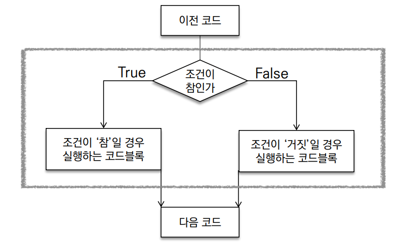
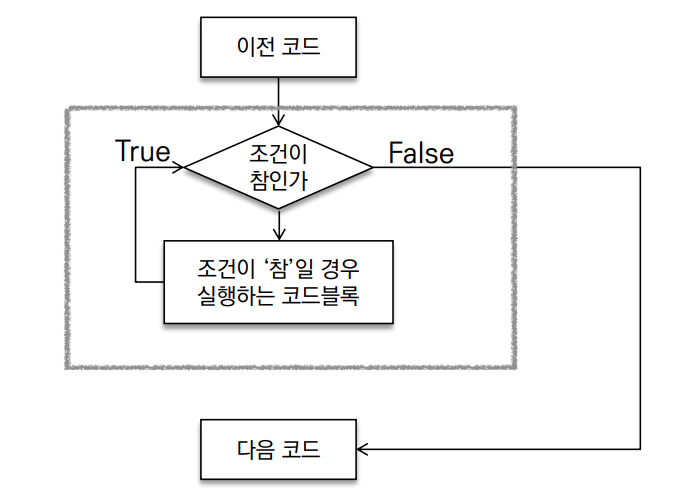
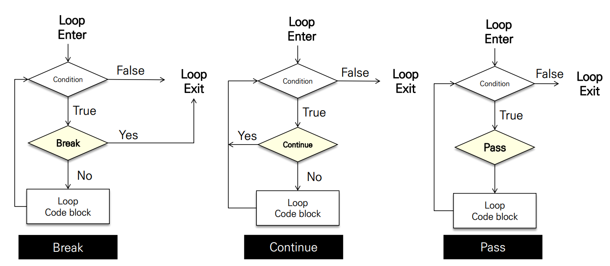

# 제어문(Control Statement) ✒

- 파이썬은 기본적으로 **위에서부터 아래로 순차적으로 명령을 수행**
- 특정 상황에 따라 코드를 **선택적으로 실행(분기/조건)하거나 계속하여 실행(반복)하는 제어**가 필요함
- **제어문은 순서도(flow chart)로 표현이 가능**


# 📄 조건문(Conditional Statement) 

- 조건문은 참/거짓을 판단할 수 있는 조건식과 함께 사용

  

## 📌 기본 형식 

- #### expression에는 참/거짓에 대한 조건식

  - 조건이 참인 경우 이후 들여쓰기 되어있는 코드 블럭을 실행

  - 이외의 경우 else 이후 들여쓰기 되어있는 코드 블럭을 실행

    - else는 선택적으로 활용 가능함

      ```python
      if <expression >:
      	# Run this Code block
      else:
      	# Run this Code block
      ```


## 📌 복수 조건문 

- 복수 조건식을 활용할 경우 elif를 활용하여 표현한다.

- 복수 조건문

  ```python
  if <expression>:
  	# Code block
  elif <expression>:
  	# Code block
  elif <expression>:
  	# Code block
  else:
  	# Code block
  ```

  - 조건식을 동시에 검사하는 것이 아니라 순차적으로 비교한다.


## 📌 중첩 조건문 

- #### 조건문은 다른 조건문에 중첩되어 사용될 수 있음

  - 들여쓰기를 유의하여 작성할 것

    ```python
    if <expression>:
    	# Code block
    	if <expression>:
    		# Code block
    else:
    	# Code block
    ```


## 📌 조건 표현식 

- #### 조건표현식(Conditional Expression)이란?

  - 조건 표현식을 일반적으로 **조건에 따라 값을 할당 할 때 활용**

    ```python
    <true인 경우 값> if <expression> else <false인 경우 값>
    ```

    ```python
    value = num if num >= 0 else -num
    # 절대값을 저장하기 위한 코드 예시

# 📄 반복문 (Loop Statement) 

- ### 특정 조건을 도달할 때까지, 계속 반복되는 일련의 문장

  

## 📌 반복문의 종류 

- #### while 문
  - **종료조건에 해당하는 코드**를 통해 반복문을 종료시켜야 함
  
- #### for 문

  - **반복가능한 객체를 모두 순회하면 종료** (별도의 종료조건이 필요 없음)

- #### 반복 제어

  - `break`, `continue`, `for-else`
  
    

### 📎 while 문

- #### while 문은 조건식이 참인 경우 반복적으로 코드를 실행

  - **조건이 참인 경우 들여쓰기 되어 있는 코드 블록**이 실행됨
  - **코드 블록이 모두 실행되고, 다시 조건식을 검사하며 반복**적으로 실행됨
  - `while`문은 **무한 루프를 하지 않도록 종료조건이 반드시 필요**

```python
while <expression>:
	# Code block
```

### 📎 for 문

- #### for문은 시퀀스(string, tuple, list, range)를 포함한 순회가능한 객체(iterable) 요소를 모두 순회함

  - 처음부터 끝까지 모두 순회하므로 별도의 종료조건이 필요하지 않음

    ```python
    for <변수명> in <iterable>:
    	# Code block
    ```


#### for 문 일반 형식

- `Iterable`

  - 순회할 수 있는 자료형(`str`,`list`, `dict` 등)
  - 순회형 함수(`range`, `enumerate`)

- `enumerate` 순회

  ```python
  enumerate(members)
  # <enumerate at 0x105d3e100>
  list(enumerate(members)) 
  # [(0, '민수'), (1, '영희'), (2, '철수')] # 숫자와 값의 tuple
  list(enumerate(members, start=1))
  # [(1, '민수'), (2, '영희'), (3, '철수')] 
  # 기본값 0, start를 지정하면 해당 값부터 순차적으로 증가
  ```

- 딕셔너리 순회

  - 딕셔너리는 기본적으로 `key`를 순회하며, `key`를 통해 값을 활용

    ```python
    # ex)
    grades = {'john': 80, 'eric': 90} 
    for name in grades:
    print(name)
    # john
    # eric
    
    grades = {'john': 80, 'eric': 90}
    for name in grades:
    print(name, grades[name])
    #john 80
    #eric 90


## 📌 반복문 제어 

- ### break

  - **반복문을 종료**

- ### continue

  - `continue` 이후의 코드 블록은 수행하지 않고, 다음 반복을 수행

- ### for-else

  - 끝까지 반복문을 실행한 이후에 `else`문 실행
    - `break`를 통해 중간에 종료되는 경우 `else`문은 실행되지 않음
    - `else` 문은 `break`로 중단되었는지 여부에 따라 실행


  

