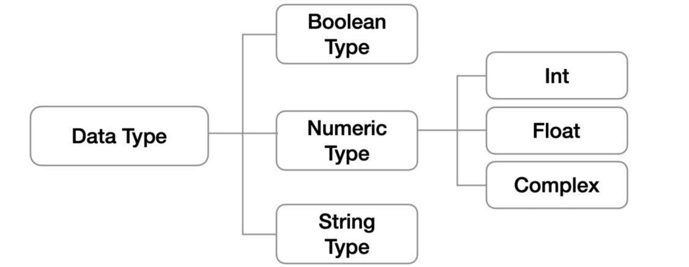

# Python 기초 ✒

- ## 		Computer?

​		**[계산] Caculation + [기억] Remember**

- ## 	programming?

​		**명령어의 모음 (집합)**

- ## 언어

  자신의 **생각을 나타내고 전달**하기 위해 사용하는 체계

  **문법적**으로 맞는 말의 집합

  - 선언적 지식(declarative knowledge)

  - <u>**명령적 지식(imperative knowledge) "How-to"**</u>

    

# 💻 Python 개발 환경 (Python Environment)

- ## Python?	

  - ### Easy to learn

    - 다른 프로그래밍 언어보다 **문법이 간단**하면서도 엄격하지 않음

      - 예시 : 변수에 별도의 타입 지정이 필요 없음 👉 **동적 타이핑 언어**

    - **문법 표현이 매우 간결**하여 프로그래밍 경험이 없어도 짧은 시간 내에 마스터할 수 있음

      - 예시 : 문장을 구분할 때 중괄호({,}) 대신 들여쓰기를 사용

  - ### Expressive Language

    - 같은 작업에 대해서도 C나 자바로 작성할 때 보다 더 간결하게 작성 가능

    - ```java
      public class HelloPython {
          public static void main(String[] args) {
              System.out.println("Hello Python!");
          }
      ```

    - ```python
      print("Hello Python!")
      ```

  - ### 크로스 플랫폼 언어

    - 윈도우즈 (Windows), macOS, 리눅스(Linux), 유닉스(Unix) 등 다양한 운영체제에서 실행가능

- ## 파이썬의 특징

  - ### 인터프리터 언어(interpreter)

    - 소스코드를 기계어로 변환하는 **컴파일 과정 없이** 바로 실행 가능
    - 코드를 대화하듯 한 줄로 입력하고 실행한 후 **바로 확인할 수 있음**
    
    ```python
    >>> 2 + 2 # 사용자가 입력 (input)
    4         # 컴퓨터가 대답 (output)
    ```
  
  
  - ### 객체 지향 프로그래밍
    - 파이썬은 **객체지향 언어**이며, 모든 것이 객체로 구현되어 있음
      - 객체(object) : 숫자, 문자, 클래스 등 **값을 가지고 있는 모든 것**
  

## 기초 문법

- ### 코드 스타일 가이드

  - 코드를 **'어떻게 작성할지'**에 대한 가이드라인
  - 파이썬에서 제안하는 스타일 가이드
    - [PEP8](https://www.python.org/dev/peps/pep-0008/ ) ✔
  - 기업, 오픈소스 등에서 사용되는 스타일 가이드
    - [Google Style guide](https://google.github.io/styleguide/pyguide.html) 
  
- ### 들여쓰기(Identation)

  - #### Space Sensitive
  
    - 문장을 구분할 때, 들여쓰기(indentation)를 사용
    - 들여쓰기를 할 때는 4칸(space키 4번) 혹은 1탭(Tab키 1번)을 입력
      - **주의! 한 코드 안에서는 반드시 한 종류의 들여쓰기를 사용 👉 혼용하면 안됨**
        - Tab으로 들여쓰면 계속 탭으로 들여써야 함
        - **원칙적으로는 공백 (빈칸, space) 사용을 권장** * PEP8 권장사항
  
- ### 변수(Variable)

  - #### 변수란? 

    - 컴퓨터 메모리 어딘가에 저장되어 있는 **객체를 참조하기 위해 사용되는 이름**

      - 객체(object) : 숫자, 문자, 클래스 등 **값을 가지고 있는 모든 것**

        👉 **파이썬은 객체지향 언어이며, 모든 것이 객체로 구현되어 있음**

      - 동일 변수에 다른 객체를 언제든 할당할 수 있기 때문에,

        즉, **참조하는 객체가 바뀔 수 있기 때문에 '변수' 라고 불림**

    - 변수는 할당 연산자(=)를 통해 값을 할당(assignment)

    - `type()`

      - 변수에 할당된 값의 타입

    - `id()`

      - 변수에 할당된 값(객체)의 고유한 아이덴티티 값이며, 메모리주소

      ```python
      X = 'hi'
      type(x)
      #str
      id(x)
      #4645387184
      ```


  - #### 변수 연산

    - ``` python
      i = 5
      j = 3
      s = '파이썬'
      ```

    - ```python
      i + j # 8
      
      i - j # 2
      
      j = -2
      i * j # -10
      ```

    - ``` python
      '안녕' + s #'안녕파이썬'
      
      s * 3 #'파이썬파이썬파이썬'
      
      s = 'Python' 
      s + 'is fun' # Python is fun
      ```

  - #### 변수 할당

    - **같은 값을 동시에 할당할 수 있음**

      - ```python
        X = y = 1004 
        print(x, y) # 1004 1004
        ```

      - ```python
        X = y = 1004
        print(X, y) # 1 2 
        ```
    
- #### 식별자(Identifiers)


   - 파이썬 객체(변수, 함수, 모듈, 클래스 등)를 식별하는데 사용하는 이름(name)
    
   - **규칙**
    
       - 식별자의 이름은 영문 알파벳, 언더스코어(_), 숫자로 구성
    
      - 첫 글자에 숫자가 올 수 없음
    
      - 길이제한이 없고, 대소문자를 구별
    
      - 다음의 키워드(keywords)는 예약어(reserved words)로 사용할 수 없음
    
        - ```
        False, None, True, and, as, assert, async, await, 
          break, class, continue, def, del, elif, else, except, finally, 
          for, from, global, if, import, in, is, lambda, nonlocal, 
          not, or, pass, raise, return, try, while, with, yield


- #### 사용자 입력

  - `input([prompt])`
    - 사용자로부터 **값을 즉시 입력 받을 수 있는 내장함수**
    - 대괄호 부분에 문자열을 넣으면 입력 시, 해당 문자열을 출력할 수 있음
    - ⭐ **반환값은 항상 문자열의 형태로 반환**

- #### 주석

  - **코드의 대한 설명**

    - **중요한 점이나 다시 확인하여야 하는 부분을 표시**

      컴퓨터는 주석을 인식하지 않음 **사용자만을 위한 것**

  - **가장 중요한 습관**

    - 개발자에게 **주석을 작성하는 습관** ✔ 은 매우 중요

    - 쉬운 이해와 코드의 분석 및 수정이 용이

      🏷 주석은 코드 실행에 영향을 미치지 않을 뿐만 아니라

      🏷 프로그램의 속도를 느리게 하지 않으며, 용량을 늘리지 않음

  - **한 줄 주석**

    ```python
    # 주석(comment)입니다.
    # print('Hello')
    print('World') # 주석

# 📄 파이썬 기본 자료형 



- ## 자료형 분류

  - ### `None`

    - 파이썬 자료형 중 하나

    - 파이썬에서는 값이 없을 표현하기 위해 `None` 타입이 존재함.

    - 일반적으로 반환 값이 없는 함수에서 사용하기도 함. 

    - ```python
      print(type(None))
      # <class 'NoneType'
      a = None
      print(a)
      # None
      ```
    
  - ### 불린형(Boolean)
  
    - `True` / `False` 값을 가진 타입은 `bool`
  
    - 비교/논리 연산을 수행함에 있어서 활용됨
  
    - 다음은 모두 `False`로 변환
      - `0`, `0.0`, `()`, `[]`, `{}`, `"`, `None`
      
    - boll() 함수
  
      - 특정 데이터가 `True`인지 `False`인지 검증
  
        ```python
        bool(0) #False
        ```
  
    -  논리 연산자(Logical Operator)
  
      - 논리식을 판단하여 `True`, `False` 반환함
  
      - | 연산자  | 내용                                         |
        | ------- | -------------------------------------------- |
        | A and B | 모두 참인 경우 참, 그렇지 않으면 거짓        |
        | A or B  | 둘 중 하나만 참이라도 참, 그렇지 않으면 거짓 |
        | Not     | 참 거짓의 반대의 결과                        |
  
        ``` python
        num = 100
        num >= 100 and num % 3 == 1
        # True
        ```
  
  - ### 수치형(Numeric Type)
  
    - #### 정수(int)
  
      - 모든 정수의 타입은 `int`
      - 오버플로우가 발생하지 않음
  
    - #### 실수(Falot)
  
      - 정수가 아닌 모든 실수는 `float` 타입
  
      - 부동소수점
  
        - 실수를 컴퓨터가 표현하는 방법 - 2진수(비트)로 숫자를 표현
  
        - 이 과정에서 **floating point rounding error**가 발생하여, 예상치 못한 결과가 발생
  
          - 실수에서 실수할 수 있다. 주의 ✔
  
        - 매우 작은 수보다 작은지를 확인하거나 `math` 모듈 활용
  
  - #### 기본적인 사칙연산 및 수식 계산
  
  | 연산자  |     내용     |
  | :-----: | :----------: |
  |   `+`   |     덧셈     |
  |   `-`   |     뺄셈     |
  |   `*`   |     곱셈     |
  |   `%`   |  **나머지**  |
  | **`/`** |  **나눗셈**  |
  |  `\\`   |    **몫**    |
  |  `**`   | **거듭제곱** |
  
  | 연산자 |     내용     |
  | :----: | :----------: |
  |  `<`   |     미만     |
  |  `<=`  |     이하     |
  |  `>`   |     초과     |
  |  `>=`  |     이상     |
  |  `==`  |     같음     |
  |  `**`  | **거듭제곱** |
  
  - #### 문자열(String Type)
  
    - 모든 문자는 `str` 타입
  
    - 문자열은 작은 따옴표(')나 큰 따옴표(")를 활용하여 표기
  
      - 문자열을 묶을 때 동일한 문장부호를 활용
      - **PEP8**에서는 소스코드 내에서 하나의 문장부호를 선택하여 유지하도록 함
  
      ```python
      print('hello')
      # hello
      print(type('hello'))
      # <class 'str'>
      ```
  
      ```python
      print("문자열 안에 '작은 따옴표를 사용하려면 큰 따옴표로 묶는다'")
      print('''문자열 안에 '작은 따옴표'나 "큰 따옴표" 를 사용할 수 있고
      여러 줄을 사용할 때도 편리하다.```)
      ```
  
    - #### 인덱싱
  
      - 인덱스를 통해 특정 값에 접근할 수 있음
  
      - `s[1] => 'b'`
  
      - |       | a    | b    | c    | d    | e    | f    |
        | :---- | ---- | ---- | ---- | ---- | ---- | ---- |
        | index | 0    | 1    | 2    | 3    | 4    | 5    |
  
        - `s[2:5]` # 'cde'
        - `s[2:5:2]` # 'ce'
        - `s[5:2:-1]` # 'fed'
        - `s[:3]` ⇒ 'abc'
        - `s[5:]` ⇒ 'fghi
        - `s[::]` ⇒ 'abcdefghi’ => s[0:len(s):1]과 동일
        - `s[::-1]` ⇒ 'ihgfedcba’ => s[-1:-(len(s)+1):-1]과 동일
  
    - ### Escape sequence
  
      - 문자열 내에서 특정 문자나 조작을 위해서 **역슬래시(\\)**를 활용하여 구분
  
      - | 예약문자 | 내용(의미)      |
        | -------- | --------------- |
        | `\n`     | 줄 바꿈         |
        | `\t`     | 탭              |
        | `\r`     | 캐리지리턴      |
        | `\0`     | 널(Null)        |
        | `\`      | \\              |
        | `'`      | 단일인용부호(') |
        | `"`      | 이중인용부호(") |
  
    - #### String Interpolation
  
      - 문자열을 변수를 활용하여 만드는 법
  
        - ```f-string```
  
        - ```python
          name = 'Kim'
          score = 4,5
          print(f'Hello, {name}! 성적은 {score}')
          # Hello, Kim! 성적은 4.5
          
          pi = 3.141592
          print(f'원주율은 {pi:.3}. 반지름이 2일때 원의 넓이는 {pi*2*2}')
          # '원주율은 3.14. 반지름이 2일때 원의 넓이는 12.566368'
          ```
  
    - #### 문자열 특징
  
      - Immutable : 변경 불가능함
      - Iterable : 반복 가능함

##  📌형 변환(Typecasting)

- ### 자료형 변환 (Typecasting)

  - **파이썬에서 데이터 형태는 서로 변환할 수 있음**
    - 암시적 형 변환(Implicit)
      - 사용자가 의도하지 않고, 파이썬 내부적으로 자료형을 변환 하는 경우
    - 명시적 형 변환(Explicit)
      - 사용자가 특정 함수를 활용하여 의도적으로 자료형을 변환 하는 경우

- ### 명시적 형 변환(Explicit Typecasting)

  - `int`
    - `str*, float` ⇒ `int`
  - `float`
    - `str*, int` ⇒ `float`
  - `str`
    - `int, float, list, tuple, dict` ⇒ `str`

  - ***형식에 맞는 문자열만 가능**


## 📌 컨테이너(Container) 

- ### 컨테이너(Container) 정의

  - 컨테이너란?
    - 여러 개의 값을 담을 수 있는 것(객체)으로, 서로 다른 자료형을 저장할 수 있음
      - 예시 : ```List, tuple```
  - 컨테이너의 분류
    - 순서가 있는 데이터 (Ordered) vs 순서가 없는 데이터 (Unordered)
    - 순서가 있다 ! = 정렬되어 있다.

- ### 컨테이너 분류

  - 시퀀스 # **순서가 있음**

    - **문자열(immutable) : 문자들의 나열**

    - **리스트 (mutable) : 변경 가능한 값들의 나열**

    - **튜플 (immutable) : 변경 불가능한 값들의 나열**

    - **레인지 (immutable) : 숫자의 나열**

  
  - 컬렉션/비시퀀스 # **순서가 없음**
    - **세트 (mutable) : 유일한 값들의 모음**
    - **딕셔너리 (mutable) : 키-값들의 모음**
  
- ### 시퀀스형 주요 공통 연산자

  | 연산                   | 결과                                                      |
  | ---------------------- | --------------------------------------------------------- |
  | ```s[i]```             | s 의 i 번째 항목, 0에서 시작합니다                        |
  | ```s[i:j]```           | s 의 i 에서 j 까지의 슬라이스                             |
  | ```s[i:j:k]```         | s 의 i 에서 j 까지 스텝 k 의 슬라이스                     |
  | ```s + t```            | s 와 t 의 이어 붙이기                                     |
  | ```s * n 또는 n * s``` | s 를 그 자신에 n 번 더하는 것                             |
  | ```x in s```           | s 의 항목 중 하나가 x 와 같으면 True, 그렇지 않으면 False |
  | `x not in s`           | s 의 항목 중 하나가 x 와 같으면 False, 그렇지 않으면 True |
  | `len(s)`               | s 의 길이                                                 |
  | `min(s)`               | s 의 가장 작은 항목                                       |
  | `max(s)`               | s 의 가장 큰 항목                                         |

## 📌 리스트(List)

- ### 리스트(List) 정의

  - 변경 가능한 값들의 나열된 자료형
  - 순서를 가지며, 서로 다른 타입의 요소를 가질 수 있음
  - **변경 가능하며(mutable), 반복 가능함(iterable)**
  - 항상 대괄호 형태로 정의하며, 요소는 콤마로 구분
  -  ex = ```[ 0, 1, 2, 3, 4, 5 ]```

- ### 생성과 접근

  - 리스트는 대괄호([]) 혹은 ```list()```를 통해 생성]
  - 순서가 있는 시퀀스로 인덱스를 통해 접근 가능
  - 값에 대한 접근은 ```list[i]```

- ### 리스트 값 추가/삭제

  - 값 추가는 ```.append()```를 활용하여 **추가**하고자 하는 값을 전달
  - 값 삭제는``` .pop()```을 활용하여 **삭제**하고자 하는 인덱스를 전달

## 📌 튜플(Tuple)

- ### 튜플(Tuple) 정의

  - **불변한 값들의 나열**
  - 순서를 가지며, 서로 다른 타입의 요소를 가질 수 있음
  - **변경 불가능하며(immutable), 반복 가능함(iterable)**
  - 항상 소괄호 형태로 정의하며, 요소는 콤마로 구분
  - ex = ```(0,1,3)```

- ### 생성과 접근

  - 소괄호(()) 혹은 ```tuple()```을 통해 생성
    - 값에 대한 접근은 리스트와 동일하게 인덱스로 접근
    - **값 변경은 불가능하여 추가/삭제도 불가능함**

## 📌 레인지(range)

- #### 숫자의 시퀀스를 나타내기 위해 사용

  - 기본형 : ```range(n)```
    -  0부터 n-1까지의 숫자의 시퀀스
    - 범위 지정 : ```range(n, m)```
      - n부터 m-1까지의 숫자의 시퀀스
    - 범위 및 스텝 지정 : ```range(n, m, s)```
      -  n부터 m-1까지 s만큼 증가시키며 숫자의 시퀀스
  - **변경 불가능하며(immutable), 반복 가능함(iterable)**
  - **```range(n=0, m, s=1)```**
  - ```range```는 숫자의 시퀀스를 나타내기 위해 사용 

## 📌 세트(Set)

- #### 유일한 값들의 모음(collection)

  - **순서가 없고 중복된 값이 없음**
    - 수학에서의 집합과 동일한 구조를 가지며, 집합 연산도 가능
  - **변경 가능하며(mutable), 반복 가능함(iterable)**
    - 단, 셋은 순서가 없어 반복의 결과가 정의한 순서와 다를 수 있음

- #### 세트(Set) 생성

  - 중괄호({}) 혹은 set()을 통해 생성
    - 빈 **Set**를 만들기 위해서는 ```set()```을 반드시 활용해야 함
    - 순서가 없어 별도의 값에 접근할 수 없음
  
- #### 세트(Set) 추가/삭제

  - 값 추가는 ```.add()```를 활용하여 **추가**하고자 하는 값을 전달
  - 값 삭제는 ```.remove()```를 활용하여 **삭제**하고자 하는 값을 전달

- #### 세트(Set) 활용

  - **세트를 활용하면 다른 컨테이너에서 중복된 값을 쉽게 제거할 수 있음**
    - 단, 이후 순서가 무시되므로 **순서가 중요한 경우 사용할 수 없음**


## 📌 딕셔너리(Dictionary)

- #### 키-값(key-value) 쌍으로 이뤄진 모음(collection)

  - **키(key)**
    - 불변 자료형만 가능 (리스트, 딕셔너리 등은 불가능함)
  - **값(values)**
    - 어떠한 형태든 관계 없음
  - 키와 값은 ```:```로 구분 
  - 개별 요소는 ```,```로 구분
  - **변경 가능하며(mutable), 반복 가능함(iterable)**
    - 딕셔너리는 반복하면 키가 반환됨

- #### 딕셔너리(Dictionary) 생성

  - **key와 value가 쌍으로 이뤄진 자료구조**
    - key는 **변경 불가능한 데이터(immutable)만 활용** 가능
      - string, integer, float, boolean, tuple, range
    - **value는 모든 값으로 설정 가능** (List, Dictionary 등)

- #### 딕셔너리(Dictionary) 접근

  ```python
  movie = {
      'title' : '설국열차',
      'geners' : ['sf', '액션', '드라마'],
      'open_date' : '2013-08-01',
      'time' : 126,
      'adult' : False,
  }
      
  movie['genres']
      #['sf', '액션', '드라마']
  
  movie['actors’]
  Traceback (most recent call last):
  File "<stdin>", line 1, in <module>
  KeyError: 'actors'
  ```

- #### 딕셔너리(Dictionary) 키-값 추가 및 변경

  - 딕셔너리에 **키와 값의 쌍을 추가**할 수 있음
  - 이미 해당하는 키가 있다면 **기존 값이 변경**됨
  - 키를 삭제하고자하면 ```.pop()```을 활용하여 삭제하고자 하는 키를 전달
  - 키가 없는 경우는 **KeyError** 발생

