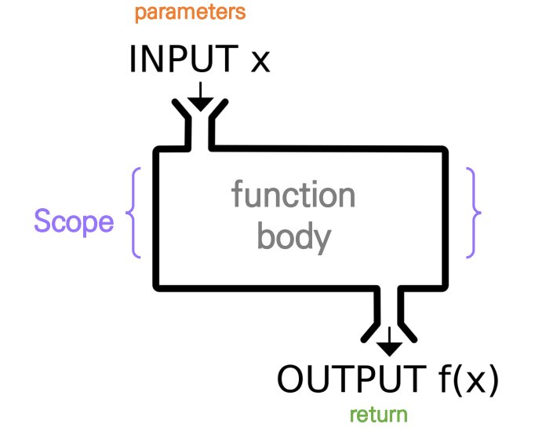
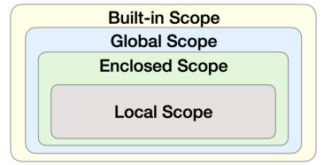
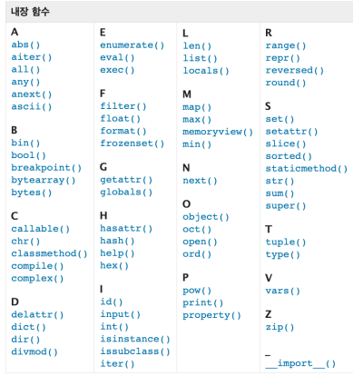

# 함수(function) ✒

- ### 우리는 왜 **함수**를 사용할까?

  - **기능을 분해, 재사용 가능** (Decomposition)
  - **복잡한 내용을 숨기고, 기능에 집중하여 사용할 수 있다**
    - **재사용성, 가독성, 생산성 (블랙박스)**

- ```python
  name = 'Python' # 메모리에 할당되어 있음
  # input 👉 [         
  #						] 👉 output
  ```
  

## 	📌 함수의 정의 

- ### 함수(Function)

  - **특정한 기능을 하는 코드의 조각(묶음)**
  - 특정 명령을 수행하는 코드를 **매번 다시 작성하지 않고, 필요 시에만 호출하여 간편히 사용**

- ### 사용자 함수(Custom Function)

  - **구현되어 있는 함수가 없는 경우, 사용자가 직접 함수를 작성 가능**

    ```python
    def function_name
    	# code block
    	return returning_value
    ```


- #### 함수를 사용해야 하는 이유

  - **재사용이 용이하다. 코드 중복을 방지한다. 내장함수를 사용하면 코드가 간결해진다.**

- ### 함수 기본 구조

  - 선언과 호출(`define` & `call`)

  - 입력(`Input`)

  - 범위(`Scope`)

  - 결과값(`Output`)

    

- ### 선언과 호출

  - #### 함수의 선언은 `def` 키워드를 활용함 

  - 들여쓰기를 통해 `Function body`(실행될 코드 블록)를 작성함

    - `Docstring`은 함수 `body` 앞에 선택적으로 작성 가능 
      - 작성시에는 반드시 첫 번째 문장에 문자열 ` ''' ''' `

  - 함수는 `parameter`를 넘겨줄 수 있음 

  - 함수는 동작 후에 `return`을 통해 결과값을 전달함

  - #### 함수는 함수명()으로 호출

    - `parameter`가 있는 경우, 함수명(값1, 값2, …)로 호출

      ```python
      def foo():                   # foo()
      	return True
      
      def add(x, y):              # add(2, 3)
      	return x + y
      
      # 함수는 호출되면 코드를 실행하고 return 값을 반환하며 종료된다.
      ```

## 📌 함수의 결과값 (Output)

- ### `return`

  - #### 함수는 반드시 값을 하나만 `return`한다.

    - 명시적인 `return`이 없는 경우에도 `None`을 반환한다.

  - #### 함수는 `return`과 동시에 실행이 종료된다.

- `return` 문을 한번만 사용하면서 두 개 이상의 값을 반환하는 방법은?

  - 튜플 반환

    ```python
    def minus_and_product(x, y):
    	return x - y, x * y
    ```

- `return` vs `print`

  - `return`은 함수 안에서 값을 반환하기 위해 사용되는 키워드
  - `print`는 출력을 위해 사용되는 함수

## 📌 함수의 입력 (Input)

- ### `parameter` vs `argument`

  - `Parameter` : **함수를 실행할 때, 함수 내부에서 사용되는 식별자**

  - `Argument` : 함수를 호출 할 때, 넣어주는 **값**

    - 함수 호출 시 함수	의 `parameter`를 통해 전달되는 값
    - `Argument`는 **소괄호** 안에 할당 `func_name(argument)`
      - 필수 `Argument` : **반드시 전달되어야 하는** `argument`
      - 선택 `Argument` : 값을 전달하지 않아도 되는 경우는 **기본 값이 전달**

    ```python
    def function(ham): 	# parameter : ham
    	return ham
    
    function('spam') 	# argument: 'spam'
    ```

- #### positional arguments

  - 기본적으로 함수 호출 시 `Argument`는 위치에 따라 함수 내에 전달됨

    ```python
    def add(x, y):       add(2, 3)
    	return x + y
    ```

  - `keyword arguments`

    - 직접 변수의 이름으로 특정 `Argument`를 전달할 수 있음

    - `Keyword Argument` 다음에 `Positional Argument`를 활용할 수 없음

      ```python
      def add(x, y):      add(x=2, y=5)
      	return x + y    add(2, y=5)
      ```

- ####  Default Arguments Values

  - 기본값을 지정하여 함수 호출 시 `argument` 값을 설정하지 않도록 함

    - **정의된 것 보다 더 적은 개수**의 `argument`들로 호출 될 수 있음

    ```python
    def add(x, y=0):  add(2)
    	return x + y
    ```

- #### 정해지지 않은 개수의 arguments

  - 여러 개의 `Positional Argument`를 하나의 필수 `parameter`로 받아서 사용

    - 몇 개의 `Positional Argument`를 받을지 모르는 **함수를 정의할 때 유용**

  - `Argument`들은 `tuple`로 묶여 처리되며, `parameter`에 ***를 붙여 표현**

    ```python
    def add(*args):      	add(2)
    	for arg in args:    add(2, 3, 4, 5)
    	print(arg)
    ```

- #### 정해지지 않은 개수의 keyword arguments

  - 함수가 임의의 개수 `Argument`를 `Keyword Argument`로 호출될 수 있도록 지정

  - `Argument`들은 딕셔너리로 묶여 처리되며, `parameter`에 **를 붙여 표현

  - ```python
    def family(**kwargs):
    	for key, value in kwargs:
    		print(key, ":", value)
    family(father='John', mother='Jane', me='John Jr.')


## 📌 함수의 범위 (Scope)

- #### 함수는 코드 내부에 `local scope`를 생성하며, 그 외의 공간인 `global scope`로 구분

- #### `scope`

  - `global scope` : 코드 어디에서든 참조할 수 있는 공간
  - `local scope` : 함수가 만든 `scope` 함수 내부에서만 참조 가능

- #### variable

  - `global variable` : `global scope`에 정의된 변수
  - `local variable` : `local scope`에 정의된 변수


### 📎 객체 수명주기

- #### 객체는 각자의 수명주기(lifecycle)가 존재

  - `built-in scope `

    - 파이썬이 실행된 이후부터 영원히 유지

  - `global scope`

    - 모듈이 호출된 시점 이후 혹은 인터프리터가 끝날 때까지 유지

  - `local scope`

    - 함수가 호출될 때 생성되고, 함수가 종료될 때까지 유지

    ```python
    def func():
    	a = 20
    	print('local', a)
    func()
    print('global', a)
    
    local 20
    ---------------------------------------------------------------------------
    3 print('local', a)
    5 func() ---->
    6 print('global', a)
    NameError: name 'a' is not defined
        # a는 Local scope에서만 존재
    ```

### 📎 이름 검색 규칙(Name Resolution)

- #### 파이썬에서 사용되는 이름(식별자)들은 이름공간(namespace)에 저장되어 있음

- #### 아래와 같은 순서로 이름을 찾아나가며, LEGB Rule이라고 부름

  - `Local scope` : **함수**
  - `Enclosed scope` : **특정 함수의 상위 함수**
  - `Global scope` : **함수 밖의 변수**, `Import` 모듈
  - `Built-in scope` : **파이썬 안에 내장되어 있는 함수 또는 속성**

- #### 즉, 함수 내에서는 바깥 Scope의 변수에 접근 가능하나 수정은 할 수 없음

  

## 📌 함수 응용

### 📎 내장 함수 응용

- #### 파이썬 인터프리터에는 사용할 수 있는 많은 함수와 형(`type`)이 내장되어 있음

  


```python
len('happy!') # 6 #길이를 구할 수 있음
```

```python
sum([1, 10, 100]) #111 #합을 구할 수 있음
```

```python
numbers = [1, 2, 3]
result = map(str,numbers)
print(result, type(result))

# <map object at 0x12e2ca100> <calss 'map'>

list(result) # 리스트 형변환을 통해 결과 직접 확인
```

- #### `map`

  - 알고리즘 문제 풀이시 `input` 값들을 숫자로 바로 활용하고 싶을 때

    ```python
    n, m map(int, input().split())
    
    print(n,m)
    print(type(n), type(m))
    
    #<class 'int'>
    ```

    

