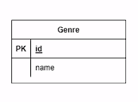
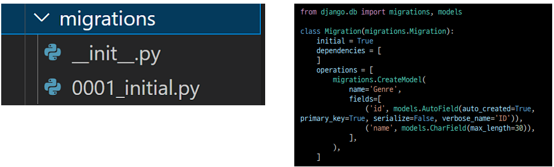
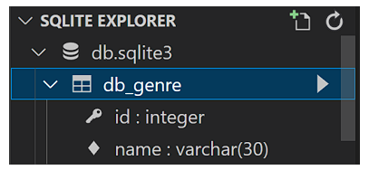

# ORM

*Object Relational Mapping*

#### *객체로 DB를 조작한다*

- 객체 지향 프로그래밍 언어를 사용하여 호환되지 않는 유형의 시스템 간의 데이터를 변환하는 프로그래밍 기술
- 파이썬에서는  *SQLAIchemy, peewee* 등 라이브러리가 있으며 *Django* 프레임워크에서는 내장 *Django ORM*을 활용

- 모델 설계 및 반영

  

  ```python
  class Genre(model.Model):
      name = model.CharField(max_length=30)
  ```

- ##### (1) 클래스를 생성하여 내가 원하는 DB의 구조를 만든다.

- ##### (2) 클래스의 내용으로 데이터베이스에 반영하기 위한 마이그레이션 파일을 생성한다.

  ```bash
  $ python manage.py makemigrations
  ```

  

- #### (3) `DB`에 `migrate` 한다. 

  ```bash
  $ python manage.py migrate
  ```

  


- #### 🔎 Migration (마이그레이션)

  - `Model`에 생긴 변화를 `DB`에 반영하기 위한 방법

  - 마이그레이션 파일을 만들어 `DB` 스키마를 반영한다.

  - #### 명령어 💡

    - ##### `makemigrations` :  마이그레이션 파일 생성

    - ##### `migrate` : 마이그레이션을 DB에 반영
    
      ```sql
      BEGIN;
      --
      -- Create model Genre
      --
      CREATE TABLE "db_genre" (
          "id" integer NOT NULL PRIMARY KEY AUTOINCREMENT,
          "name" varchar(30) NOT NULL
      );
      COMMIT;
      ```
    


- #### 🔎 데이터베이스 조작(Database API)

  ```python
  Genre.	objects.	 all()
  # Class Name Manager QuerySet API
  ```


## ORM 기본조작

- #### 📖 Create

  ```python
  # 1. create 메서드 활용
  Genre.objects.create(name='발라드')
  
  # 2. 인스턴스 조작
  genre = Genre()
  genre.name = '인디밴드'
  genre.save()
  ```


- #### 📖 Read

  ```python
  # 1. 전체 데이터 조회
  Genre.objects.all()
  # <QuerySet [<Genre: Genre object (1)>, <Genre:Genre object (2)>]>
  
  # 2. 일부 데이터 조회 (get)
  Genre.objects.get(id=1)
  # <Genre: Genre object (1)>
  
  # 3. 일부 데이터 조회 (filter)
  Genre.objects.filter(id=1)
  # <QuerySet [<Genre: Genre object (1)>]>
  ```

  

- #### 📖 Update

  ```python
  # 1. genre 객체 활용
  genre = Genre.objects.get(id=1)
  
  # 2. genre 객체 속성 변경
  genre.name = '트로트'
  
  # 3. genre 객체 저장
  genre.save()
  ```


- #### 📖 Delete

  ```python
  # 1. genre 객체 할용
  genre = Genre.objects.get(id=1)
  
  # 2. genre 객체 삭제
  genre = delete()
  ```

  