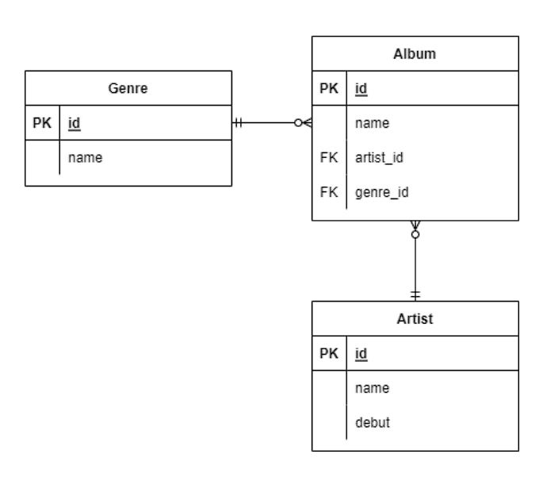

# QuerySet API 📥


### 🔎 부등호 

- ### ✔ gt (>) 

    ```python
    #python
    Entry.objects.filter(id__gt=4)
    ```

    ```sqlite
    -- sqlite
    SELECT ... WHERE id > 4;
    ```


- ### ✔ gte (>=)

  ```python
  # python
  Entry.objects.filter(id__gte=4)
  ```
  
  ```sqlite
  -- sqlite
  SELECT ... WHERE id >= 4;
  ```


- ### ✔ lt (<), lte (<=)

  ```python
  # python
  Entry.objects.filter(id__lt=4)
  Entry.objects.filter(id__lte=4)
  ```

  ```sqlite
  -- sqlite
  SELECT ... WHERE < 4;
  SELECT ... WHERE <= 4;
  ```


### 🔎 IN (포함)

```python
# python
Entry.objects.filter(id__in=[1, 3, 4])
Entry.objects.filter(headline__in='abc')
```

```sqlite
-- sqlite
SELECT ... WHERE id IN (1, 3, 4);
SELECT ... WHERE headline IN ('a', 'b', 'c');
```


### 🔎 탐색

- ### ✔ startswith (시작하는 단어)

  ```python
  # python
  Entry.objects.filter(headline__startwith='Lennon')
  ```

  ```sqlite
  -- sqlite
  SELECT ... WHERE headline LIKE 'Lennon%';
  ```


- ### ✔ istartswith (시작하는 단어와 대,소문자를 무시) 

  ```python
  #python
  Entry.objects.filter(headline__startwith='Lennon')
  ```

  ```sqlite
  -- sqlite
  SELECT ... WHERE headline LIKE 'Lennon%';
  ```


- ### ✔endswith (끝나는 단어)

  ```python
  # python
  Entry.objects.filter(headline__endswith='Lennon’)
  Entry.objects.filter(headline__iendswith='Lennon')
  ```

  ```sqlite
  -- sqlite
  SELECT ... WHERE headline LIKE '%Lennon';
  SELECT ... WHERE headline ILIKE '%Lennon';
  ```

  

- ### ✔ contains (포함되는 단어)

  ```python
  # python
  Entry.objects.get(headline__contains='Lennon’)
  Entry.objects.get(headline__icontains='Lennon’)
  ```

  ```sqlite
  -- sqlite
  SELECT ... WHERE headline LIKE '%Lennon%';
  SELECT ... WHERE headline ILIKE '%Lennon';
  ```

  

-  ### ✔ range (범위)

  ```python
  # python
  import datatime
  
  start_date = datetime.date(2005, 1, 1)
  end_date = datetime.date(2005, 3, 31)
  Entry.objects.filter(pub_date__range=(start_date, end_date))
  ```

  ```sqlite
  -- sqlite
  SELECT ... WHERE pub_date
  BETWEEN '2005-01-01' and '2005-03-31';
  ```


### 🔎 복합 활용

```python
# 서브쿼리 예시
# python
inner_qs = Blog.objects.filter(name__contains='Cheddar')
entries = Entry.objects.filter(blog__in=inner_qs
```

```sqlite
-- sqlite
SELECT ... 
WHERE blog.id IN (SELECT id FROM ... WHERE NAME
LIKE '%Cheddar%’);
```


### 🔎 활용

- #### ✔ 인덱스 접근

    ```python
    # python 
    Entry.objects.all()[0]
    ```

    ```sqlite
    -- sqlite
    SELECT ...
    LIMIT 1;
    ```


- #### ✔ 정렬

  ```python
  # python
  Entry.objects.order_by('-id')
  ```

  ```sqlite
  -- sqlite
  SELECT ...
  ORDER BY id DESC;


## 📝 ORM 확장



```python
class Genre(models.Model):
    name = models.CharField(max_length=30)
    
class Artist(models.Model):
    name = models.CharField(max_length=30)
    debut = models.DateField()
    
class Album(models.Model):
    name = models.CharField(max_length=30)
    genre = models.Foreignkey('Genre', on_delete=models.CASCADE)
    artist = models.Foreignkey('Artist', on_delete=models.CASCADE)
```


- ### 🔎 Foreign Key (외래키) 

  - #### 키를 사용하여 부모 테이블의 유일한 값을 참조 (참조 무결성) 

  - **데이터베이스 관계 모델에서 관련된 2개의 테이블 간의 일관성** 

  - 외래 키의 값이 반드시 부모 테이블의 기본 키일 필요는 없지만 **유일한 값이어야 함**

  

- ### 🔎 models.ForeignKey 필드 

- #### 2개의 필수 위치 인자 

  - #### `Model class` : 참조하는 모델 

  - #### `on_delete` : 외래 키가 참조하는 객체가 삭제되었을 때 처리 방식

    - ##### `CASCADE` : 부모 객체(참조 된 객체)가 삭제 됐을 때 이를 참조하는 객체도 삭제 

    - ##### `PROTECT` : 삭제되지 않음 

    - ##### `SET_NULL` : `NULL` 설정

    - ##### `SET_DEFAULT` : 기본 값 설정


- ### ✔ Create

  ```python
  artist = Artist.objects.get(id=1)
  genre = Genre.objects.get(id=1)
  
  album = Album()
  album.name = '앨범1'
  album.artist = artist # 객체 저장
  album.genre = genre
  album.save()
  ```

  

- ### ✔ 참조와 역참조

  ```python
  # 1. 참조
  album = Album.objects.get(id=1)
  album.artist	# <Artist: Artist object (1)>
  album.genre 	# <Genre: Genre object (1)
  
  # 2. 역참조
  genre = Genre.objects.get(id=1)
  genre.album_set.all()
  
  # 역참조시 소문자 set을 붙여주는 약속! 💡
  
  '''
  <QuerySet [<Album: Album object (1)>, <Album: 
  Album object (2)>]
  '''
  ```

  
