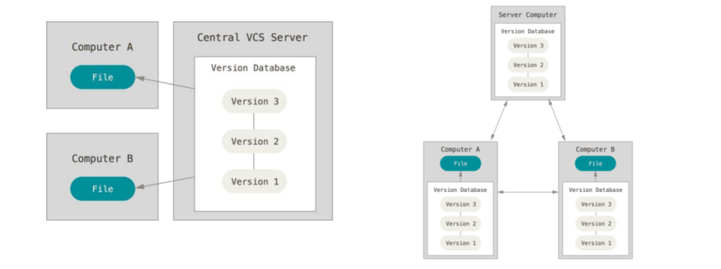

# git ✒

- **분산버전관리시스템**으로 코드의 버전을 관리하는 도구
- 2005년 리눅스 커널을 위한 도구로 **리누스 토르발스**가 개발
- 컴퓨터 파일의 변경사항을 추적하고 여러 명의 사용자들 간에 해당 파일들의 작업을 조율


## 📋 버전 관리란?

- **컴퓨터 소프트웨어의 특정 상태** 	

- In software engineering, version control (also known as revision control, source 
  control, or source code management) is a class of systems responsible for 
  managing changes to computer programs, documents, large web sites, or other
  collections of information.

- **버전관리, 소스코드 관리**란 동일한 정보에 대한 여러 **버전**을 관리하는 것을 말한다.

  

## 🗄 분산버전관리시스템(DVCS)

- **중앙집중식버전관리시스템**은 중앙에서 버전을 관리하고 파일을 받아서 사용-

- **분산버전관리시스템**은 **원격 저장소(remote repository)**를 통하여 협업하고, 

  모든 히스토리를 클라이언트들이 공유



## ⚙ git 기본 설정 

- 사용자 정보 (commit author) : 커밋을 하기 위해 반드시 필요
  - git config —global user.name “username”
  - **Github**에서 설정한 **username**으로 설정
  - git config —global user.email “my@email.com”
  - **Github**에서 설정한 **email**로 설정

- 설정 확인
  - git config -l
  - git config —global -
  - git config user.name

## 📄 git 명령어 모음

```$ git init```

- 특정 폴더를 **git 저장소(repository)**를 만들어 **git**으로 관리
  - **.git** 폴더가 생성되며
  - **git bash**에서는 **(master)**라는 표기를 확인할 수 있음

```$ git add [file]```

- **working directory**상의 변경 내용을 **staging area**에 추가하기 위해 사용
  - **untracked **상태의 파일을 **staged**로 변경
  - **modified** 상태의 파일을 **staged**로 변경

```$ git commit[text]```

- **staged** 상태의 파일들을 커밋을 통해 버전으로 기록
- **SHA-1** 해시를 사용하여 40자 길이의 체크섬을 생성하고, 이를 통해 고유한 커밋을 표
- **커밋 메시지**는 변경 사항을 나타낼 수 있도록 명확하게 작성해야 함

```$ git status```

- **Git 저장소**에 있는 파일의 **상태**를 확인하기 위하여 활용
  - 파일의 **상태**를 알 수 있음

```$ git log```

- 현재 저장소에 기록된 커밋을 조회-
- 다양한 옵션을 통해 로그를 조회할 수 있음
  ```$ git log -1```
  ```$ git log --oneline```
  ```$ git log -2 --oneline``` 

