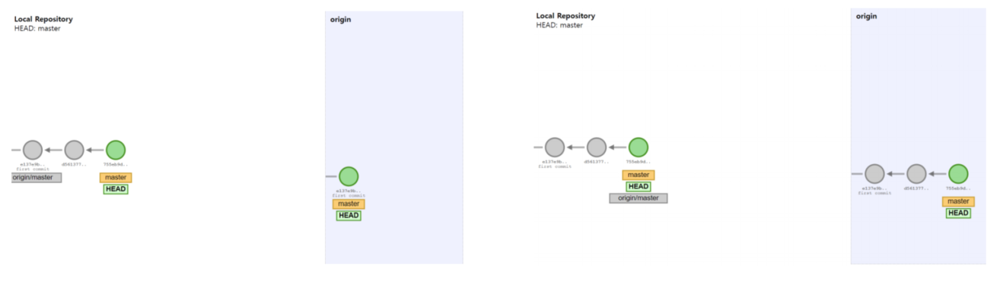
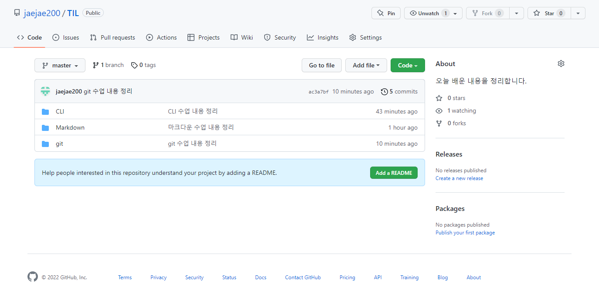

# github ✒

- 버전을 관리하는 **원격저장소**


## ⏳ 원격저장소 (Remote Repository) 기본 흐름

- **로컬 저장소의 버전을 원격저장소로 보낸다. (PUSH)**



- **원격저장소의 버전을 로컬 저장소로 가져온다. (PULL)**


## 🔨 GitHub에서 원격 저장소가 만들어지는 과정

- **New Repositiory**

- **저장소 설정하기**

- **주소 확인하기**

  ex) http://github.com/jaejae200/TIL


## 📤 로컬저장소의 버전을 원격저장소로 보내주기

ex)

```$ git remote add origin http://github.com/(githubname)/(name).git```


## 📏 원격저장소 활용 명령어 

```$ git push [name][branch]```

- 원격 저장소로 로컬 저장소 **변경 사항(커밋)**을 **올림(push)**
- 로컬 폴더의 파일/폴더가 아닌 저장소의 **버전(커밋)**이 올라감

**ex)**




`$ git pull [name][branch]`

- 원격 저장소로부터 **변경된 내역**을 받아와서 이력을 **병합**한다.

`$ git clone [url]`

- 원격 저장소를 **복제**하여 가져온다.
  - ex) 다른 원격저장소와 **같은 이름의 폴더**가 생성됨

```$ git remote –v```

- 원격 저장소의 **정보**를 확인한다. 

`$ git remote add [name][url]`

- 원격저장소를 **추가**한다. 

```$ git remote rm [name]```

- 원격저장소를 **삭제**한다.

